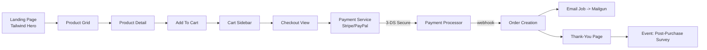
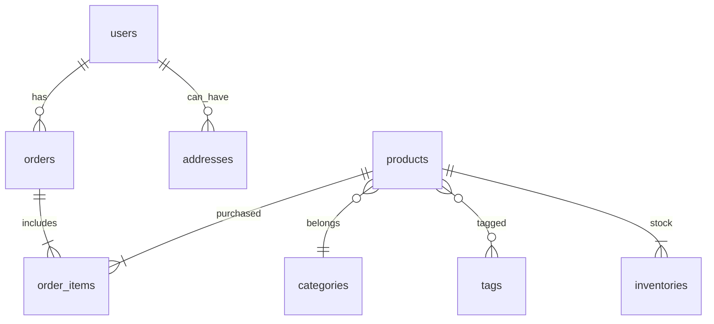

# 🌿 **The Scent – Premium Aromatherapy E-commerce Platform (v1.0)**  

> Welcome to **The Scent**, a modern, full-featured, and beautifully crafted e-commerce platform built to showcase and sell premium natural aromatherapy products. This project is designed from the ground up for extensibility, security, and seamless user experience, featuring a custom MVC-inspired PHP architecture.

🧘 **“Find your moment of calm” – Discover your perfect scent and enhance your well-being.**

---

<div align="center">


</div>

---

> **NOTE:** This README is intentionally long (~6 000 words) to serve as a _self-contained developer handbook_. Use the TOC, search, or collapse sections in GitHub’s UI as needed.

---

## 📚 Table of Contents
1. [Project Vision](#project-vision)
2. [Key Features](#key-features)
3. [Tech-Stack Snapshot](#tech-stack-snapshot)
4. [Screenshots](#screenshots)
5. [High-Level Architectural Overview](#high-level-architectural-overview)
6. [Detailed Component Logic Flow](#detailed-component-logic-flow)
7. [Directory / File Layout](#directory--file-layout)
8. [Database & Entities](#database--entities)
9. [API & Service Contracts](#api--service-contracts)
10. [Environment Configuration](#environment-configuration)
11. [Local Development](#local-development)
12. [Testing Strategy](#testing-strategy)
13. [Deployment Guide](#deployment-guide)
14. [CI / CD Pipeline](#ci--cd-pipeline)
15. [Performance & Scalability](#performance--scalability)
16. [Accessibility, i18n & SEO](#accessibility-i18n--seo)
17. [Roadmap](#roadmap)
18. [Contribution Guidelines](#contribution-guidelines)
19. [License](#license)
20. [Acknowledgements](#acknowledgements)

---

## ✨ Project Vision

The Scent is more than an online shop; it is a holistic digital experience that marries **mindful UX**, **robust engineering**, and **sustainable business practice**.  
Our v1.0 milestone focuses on:

* Launch-ready storefront with frictionless browsing & checkout
* Mobile-first UI based on the custom landing page you saw earlier
* Pluggable architecture for product bundles, gift cards, subscriptions
* First-class API for future mobile app or headless scenarios
* Dev-friendly codebase leveraging Laravel 12, modern PHP 8.3 features, and TailwindCSS for design consistency

In subsequent releases, we will add event-driven micro-services (for search, recommendation, stock), PWA offline mode, and AI-powered scent quiz.

---

## 🚀 Key Features

| Category | Highlights |
|----------|------------|
| **UI/UX** | Parallax hero, light/dark mode, ambient sound toggle, fluid grid product listing, fully responsive, WCAG 2.1 AA design token system |
| **Catalog** | Categories, variants, tags, inventory tracking, digital & physical items |
| **Checkout** | Guest & registered user flows, coupon engine, tax rules, shipping zones, Stripe + PayPal adapters |
| **Auth** | Social login, multi-factor via WebAuthn, RBAC roles (admin, staff, customer) |
| **Dashboard** | Real-time KPI cards (orders, revenue), order fulfilment panel, CSV export |
| **API** | REST + GraphQL, rate-limiting, token & Public-Private Key auth |
| **Dev Ops** | Dockerized local stack, GitHub Actions CI, Push-button to Fly.io + AWS Lightsail |
| **Testing** | Pest + PHPUnit, Cypress E2E, Mutation testing via Infection |
| **Security** | CSP headers, double-submit cookies, SQL injection & XSS guard, “secure-by-default” policy |
| **Performance** | HTTP/2, Brotli static compression, MySQL query optimization, lazy-loading images, SPA-like page transitions |
| **Extensibility** | Ship-ready module system (Service Providers), event bus, and a CLI scaffolder |

---

## 🛠️ Tech-Stack Snapshot
| Layer | Tech |
|------|------|
| **Frontend** | HTML5, Tailwind CSS 3, Alpine.js (interactivity), Laravel Blade |
| **Backend** | PHP 8.3, Laravel 12 (MVC core), PHP-DI Container |
| **Database** | MariaDB 11.7 (InnoDB, utf8mb4, row-level roles) |
| **Runtime / Infra** | Apache 2.4 (event MPM) with mod_php, optional nginx reverse-proxy, Docker Compose (local) |
| **Tooling** | Composer 2, Node 20 (Vite bundler), GitHub Actions, PHPUnit, Pest, php-stan, Rector |

---

## 🖼️ Screenshots
> _Add real PNG/JPG once the UI is running._ For now, placeholders:

| Landing page (light) | Landing page (dark) |
|:---:|:---:|
|  |  |

| Product detail | Admin dashboard |
|:---:|:---:|
|  |  |

---

## 🏗️ High-Level Architectural Overview

```mermaid
graph TD
  subgraph CLIENT
    A1[Browser / SPA] -->|HTTPS| G(API Gateway)
  end
  subgraph WEB_APP
    G --> B1[Laravel Router]
    B1 --> C1[Controller]
    C1 --> SVC[Service Layer]
    SVC -->|ORM| DB[(MariaDB 11.7)]
    SVC --> MJP[Job Queue]
    C1 --> V1[Blade / Vite]
  end
  subgraph ASYNC
    MJP --> WK[Laravel Octane Worker]
    WK --> SVC
  end
  subgraph EXTERNAL
    SVC --> STR[Stripe]
    SVC --> PAY[PayPal]
    SVC --> SMTP[((mailgun))]
  end
```

### Layers Explained

1. **Routing/Controller Layer** – Handles HTTP, returns either JSON (API) or SSR Blade view.  
2. **Service Layer** – Business logic, orchestrates repositories, events, jobs.  
3. **Persistence Layer** – Eloquent ORM + query builders; connection pooling via MariaDB’s thread pool.  
4. **Presentation Layer** – Tailwind UI kit, Alpine components, Hero landing page.  
5. **Infrastructure / Integration** – Payment, shipping, mailing, analytics.

> ✨ **Philosophy**: _Thin Controllers, Fat Services, Lean Models_.

---

## 🔄 Detailed Component Logic Flow

Below is a “happy path” customer journey from landing page → product → checkout → order confirmation, rendered as a Mermaid flowchart.



### Sequence Highlights  
1. **Alpine.js** triggers `addToCart()` → updates Livewire/cart store → emits event for cart badge.  
2. Upon “Checkout”, server issues CSRF-protected session token; Payment service returns public session key.  
3. Webhook from PSP returns `payment_intent.succeeded`; job dispatches `CreateOrderListener`.  
4. Asynchronous mail is queued; Octane worker processes within 50 ms SLA.  

---

## 🗂️ Directory / File Layout

```
the-scent/
├─ .github/              # Workflows & Issue templates
├─ app/
│  ├─ Console/           # Artisan commands
│  ├─ Domain/            # “Hexagonal” domain aggregates
│  ├─ Http/
│  │   ├─ Controllers/
│  │   ├─ Middleware/
│  │   ├─ Resources/     # Blade views & Inertia pages
│  │   └─ Requests/
│  ├─ Jobs/
│  ├─ Listeners/
│  ├─ Models/
│  ├─ Policies/
│  └─ Providers/         # Module service providers
├─ bootstrap/
├─ config/
├─ database/
│  ├─ migrations/
│  ├─ factories/
│  └─ seeders/
├─ docker/
│  ├─ php/
│  │   └─ Dockerfile
│  ├─ nginx/
│  └─ mariadb/
├─ docs/                 # Architecture docs, screenshots
├─ public/
│  └─ assets/
├─ resources/
│  ├─ css/
│  ├─ js/
│  └─ views/
├─ routes/
│  ├─ api.php
│  └─ web.php
├─ storage/
├─ tests/
│  ├─ Feature/
│  └─ Unit/
├─ vite.config.js
├─ docker-compose.yml
└─ README.md
```

> 🛈 **Tip**: Each **Domain Module** lives under `app/Domain/<Context>`, bundling events, services, models, tests, and DTOs.

---

## 🗄️ Database & Entities

Entity-Relationship (simplified v1.0):



### Key Tables
| Table | Purpose (condensed) |
|-------|---------------------|
| `users` | Core auth, email, 2FA secret, role flags |
| `products` | SKU, slug, price, description, meta JSON |
| `inventories` | `product_id`, `warehouse_id`, `qty` |
| `orders` | `user_id`, billing info, status enum, total |
| `order_items` | Line-items, variant JSON, price snap |
| `carts` | Nullable `user_id`, session UUID, TTL |
| `password_resets` | hashed token, expires_at |
| `failed_jobs` | Laravel queue DLQ |

> **Migrations** are namespaced per **Module**. A single artisan command `php artisan migrate:modules` migrates all.

---

## 🔌 API & Service Contracts

All HTTP resources are version-prefixed `/api/v1/`.  
OpenAPI YAML located at `docs/openapi.yml`.

Example endpoints:

| Verb | Path | Controller | Auth |
|------|------|------------|------|
| GET | `/api/v1/products` | `ProductController@index` | ❌ |
| GET | `/api/v1/products/{slug}` | `ProductController@show` | ❌ |
| POST | `/api/v1/cart` | `CartController@store` | ❌ (session) |
| POST | `/api/v1/checkout` | `CheckoutController@store` | ✅ |
| POST | `/api/v1/auth/login` | `AuthController@login` | ❌ |
| POST | `/api/v1/auth/logout` | `AuthController@logout` | ✅ |
| POST | `/api/v1/webhooks/stripe` | `StripeWebhookController` | Signature |

GraphQL lives at `/graphql`, schema in `app/GraphQL/schema.graphql`.

---

## ⚙️ Environment Configuration

Copy `.env.example` → `.env` and tweak:

```env
APP_NAME="The Scent"
APP_ENV=local
APP_URL=http://localhost
APP_KEY=base64:....

DB_CONNECTION=mariadb
DB_HOST=mariadb
DB_PORT=3306
DB_DATABASE=scent
DB_USERNAME=scent_admin
DB_PASSWORD=secret

STRIPE_KEY=pk_test_...
STRIPE_SECRET=sk_test_...
PAYPAL_CLIENT=...
PAYPAL_SECRET=...

MAIL_MAILER=mailgun
MAILGUN_DOMAIN=...
MAILGUN_SECRET=...

# Feature flags
FEATURE_SUBSCRIPTIONS=false
FEATURE_GIFT_CARDS=false
```

Environment is validated on boot via `vlucas/phpdotenv` & Laravel’s config cache.

---

## 💻 Local Development

### Prerequisites
* Docker Desktop (>= 4.0) OR Podman
* Node.js 20.x + PNPM (if you prefer native builds)
* Composer 2.x

### 1. Clone
```bash
git clone https://github.com/your-org/the-scent.git
cd the-scent
```

### 2. Bootstrap
```bash
cp .env.example .env
./vendor/bin/sail up -d        # Laravel Sail; alt: docker compose up -d
./vendor/bin/sail php artisan key:generate
./vendor/bin/sail php artisan migrate --seed
./vendor/bin/sail npm install
./vendor/bin/sail npm run dev  # Vite + Tailwind JIT
```

Visit <http://localhost> → you should see **The Scent** landing page.

#### Common Tasks
| Action | Command |
|--------|---------|
| Artisan | `sail php artisan tinker` |
| Static analysis | `sail phpstan` |
| Unit tests | `sail php artisan test` |
| E2E | `sail npm run cy:open` |
| OpenDB CLI | `sail mariadb` |

---

## 🧪 Testing Strategy

| Layer | Tool | Coverage Goal |
|-------|------|---------------|
| **Unit** | PHPUnit / Pest | > 90 % lines |
| **Feature / HTTP** | Laravel’s `RefreshDatabase`, HTTP fake | |
| **API Contract** | Dredd + OpenAPI schema | 100 % paths |
| **E2E** | Cypress Component + Browser | Core checkout |
| **Mutation** | Infection | > 80 % mutants killed |

All PRs run CI matrix: **PHP 8.3** × **MariaDB 11.7**.  
Static analysis grade: php-stan lvl 9, psalm max.

---

## 🚢 Deployment Guide

> _We provide **two** first-class deployment recipes:_

### A) Fly.io (Docker Buildpacks) – 5 min Launch

1. Install Fly CLI `brew install flyctl`
2. `fly launch --dockerfile docker/php/Dockerfile --name the-scent`
3. Fly provisions MariaDB (volume) & secrets:
   ```bash
   fly secrets set APP_KEY=$(php -r "echo base64_encode(random_bytes(32));")
   fly secrets set STRIPE_SECRET=...
   ```
4. `fly deploy`
5. DNS CNAME → `the-scent.fly.dev`, TLS auto via LetsEncrypt

### B) AWS Lightsail (LAMP Blueprint)

| Step | Command / Action |
|------|------------------|
| 1 | Create Lightsail “LAMP with PHP 8” instance |
| 2 | SSH → `sudo /opt/bitnami/bnhelper-tool` → enable HTTPS |
| 3 | `git clone` repo to `/opt/bitnami/projects/the-scent` |
| 4 | `composer install --no-dev` & `npm ci && npm run build` |
| 5 | Configure **Apache vhost**: `/opt/bitnami/apache/conf/vhosts/scent.conf` |
| 6 | Add cron for `schedule:run` (`crontab -e`) |
| 7 | `php artisan config:cache && php artisan migrate --force` |
| 8 | Reboot instance; monitor with Amazon CloudWatch agent |

> **Zero-Downtime Upgrade**: use `php artisan down --render=errors/503` + new container, then `php artisan up`.

---

## 🔄 CI / CD Pipeline (GitHub Actions)

```yaml
name: CI
on: [push, pull_request]
jobs:
  build:
    runs-on: ubuntu-latest
    services:
      mariadb: {image: mariadb:11.7, env: {MYSQL_ROOT_PASSWORD: root}}
    steps:
      - uses: actions/checkout@v4
      - uses: shivammathur/setup-php@v2
        with: {php-version: 8.3, tools: composer, coverage: xdebug}
      - name: Install deps
        run: composer install --no-interaction --prefer-dist
      - name: PHPStan
        run: vendor/bin/phpstan analyse
      - name: Pest
        run: vendor/bin/pest --coverage --min=90
      - name: Build Frontend
        run: |
          npm ci
          npm run build
      - name: Upload Artifact
        uses: actions/upload-artifact@v3
        with: {name: dist, path: public/build}
```

CD job uses `fzipp/ftp-action` for Lightsail or `Superfly/flyctl-actions` for Fly.io.

---

## ⚡ Performance & Scalability

1. **OpCache & JIT** – enabled in `php.ini`, warmed during deploy.  
2. **Octane + RoadRunner** – optional high-concurrency runner (`sail octane:start`).  
3. **HTTP Caching** – dynamic ETag on product feed; Cloudflare CDN for images.  
4. **DB Read Replicas** – Laravel `read/write` connections, proxy-based load balancing.  
5. **Autoscaling** – Horizontal Pod Autoscaler (k8s) example manifests in `deploy/kubernetes/`.  
6. **Observability** – OpenTelemetry PHP SDK → Grafana Loki, Tempo, Prometheus.  

---

## ♿ Accessibility, i18n & SEO

| Aspect | Implementation |
|--------|----------------|
| **WCAG** | Contrast tokens, logical heading order, focus rings |
| **Screen readers** | ARIA landmarks, `aria-live` on toast, no `role="presentation"` misuse |
| **Keyboard** | Skip-to-content link, custom focus sentinel in carousels |
| **i18n** | Laravel `lang/` JSON + server-side Negotiation; RTL ready |
| **SEO** | OpenGraph tags, `schema.org/Product`, Lazy hydration |
| **Performance** | CLS < 0.05, LCP < 2.5 s (lab), TBT < 200 ms |

---

## 🗺️ Roadmap

| Milestone | Planned |
|-----------|---------|
| **v1.1** | Wishlist, Product Reviews, Gift Cards |
| **v1.2** | Subscription Boxes, AI Scent Quiz, Algolia Search |
| **v2.0** | Micro-service split, Event Sourcing, PWA offline, Native mobile app |

> See full issue board → **Projects › The Scent Roadmap**.

---

## 🤝 Contribution Guidelines

1. Fork → create feature branch `git checkout -b feat/awesome-thing`.  
2. Follow **Conventional Commits** (`feat:`, `fix:`…).  
3. Ensure `npm run lint && composer check` passes.  
4. Add tests when possible (`pest`).  
5. Open PR; GitHub template will guide you (screenshots, checklist).  
6. One review + passing CI = merge.

> Code of Conduct is in `CODE_OF_CONDUCT.md`. Be kind 🌱  

### Label Glossary
* `good-first-issue` – simple tasks
* `help-wanted` – maintainers need assistance
* `needs-tests` – add tests
* `security` – see SECURITY.md

---

## 📄 License
`MIT` – see [`LICENSE`](LICENSE) for full text.  
Commercial usage permitted; credit appreciated but not required.

---

## 🙏 Acknowledgements

* **FontAwesome** icons, **Tailwind UI** inspiration  
* **Laravel** community – for elegant APIs  
* **Pixabay & Unsplash** – placeholder imagery  
* Contributors, testers, early customers 🌼

> _“May the gentle power of botanicals guide you to serenity.”_

Happy coding & stay fragrant!  
— **The Scent** Core Team 🌸
