# 🌿 **The Scent – Premium Aromatherapy E-commerce Platform (v1.0)**

> **Version:** 1.0.0 | **Last Updated:** 2025-04-27 | **License:** MIT

> Welcome to **The Scent**, a modern, full-featured, and beautifully crafted e-commerce platform designed to showcase and sell premium natural aromatherapy products. This project serves not only as a functional storefront but also as a reference implementation demonstrating best practices in modern web application development using PHP and the Laravel framework. It is architected from the ground up for extensibility, maintainability, security, and a seamless, mindful user experience.

🧘 **“Find your moment of calm” – Discover your perfect scent and enhance your well-being.**

---

<div align="center">


[](https://github.com/your-org/the-scent/actions/workflows/ci.yml)
[](https://example.com/coverage-report) <!-- Replace with actual coverage badge if set up -->
[](phpstan.neon)
[](pint.json)

</div>

---

> **IMPORTANT NOTE:** This README is intentionally **very long and detailed** (targeting ~6000 words) to function as a comprehensive, self-contained **Developer Handbook** for the project. It covers architecture, setup, development workflows, testing, deployment, and core concepts. Please use the Table of Contents, your editor's search function (`Ctrl+F` / `Cmd+F`), or collapse sections in GitHub’s UI to navigate efficiently.

---

## 📚 Table of Contents

1.  [**Project Vision & Philosophy**](#-project-vision--philosophy)
    *   [Core Goals](#core-goals)
    *   [Guiding Principles](#guiding-principles)
2.  [**Key Features Deep Dive**](#-key-features-deep-dive)
    *   [UI/UX Highlights](#uiux-highlights)
    *   [E-commerce Engine](#e-commerce-engine)
    *   [Authentication & Authorization](#authentication--authorization)
    *   [Admin Dashboard](#admin-dashboard)
    *   [API Capabilities](#api-capabilities)
3.  [**Technology Stack Rationale**](#-technology-stack-rationale)
    *   [Why Laravel 12?](#why-laravel-12)
    *   [Why Tailwind CSS 3?](#why-tailwind-css-3)
    *   [Why Alpine.js?](#why-alpinejs)
    *   [Why PHP 8.3?](#why-php-83)
    *   [Why MariaDB 11.7?](#why-mariadb-117)
    *   [Why Docker & Laravel Sail?](#why-docker--laravel-sail)
4.  [**Screenshots (Illustrative)**](#-screenshots-illustrative)
5.  [**Architectural Overview: A Layered Approach**](#-architectural-overview-a-layered-approach)
    *   [High-Level Diagram](#high-level-diagram)
    *   [Architectural Layers Explained](#architectural-layers-explained)
        *   [Presentation Layer (Client/Browser)](#presentation-layer-clientbrowser)
        *   [Web Application Layer (Laravel)](#web-application-layer-laravel)
        *   [Domain Layer (Core Business Logic)](#domain-layer-core-business-logic)
        *   [Infrastructure Layer (Persistence, External Services)](#infrastructure-layer-persistence-external-services)
        *   [Async Processing Layer (Queue Workers)](#async-processing-layer-queue-workers)
    *   [Design Philosophy: DDD Influences](#design-philosophy-ddd-influences)
6.  [**Core Concepts & Design Patterns Employed**](#-core-concepts--design-patterns-employed)
    *   [Model-View-Controller (MVC)](#model-view-controller-mvc)
    *   [Service Layer Pattern](#service-layer-pattern)
    *   [Repository Pattern (Implicit via Eloquent)](#repository-pattern-implicit-via-eloquent)
    *   [Data Transfer Objects (DTOs)](#data-transfer-objects-dtos)
    *   [Dependency Injection & Service Container](#dependency-injection--service-container)
    *   [Events & Listeners (Decoupling)](#events--listeners-decoupling)
    *   [Middleware (HTTP Request Handling)](#middleware-http-request-handling)
7.  [**Detailed Component Logic Flow: Checkout Example**](#-detailed-component-logic-flow-checkout-example)
    *   [Flowchart Diagram](#flowchart-diagram)
    *   [Sequence Narrative & Technical Details](#sequence-narrative--technical-details)
8.  [**Directory & File Layout Explained**](#-directory--file-layout-explained)
    *   [Standard Laravel Structure](#standard-laravel-structure)
    *   [Key Customizations (`app/Domain`)](#key-customizations-appdomain)
    *   [Directory Breakdown](#directory-breakdown)
9.  [**Database Schema & Entity Relationships**](#-database-schema--entity-relationships)
    *   [Entity-Relationship Diagram (ERD)](#entity-relationship-diagram-erd)
    *   [Key Table Deep Dive](#key-table-deep-dive)
    *   [Data Modeling Choices & Rationale](#data-modeling-choices--rationale)
    *   [Migrations & Seeding Strategy](#migrations--seeding-strategy)
10. [**API & Service Contracts: Usage Guide**](#-api--service-contracts-usage-guide)
    *   [API Philosophy (RESTful, Versioned)](#api-philosophy-restful-versioned)
    *   [Authentication Mechanisms](#authentication-mechanisms)
        *   [API Tokens (Laravel Sanctum)](#api-tokens-laravel-sanctum)
        *   [Webhook Signatures (Example: Stripe)](#webhook-signatures-example-stripe)
    *   [Key REST Endpoint Examples](#key-rest-endpoint-examples)
        *   [Fetching Products](#fetching-products)
        *   [User Authentication](#user-authentication)
        *   [Cart Management](#cart-management)
        *   [Checkout Process](#checkout-process)
    *   [GraphQL Endpoint](#graphql-endpoint)
    *   [API Versioning](#api-versioning)
    *   [Rate Limiting](#rate-limiting)
    *   [API Documentation (OpenAPI)](#api-documentation-openapi)
11. [**Environment Configuration In-Depth**](#-environment-configuration-in-depth)
    *   [The `.env` File](#the-env-file)
    *   [Core Application Settings](#core-application-settings)
    *   [Database Connection](#database-connection)
    *   [Session, Cache, Queue Drivers](#session-cache-queue-drivers)
    *   [External Service Keys (Mail, Payments)](#external-service-keys-mail-payments)
    *   [Feature Flags](#feature-flags)
    *   [Configuration Caching (`config:cache`)](#configuration-caching-configcache)
    *   [Environment Validation](#environment-validation)
12. [**Comprehensive Local Development Setup Guide**](#-comprehensive-local-development-setup-guide)
    *   [Prerequisites](#prerequisites)
    *   [Cloning the Repository](#cloning-the-repository)
    *   [Setting Up Laravel Sail (Docker)](#setting-up-laravel-sail-docker)
    *   [Initial Bootstrap Commands](#initial-bootstrap-commands)
    *   [Running the Application](#running-the-application)
    *   [Working with Sail: Common Commands](#working-with-sail-common-commands)
    *   [Frontend Asset Pipeline (Vite)](#frontend-asset-pipeline-vite)
    *   [Database Interaction (Sail & GUI Tools)](#database-interaction-sail--gui-tools)
    *   [Debugging with Xdebug & Sail](#debugging-with-xdebug--sail)
    *   [Running Tests Locally](#running-tests-locally)
    *   [Common Troubleshooting Tips](#common-troubleshooting-tips)
13. [**Robust Testing Strategy & Implementation**](#-robust-testing-strategy--implementation)
    *   [Testing Philosophy](#testing-philosophy)
    *   [Unit Tests (Pest/PHPUnit)](#unit-tests-pestphpunit)
    *   [Feature Tests (Laravel HTTP Tests)](#feature-tests-laravel-http-tests)
    *   [End-to-End (E2E) Tests (Cypress)](#end-to-end-e2e-tests-cypress)
    *   [API Contract Tests (Dredd - Optional)](#api-contract-tests-dredd---optional)
    *   [Mutation Testing (Infection)](#mutation-testing-infection)
    *   [Static Analysis (PHPStan, Psalm)](#static-analysis-phpstan-psalm)
    *   [Code Style (Pint/PHP-CS-Fixer)](#code-style-pintphp-cs-fixer)
    *   [Running Tests in CI](#running-tests-in-ci)
14. [**Detailed Deployment Guide: Fly.io & AWS Lightsail**](#-detailed-deployment-guide-flyio--aws-lightsail)
    *   [General Deployment Principles](#general-deployment-principles)
        *   [Environment Parity](#environment-parity)
        *   [Build Artifacts](#build-artifacts)
        *   [Configuration & Secrets Management](#configuration--secrets-management)
        *   [Zero-Downtime Deployments Goal](#zero-downtime-deployments-goal)
    *   **A) Deploying to Fly.io (Recommended for Simplicity)**
        *   [Prerequisites: Fly CLI & Account](#prerequisites-fly-cli--account)
        *   [Initial Launch (`fly launch`)](#initial-launch-fly-launch)
        *   [Database Provisioning](#database-provisioning)
        *   [Setting Secrets (`fly secrets set`)](#setting-secrets-fly-secrets-set)
        *   [The `fly.toml` Configuration File](#the-flytoml-configuration-file)
        *   [Deploying (`fly deploy`)](#deploying-fly-deploy)
        *   [Running Migrations & Release Commands](#running-migrations--release-commands)
        *   [Scaling Services](#scaling-services)
        *   [Custom Domains & TLS](#custom-domains--tls)
        *   [Logging & Monitoring](#logging--monitoring)
        *   [Accessing the Production Container (`fly ssh console`)](#accessing-the-production-container-fly-ssh-console)
    *   **B) Deploying to AWS Lightsail (LAMP Blueprint - More Manual)**
        *   [Prerequisites: AWS Account & SSH Key](#prerequisites-aws-account--ssh-key)
        *   [Creating the Lightsail Instance (LAMP Stack)](#creating-the-lightsail-instance-lamp-stack)
        *   [Configuring the Firewall (Security Group)](#configuring-the-firewall-security-group)
        *   [Connecting via SSH](#connecting-via-ssh)
        *   [Installing Dependencies (Git, Composer, Node.js if needed)](#installing-dependencies-git-composer-nodejs-if-needed)
        *   [Cloning the Repository](#cloning-the-repository-1)
        *   [Installing Application Dependencies (`composer`, `npm`)](#installing-application-dependencies-composer-npm)
        *   [Configuring Apache Virtual Host](#configuring-apache-virtual-host)
        *   [Setting Up the `.env` File](#setting-up-the-env-file)
        *   [Laravel Production Setup Commands](#laravel-production-setup-commands)
        *   [Setting File Permissions](#setting-file-permissions)
        *   [Setting Up Cron for Scheduled Tasks](#setting-up-cron-for-scheduled-tasks)
        *   [Configuring HTTPS (Let's Encrypt via `bncert-tool`)](#configuring-https-lets-encrypt-via-bncert-tool)
        *   [Setting Up Queue Workers (Supervisor)](#setting-up-queue-workers-supervisor)
        *   [Monitoring (CloudWatch Agent)](#monitoring-cloudwatch-agent)
    *   **Zero-Downtime Deployment Strategies**
        *   [Laravel Maintenance Mode](#laravel-maintenance-mode)
        *   [Atomic Deploys (Symlink Switching - Lightsail)](#atomic-deploys-symlink-switching---lightsail)
        *   [Rolling Deploys (Fly.io Default)](#rolling-deploys-flyio-default)
    *   **Post-Deployment Checklist & Troubleshooting**
15. [**CI/CD Pipeline Explained (GitHub Actions)**](#-cicd-pipeline-explained-github-actions)
    *   [Workflow Triggers (`on:`)](#workflow-triggers-on)
    *   [Jobs, Runners, and Services](#jobs-runners-and-services)
    *   [Checkout & Setup Steps](#checkout--setup-steps)
    *   [Dependency Caching (`actions/cache`)](#dependency-caching-actionscache)
    *   [Running Linters & Static Analysis](#running-linters--static-analysis)
    *   [Executing Tests (Unit, Feature)](#executing-tests-unit-feature)
    *   [Building Frontend Assets](#building-frontend-assets)
    *   [Building Docker Image (Optional, for Fly.io)](#building-docker-image-optional-for-flyio)
    *   [Uploading/Downloading Artifacts](#uploadingdownloading-artifacts)
    *   [Conditional Deployment Job](#conditional-deployment-job)
    *   [Using Secrets in CI/CD](#using-secrets-in-cicd)
16. [**Performance Optimization & Scalability Considerations**](#-performance-optimization--scalability-considerations)
    *   [PHP OpCache & JIT Tuning](#php-opcache--jit-tuning)
    *   [Leveraging Laravel Octane (RoadRunner/Swoole)](#leveraging-laravel-octane-roadrunnerswoole)
    *   [HTTP Caching Strategies (ETag, Cache-Control)](#http-caching-strategies-etag-cache-control)
    *   [Content Delivery Network (CDN) Integration](#content-delivery-network-cdn-integration)
    *   [Database Optimization (Indexing, Query Analysis)](#database-optimization-indexing-query-analysis)
    *   [Read/Write Splitting & Database Replication](#readwrite-splitting--database-replication)
    *   [Background Job Processing & Queues](#background-job-processing--queues)
    *   [Horizontal Scaling (Stateless Application)](#horizontal-scaling-stateless-application)
    *   [Load Balancing](#load-balancing)
    *   [Application & Server Monitoring (Observability)](#application--server-monitoring-observability)
17. [**Security Best Practices Implemented**](#-security-best-practices-implemented)
    *   [Mitigating OWASP Top 10 Risks](#mitigating-owasp-top-10-risks)
        *   [A01: Broken Access Control](#a01-broken-access-control)
        *   [A02: Cryptographic Failures](#a02-cryptographic-failures)
        *   [A03: Injection](#a03-injection)
        *   [A04: Insecure Design](#a04-insecure-design)
        *   [A05: Security Misconfiguration](#a05-security-misconfiguration)
        *   [A06: Vulnerable and Outdated Components](#a06-vulnerable-and-outdated-components)
        *   [A07: Identification and Authentication Failures](#a07-identification-and-authentication-failures)
        *   [A08: Software and Data Integrity Failures](#a08-software-and-data-integrity-failures)
        *   [A09: Security Logging and Monitoring Failures](#a09-security-logging-and-monitoring-failures)
        *   [A10: Server-Side Request Forgery (SSRF)](#a10-server-side-request-forgery-ssrf)
    *   [Cross-Site Scripting (XSS) Prevention](#cross-site-scripting-xss-prevention)
    *   [Cross-Site Request Forgery (CSRF) Protection](#cross-site-request-forgery-csrf-protection)
    *   [Rate Limiting Implementation](#rate-limiting-implementation)
    *   [Security Headers (CSP, HSTS, etc.)](#security-headers-csp-hsts-etc)
    *   [Dependency Scanning (Composer Audit, Dependabot)](#dependency-scanning-composer-audit-dependabot)
    *   [Secrets Management](#secrets-management)
18. [**Accessibility (a11y), Internationalization (i18n) & SEO**](#-accessibility-a11y-internationalization-i18n--seo)
    *   [Web Content Accessibility Guidelines (WCAG) Compliance](#web-content-accessibility-guidelines-wcag-compliance)
    *   [Semantic HTML & ARIA Roles](#semantic-html--aria-roles)
    *   [Keyboard Navigation & Focus Management](#keyboard-navigation--focus-management)
    *   [Internationalization Strategy (Laravel Localization)](#internationalization-strategy-laravel-localization)
    *   [Search Engine Optimization (SEO) Techniques](#search-engine-optimization-seo-techniques)
    *   [Performance Metrics (Core Web Vitals)](#performance-metrics-core-web-vitals)
    *   [Testing Tools (axe-core, Lighthouse)](#testing-tools-axe-core-lighthouse)
19. [**Project Roadmap & Future Enhancements**](#-project-roadmap--future-enhancements)
    *   [v1.1 - Post-Launch Iterations](#v11---post-launch-iterations)
    *   [v1.2 - Feature Expansion](#v12---feature-expansion)
    *   [v2.0 - Architectural Evolution](#v20---architectural-evolution)
    *   [Contributing to the Roadmap](#contributing-to-the-roadmap)
20. [**Contribution Guidelines: How to Participate**](#-contribution-guidelines-how-to-participate)
    *   [Getting Started](#getting-started)
    *   [Branching Strategy (Gitflow Variant)](#branching-strategy-gitflow-variant)
    *   [Commit Message Format (Conventional Commits)](#commit-message-format-conventional-commits)
    *   [Code Style & Linting](#code-style--linting)
    *   [Adding Tests](#adding-tests)
    *   [Submitting Pull Requests (PRs)](#submitting-pull-requests-prs)
    *   [Code Review Process](#code-review-process)
    *   [Reporting Bugs & Suggesting Features](#reporting-bugs--suggesting-features)
    *   [Code of Conduct](#code-of-conduct)
21. [**License Information**](#-license-information)
22. [**Acknowledgements & Credits**](#-acknowledgements--credits)

---

## ✨ Project Vision & Philosophy

### Core Goals

"The Scent" aims to be more than just another e-commerce site. It's envisioned as a digital sanctuary where users can mindfully explore and purchase high-quality aromatherapy products. It marries **mindful UX**, **robust engineering**, and potentially **sustainable business practices** in its ethos. The primary goals for v1.0 are:

1.  **Flawless & Mindful User Experience:** A beautiful, intuitive, responsive, and accessible interface that guides users effortlessly from discovery to checkout. Mobile-first design is paramount. The experience should feel calm and considered.
2.  **Robust & Reliable Backend:** A stable, secure, and well-tested platform capable of handling typical e-commerce workloads, built on proven technologies and best practices.
3.  **Developer Ergonomics & Maintainability:** A clean, readable, well-documented, and easily testable codebase that is a pleasure for developers to understand, extend, and contribute to. Leverage the power and elegance of the Laravel ecosystem effectively.
4.  **Future-Proof Architecture:** A modular design, influenced by DDD principles, that facilitates future expansion, such as integrating new features (subscriptions, gift cards, AI quizzes), scaling components independently, or potentially adopting a headless architecture for native mobile apps or distinct frontends.

### Guiding Principles

*   **Simplicity & Elegance:** Strive for clarity in code and design. Favor simple solutions over complex ones. Leverage framework conventions but don't be afraid to deviate thoughtfully where it provides significant benefits. *Thin Controllers, Fat Services/Actions, Lean Models*.
*   **Security by Default:** Integrate security considerations from the outset, not as an afterthought. Follow OWASP guidelines and employ framework features diligently.
*   **Test-Driven Development (TDD) Mindset:** While not strictly enforced for every line, aim to write tests alongside or before application code to ensure correctness, facilitate refactoring, and prevent regressions. Strive for high, meaningful test coverage (Unit, Feature, E2E).
*   **Modularity & Decoupling:** Design components with clear responsibilities (Single Responsibility Principle) and minimal dependencies. Utilize Laravel's Service Container, Domain Events, and potentially Action classes to achieve loose coupling. Structure code within domain contexts where appropriate (see [Directory Layout](#key-customizations-appdomain)).
*   **Performance Awareness:** Build with performance in mind from the start. Utilize caching (application, database query, HTTP), optimize database queries (N+1 prevention, appropriate indexing), implement efficient background processing, and employ modern frontend techniques (asset bundling, lazy loading).
*   **Accessibility First (a11y):** Ensure the application is usable by everyone, regardless of ability, by adhering to WCAG 2.1 AA standards as closely as possible. Test with screen readers and keyboard navigation.

---

## 🚀 Key Features Deep Dive

This section elaborates on the highlights, providing more context on implementation details.

### UI/UX Highlights

*   **Responsive Design:** Fully adaptive layout using Tailwind CSS's responsive utilities (`sm:`, `md:`, `lg:`, `xl:`, `2xl:`). Tested across various screen sizes.
*   **Light/Dark Mode:** User-selectable theme preference stored in `localStorage`. Implemented using Tailwind's `dark:` variant, CSS variables defined in `resources/css/app.css`, and a simple Alpine.js component to toggle a class on the `<html>` element.
*   **Interactive Elements:** Subtle animations and transitions managed via CSS and potentially Alpine.js (`x-transition`). Focus on smooth, non-jarring interactions. SPA-like navigation might be achieved using Laravel's built-in support or future integration with tools like Hotwire/Turbo or Inertia.js.
*   **Accessibility (WCAG 2.1 AA Target):** Semantic HTML (`<nav>`, `<main>`, `<article>`, `<aside>`), ARIA attributes (`aria-label`, `aria-live`, roles) used where native semantics are insufficient, sufficient color contrast enforced via Tailwind theme configuration (`tailwind.config.js`), clear keyboard navigation paths, visible focus indicators (`focus:ring`).
*   **Parallax Scrolling:** Implemented selectively on the landing page hero section using CSS background properties or potentially a minimal JS library for subtle depth effect.
*   **Ambient Sound Toggle (Optional):** If implemented, likely involves a simple HTML5 `<audio>` element controlled by an Alpine.js component, allowing the user to play/pause a calming background track. Stored preference in `localStorage`.

### E-commerce Engine

*   **Product Catalog:** `products` table stores core info (name, slug, description, price). `categories` and `tags` provide organization (many-to-many relationships). `product_variants` table handles variations (e.g., size: 10ml, 30ml; scent: Lavender, Eucalyptus) linked to a base product, potentially storing overrides for price or SKU, and having their own inventory tracking. Supports `is_digital` flag for non-shippable items. Images managed via `spatie/laravel-medialibrary` or similar, allowing multiple images per product/variant.
*   **Inventory Management:** `inventory_levels` table (or similar) tracks stock quantity per `product_variant_id` (or `product_id` if no variants) potentially linked to a `warehouse_id` for future multi-location support. Stock deduction occurs upon confirmed order or payment, potentially using atomic database operations or optimistic locking to prevent overselling during checkout race conditions.
*   **Shopping Cart:** Utilizes `laravel/session` for guest carts and a dedicated `carts` database table for logged-in users (associating `user_id` with cart data). Cart items stored as serialized data or in a related `cart_items` table. Cart updates on the frontend likely handled by Alpine.js making AJAX requests to dedicated CartController endpoints, or potentially using Livewire for more reactive updates.
*   **Flexible Checkout:** Guest checkout stores shipping/billing addresses temporarily (e.g., in session or passed directly to order). Registered users can select from saved addresses (`addresses` table linked to `users`). The process involves steps like address entry, shipping method selection, payment, and confirmation. State managed via session or frontend state.
*   **Discount Engine:** `discounts` table stores coupon codes, types (percentage, fixed amount), values, usage limits (per coupon, per user), date ranges (start/end dates), minimum purchase amounts, and potentially applicability rules (specific products/categories). Applied via a `DiscountService` during cart/checkout calculation.
*   **Tax Calculation:** Configurable via a `TaxRate` model/table, potentially associated with `ShippingZone` or based on product type (`tax_categories` table). A `TaxService` calculates taxes based on the shipping address and cart contents during checkout. Could use a package like `laravel/cashier`'s tax features or a dedicated tax calculation service API for complex scenarios.
*   **Shipping Zones & Rates:** `shipping_zones` define geographical regions (countries, states/provinces, postcodes). `shipping_methods` (e.g., Standard, Express) are linked to zones with associated costs (flat rate, weight-based, price-based) stored in `shipping_rates`. Calculated during checkout based on the shipping address.
*   **Payment Integration:** Uses adapters/services for specific gateways. `Stripe` integration via `stripe/stripe-php` or `laravel/cashier` for Card payments (using Payment Intents), SEPA, iDEAL etc. `PayPal` integration via official PayPal SDKs. Securely handles API keys via `.env`. Webhooks (`/webhooks/stripe`, `/webhooks/paypal`) are crucial for confirming asynchronous payment success/failure, secured via signature verification.

### Authentication & Authorization

*   **Standard Authentication:** Built using Laravel's starter kits (Breeze/Jetstream) or Fortify, providing robust email/password login, registration, password reset flows. Passwords hashed using `bcrypt`.
*   **Social Login:** Implemented using `laravel/socialite`, configured for providers like Google, Facebook, GitHub via `.env` keys and callbacks defined in `config/services.php`. Links social accounts to existing users or creates new users.
*   **Multi-Factor Authentication (MFA):** Optional layer via TOTP (Google Authenticator compatible). Can be implemented using `laravel/fortify`'s built-in features or packages like `pragmarx/google2fa-laravel`. Future consideration for WebAuthn/Passkeys using packages like `laravie/authen`.
*   **Role-Based Access Control (RBAC):** Simple implementation using a `role` column (e.g., enum or string: `admin`, `staff`, `customer`) on the `users` table. Access control enforced using Laravel Gates (`Gate::define`) and Policies (`ProductPolicy`, `OrderPolicy`) defined in `app/Policies` and registered in `AuthServiceProvider`. Admin routes are protected by middleware checking for the 'admin' role.

### Admin Dashboard

*   **Overview KPIs:** Displays key metrics like Total Sales (last 24h/7d/30d), Average Order Value, New Customers, Pending Orders. Data potentially calculated via scheduled commands (`php artisan schedule:run`) populating a cache or summary table, or updated via event listeners (`OrderPlaced`, `UserRegistered`) for near real-time updates. Uses Chart.js or similar via Alpine.js for visualizations.
*   **Order Management:** Dedicated section (`/admin/orders`) listing orders with filtering (by status, date, customer) and search. Ability to view order details (items, customer info, shipping, payment status) and update order status (e.g., 'processing' -> 'shipped'). Potentially triggers fulfillment events or notifications.
*   **Product Management:** CRUD interface (`/admin/products`, `/admin/categories`, etc.) for managing the catalog. Includes managing variants, inventory levels (manual adjustments), images, and relationships.
*   **User Management:** Basic view of registered customers (`/admin/users`). Ability to search/filter. Role management should be handled with extreme caution, perhaps only allowing specific role changes (e.g., elevating a user to 'staff'). Disabling/Deleting users might be possible.
*   **Data Export:** Uses packages like `maatwebsite/excel` to generate CSV/XLSX exports for orders or customers based on selected filters. Implemented as a queued job for large exports to avoid request timeouts.

### API Capabilities

*   **RESTful API:** Versioned endpoints under `/api/v1/`. Follows REST principles: uses standard HTTP verbs (GET, POST, PUT, DELETE), appropriate status codes (200, 201, 404, 422, 401, 403), and resource-oriented URLs (e.g., `/api/v1/products`, `/api/v1/orders/{id}`). Responses use JSON API structure or similar standard via Laravel API Resources. See [API & Service Contracts](#-api--service-contracts-usage-guide).
*   **GraphQL API (Optional):** A single endpoint `/graphql` allows clients to request exactly the data they need. Implemented using libraries like `lighthouse-php`, which uses schema definition language (SDL) in `.graphql` files (`app/GraphQL/schema.graphql`).
*   **Authentication:** API requests are authenticated using Laravel Sanctum's API tokens (issued to users/clients, sent via `Authorization: Bearer <token>` header). Webhooks are authenticated using signature verification specific to the provider (e.g., Stripe's `Webhook-Signature` header).
*   **Rate Limiting:** Implemented using Laravel's built-in rate limiting middleware, configured in `App\Http\Kernel.php` or directly on routes/groups. Limits defined per route/group and potentially per user/IP (e.g., 60 requests per minute).

---

## 🛠️ Technology Stack Rationale

The choice of technologies is crucial for building a modern, maintainable, and performant web application.

### Why Laravel 12?

*   **Developer Productivity & Elegance:** Laravel's expressive syntax, comprehensive features (routing, Eloquent ORM, Blade templating, queues, caching, events, authentication, testing utilities), and focus on developer experience significantly accelerate development. "It just feels right."
*   **Rich Ecosystem:** Access to a vast array of high-quality official packages (Sail, Sanctum, Socialite, Telescope, Cashier, Fortify, Pint, Octane) and a thriving community package ecosystem solves common problems efficiently and reliably.
*   **Strong Community & Documentation:** Outstanding official documentation, Laracasts videos, active forums, and a large global community provide unparalleled support, learning resources, and solutions.
*   **Scalability & Performance:** Built-in support for job queues (Redis, SQS, database), caching (Redis, Memcached, file), task scheduling, database replication configuration, and performance-boosting tools like Laravel Octane make scaling applications manageable.
*   **Security Focus:** Laravel provides built-in protection against common web vulnerabilities like Cross-Site Scripting (XSS), Cross-Site Request Forgery (CSRF), and SQL injection. It encourages secure coding practices and has a clear process for security releases.

### Why Tailwind CSS 3?

*   **Utility-First Efficiency:** Enables rapid development of custom user interfaces directly in HTML without writing large amounts of custom CSS. Reduces context switching and encourages design consistency.
*   **Highly Configurable & Maintainable:** The `tailwind.config.js` file allows deep customization of the design system (colors, spacing, fonts, breakpoints). Utility classes make HTML verbose but CSS codebase minimal and easy to manage. Design changes often only require config updates.
*   **Performance Optimized:** The Just-in-Time (JIT) engine generates CSS only for the classes actually used in your project templates, resulting in extremely small production CSS files, regardless of the number of utilities defined.
*   **Responsive Design First:** Mobile-first responsive modifiers (`sm:`, `md:`, etc.) are intuitive and make building adaptive layouts straightforward.
*   **Modern Features:** Built-in support for dark mode (`dark:` variant), arbitrary values, CSS Grid, and other modern CSS features streamlines development.

### Why Alpine.js?

*   **Minimal & Lightweight:** Provides reactive and declarative JavaScript behavior directly within HTML templates with a small footprint (~7kB gzipped). Ideal for adding interactivity to server-rendered Blade views without the complexity and overhead of larger frameworks like Vue or React.
*   **Laravel Synergy:** Complements server-side rendering with Blade perfectly. Easy to sprinkle interactivity exactly where needed. Integrates well with Livewire if more complex state management is required later.
*   **Gentle Learning Curve:** Familiar syntax for developers experienced with Vue.js or basic JavaScript DOM manipulation. Directives (`x-data`, `x-on`, `x-bind`, `x-show`, `x-for`, `x-transition`) are intuitive.
*   **Sufficient for Many Use Cases:** Handles common UI tasks like dropdowns, modals, tabs, dynamic form elements, and simple AJAX interactions effectively within a traditional full-stack application context.

### Why PHP 8.3?

*   **Performance Improvements:** PHP 8.x versions offer significant performance gains over previous versions, thanks to optimizations and the JIT (Just-In-Time) compiler (though its impact varies by workload).
*   **Modern Language Features:** Enables cleaner, more expressive, and type-safe code using features like Attributes, Enums, Readonly Properties, Constructor Property Promotion, Union Types, Intersection Types, Fibers (core to Laravel Octane), `final` class constants, typed class constants, and more.
*   **Active Support & Security:** Using the latest stable version ensures ongoing bug fixes, security patches, and access to the newest language capabilities. PHP 8.3 receives active support until late 2026.
*   **Strong Typing:** Enhanced type system helps catch errors early and improves code understanding and maintainability, especially beneficial in larger applications.

### Why MariaDB 11.7?

*   **Performance & Features:** A robust, high-performance, open-source relational database. Often considered a drop-in replacement for MySQL with potential performance advantages in certain workloads and additional features (e.g., enhanced JSON functions, system-versioned tables, advanced clustering options).
*   **Full MySQL Compatibility:** Works seamlessly with Laravel's Eloquent ORM and existing MySQL drivers/tools. Easy migration path from MySQL.
*   **Open Source & Community Driven:** Avoids vendor lock-in associated with proprietary databases. Benefits from active community development and support.
*   **Mature & Reliable:** A proven database technology widely used in production environments for demanding applications.

### Why Docker & Laravel Sail?

*   **Consistent Development Environment:** Docker containers encapsulate the application and its dependencies (PHP, MariaDB, Redis, Mailpit, etc.), ensuring that all developers and CI/CD pipelines operate in the exact same environment, eliminating "it works on my machine" issues.
*   **Simplified Setup & Management:** Laravel Sail provides a lightweight command-line interface (`./vendor/bin/sail`) that abstracts away complex Docker commands for common tasks like starting/stopping containers, running Artisan commands, executing tests, accessing shells, and managing dependencies.
*   **Dependency Isolation:** Prevents conflicts between different project dependencies or versions installed directly on the host operating system. Each project runs in its isolated containerized environment.
*   **Closer Production Parity:** Using containers locally makes containerizing the application for production deployment (e.g., on Fly.io, Kubernetes, ECS) a more natural and consistent step.
*   **Cross-Platform Consistency:** Works reliably across macOS, Windows (with WSL2), and Linux.

---

## 🖼️ Screenshots (Illustrative)

> **Note:** These are placeholders. Actual screenshots should be captured once the UI is more developed and placed in the `docs/screens/` directory relative to the repository root. Update the paths below accordingly.

| Landing page (light)                                   | Landing page (dark)                                  |
| :----------------------------------------------------- | :--------------------------------------------------- |
|        |        |
| _Hero section with parallax effect and product highlights._ | _Dark mode variant showcasing theme switching._         |

| Product detail page                                    | Admin dashboard overview                               |
| :----------------------------------------------------- | :--------------------------------------------------- |
|      |              |
| _Detailed product view with images, description, variants._ | _Admin panel showing KPIs and navigation for management._ |

---

## 🏗️ Architectural Overview: A Layered Approach

This application adopts a layered architecture, heavily influenced by Domain-Driven Design (DDD) principles, to promote separation of concerns, maintainability, testability, and a clear representation of the business domain.

### High-Level Diagram

```mermaid
graph TD
    subgraph User Interaction
        direction LR
        CLIENT[Browser / SPA / Mobile App]
    end

    CLIENT -- HTTPS --> GW(API Gateway / Load Balancer / CDN);

    subgraph Web Application [Laravel Application]
        direction TB
        GW --> ROUTER[Laravel Router (web.php / api.php)];
        ROUTER --> MIDDLEWARE[HTTP Middleware (Auth, CSRF, CORS, RateLimit, etc.)];
        MIDDLEWARE --> CONTROLLERS[HTTP Controllers (app/Http/Controllers)];
        CONTROLLERS --> ACTIONS[Action Classes (Optional - app/Domain/.../Actions)];
        CONTROLLERS --> SERVICES[Service Layer (app/Domain/.../Services)];
        ACTIONS --> SERVICES; // Actions can use Services
        CONTROLLERS --> VIEWS_RESOURCES[Presentation (Blade Views / API Resources)];
        VIEWS_RESOURCES -- Vite --> ASSETS[Compiled CSS/JS (public/build)];
    end

    subgraph Domain Layer [Core Business Logic]
        direction TB
        SERVICES --> DOMAIN_MODELS[Domain Models / Aggregates (Eloquent Models - app/Domain/.../Models)];
        SERVICES --> REPOSITORIES[Repositories (Implicit via Eloquent / Explicit Interfaces)];
        SERVICES --> DOMAIN_EVENTS[Domain Events & Listeners (app/Domain/.../Events, app/Listeners)];
        DOMAIN_MODELS -- Uses --> VALUE_OBJECTS[Value Objects (e.g., Money, Address, EmailAddress - app/Domain/.../ValueObjects)];
        DOMAIN_MODELS -- Uses --> DOMAIN_EXCEPTIONS[Domain Exceptions (app/Domain/.../Exceptions)];
    end

    subgraph Infrastructure Layer
        direction TB
        REPOSITORIES -- Eloquent ORM --> DB[(MariaDB 11.7 - Database)];
        SERVICES -- Adapters/Clients --> EXT_PAYMENT[Payment Gateways (Stripe, PayPal)];
        SERVICES -- Adapters/Clients --> EXT_MAIL[Email Services (Mailgun, SES, Mailpit)];
        SERVICES -- Adapters/Clients --> EXT_SEARCH[Search Services (Algolia - Future)];
        SERVICES -- Adapters/Clients --> EXT_FILES[(File Storage - S3 / Local)];
        DOMAIN_EVENTS -- Dispatched To --> QUEUE[Job Queue (Redis / Database)];
    end

    subgraph Async Processing
        direction LR
        QUEUE --> WORKERS[Queue Workers (Horizon / queue:work)];
        WORKERS --> SERVICES;  // Workers often re-interact with Services or Actions
    end

    %% Styling
    style CLIENT fill:#f9f,stroke:#333,stroke-width:2px;
    style GW fill:#ccf,stroke:#333,stroke-width:2px;
    style DB fill:#fcc,stroke:#333,stroke-width:2px;
    style QUEUE fill:#fcc,stroke:#333,stroke-width:2px;
    style EXT_PAYMENT fill:#eee,stroke:#333,stroke-width:1px,stroke-dasharray: 5 5;
    style EXT_MAIL fill:#eee,stroke:#333,stroke-width:1px,stroke-dasharray: 5 5;
    style EXT_SEARCH fill:#eee,stroke:#333,stroke-width:1px,stroke-dasharray: 5 5;
    style EXT_FILES fill:#eee,stroke:#333,stroke-width:1px,stroke-dasharray: 5 5;
    style DOMAIN_MODELS fill:#lightgreen,stroke:#333;
    style VALUE_OBJECTS fill:#lightyellow,stroke:#333;
    style SERVICES fill:#lightblue,stroke:#333;
    style ACTIONS fill:#lightblue,stroke:#333;
    style CONTROLLERS fill:#skyblue,stroke:#333;
```

### Architectural Layers Explained

1.  **Presentation Layer (Client/Browser):** The user interface rendered in the browser. Comprises HTML generated by Blade views, styled with Tailwind CSS, and made interactive with Alpine.js. Communicates with the backend via HTTP requests (page loads, form submissions, AJAX). Could also be a Single Page Application (SPA) or mobile app consuming the API.

2.  **Web Application Layer (Laravel):** Handles incoming HTTP requests and orchestrates the response.
    *   **Router:** Maps URLs to specific controller actions.
    *   **Middleware:** Intercepts requests to perform cross-cutting concerns like authentication, authorization, CSRF protection, CORS handling, rate limiting, logging, etc.
    *   **Controllers:** Receive validated request data (often via Form Requests), interact with the Domain Layer (via Services or Actions) to perform business operations, and prepare data for the Presentation Layer (selecting a Blade view or returning an API Resource). Controllers should remain thin and focused on HTTP concerns.
    *   **Views / API Resources:** Format data for presentation. Blade views render HTML. API Resources transform Eloquent models or DTOs into standardized JSON structures for API responses.

3.  **Domain Layer (Core Business Logic):** The heart of the application, containing the business rules, logic, and state, independent of frameworks and infrastructure concerns.
    *   **Services/Actions:** Encapsulate specific business processes or use cases (e.g., `PlaceOrderService`, `RegisterUserService`, `AddProductToCartAction`). They coordinate interactions between domain models, repositories, and potentially dispatch domain events. Actions are often finer-grained than Services, representing a single command/task.
    *   **Domain Models (Aggregates):** Represent core business concepts (e.g., `Product`, `Order`, `User`, `Cart`). Implemented primarily using Eloquent models but enriched with business logic methods. An Aggregate is a cluster of domain objects (entities, value objects) treated as a single unit (e.g., an `Order` with its `OrderItems`).
    *   **Value Objects:** Small, immutable objects representing descriptive aspects of the domain without a distinct identity (e.g., `Money`, `Address`, `EmailAddress`). Ensure validity and consistency (e.g., a `Money` object always has an amount and currency).
    *   **Repositories:** Abstract the persistence mechanism. In Laravel, Eloquent often serves as an implicit repository, but explicit Repository interfaces (`ProductRepository`) can be defined (especially within the Domain layer) and implemented in the Infrastructure layer to decouple the domain from Eloquent specifics if needed.
    *   **Domain Events:** Represent significant occurrences within the domain (e.g., `OrderPlaced`, `ProductStockLow`). Used to decouple components; services dispatch events, and listeners react asynchronously or synchronously.
    *   **Domain Exceptions:** Custom exceptions (`ProductNotFoundException`, `InsufficientStockException`) representing specific business rule violations.

4.  **Infrastructure Layer (Persistence, External Services):** Deals with technical concerns and external integrations.
    *   **Persistence:** Implementation of data storage and retrieval, primarily using Eloquent ORM interacting with the MariaDB database. Includes database migrations, seeders, and potentially concrete Repository implementations.
    *   **External Service Adapters:** Code responsible for interacting with third-party services like payment gateways (Stripe, PayPal SDKs), email services (Mailgun API client), file storage (AWS S3 SDK), search services (Algolia client), etc. These adapters implement interfaces defined possibly in the Domain or Application layer.
    *   **Queue Implementation:** Configuration and interaction with the chosen queue driver (Redis, Database, SQS) for background job processing.

5.  **Async Processing Layer (Queue Workers):** Processes background jobs dispatched to the queue.
    *   **Queue Workers:** Long-running processes (managed by Supervisor or Horizon) that listen for jobs on the queue and execute them. Jobs often involve interacting back with the Service Layer to perform tasks like sending emails, processing payments, generating reports, etc., without blocking web requests.

### Design Philosophy: DDD Influences

While not a strict DDD implementation, this project borrows key concepts:

*   **Ubiquitous Language:** Strive to use terms from the business domain (aromatherapy, essential oils, blends, wellness, orders, customers) consistently in code (class names, methods, variables) and discussions.
*   **Bounded Contexts (Implicit):** The `app/Domain` directory structure encourages organizing code by business capability (e.g., `app/Domain/Catalog`, `app/Domain/Orders`, `app/Domain/Users`). Each context contains related Models, Services, Events, DTOs, etc.
*   **Layered Architecture:** Clear separation between domain logic, application logic, and infrastructure concerns enhances testability and maintainability.
*   **Aggregates:** Thinking of entities like `Order` and its `OrderItems` as a single transactional unit helps maintain consistency.
*   **Value Objects:** Using Value Objects like `Money` or `Address` improves code clarity, ensures validity, and reduces primitive obsession.
*   **Domain Events:** Decouple parts of the system, allowing reactions to significant business occurrences without direct coupling (e.g., updating inventory or sending notifications when an `OrderPlaced` event occurs).

---

## 🧩 Core Concepts & Design Patterns Employed

Understanding these patterns is key to working effectively with the codebase.

*   **Model-View-Controller (MVC):** The foundational pattern provided by Laravel.
    *   **Model:** Represents the data and business logic (Eloquent Models, Domain Models). Interacts with the database.
    *   **View:** Presents the data to the user (Blade templates, API Resources).
    *   **Controller:** Handles user input (HTTP requests), interacts with Models (often via Services/Actions), and selects the View/Response.
    *   **Why:** Provides a standard structure for web applications, separating concerns for better organization.

*   **Service Layer Pattern:** Business logic is encapsulated within Service classes (`app/Domain/.../Services`) or Action classes (`app/Domain/.../Actions`).
    *   **Why:** Keeps controllers thin and focused on HTTP. Centralizes business logic, making it reusable and easier to test independently of HTTP context. Promotes the Single Responsibility Principle.

*   **Repository Pattern (Implicit via Eloquent):** Abstracts data persistence. Eloquent models and query builder act as the primary repository implementation. Explicit Repository interfaces (`app/Domain/.../Contracts/ProductRepository.php`) can be defined for complex queries or to decouple the domain layer further from Eloquent if necessary, with implementations in `app/Infrastructure/Persistence/Eloquent`.
    *   **Why:** Decouples business logic from data storage details (though less strictly with Eloquent's active record nature). Allows swapping persistence mechanisms (theoretically) and simplifies testing by mocking repositories.

*   **Data Transfer Objects (DTOs):** Simple objects used to transfer data between layers (e.g., from HTTP Requests to Services/Actions, or from Services to Views/API Resources). Often immutable. Can be implemented as simple PHP classes, potentially using `spatie/laravel-data`.
    *   **Why:** Provide clear data contracts between components, improve type safety, and decouple internal domain model structure from external APIs or view requirements. Useful for handling validated request data.

*   **Dependency Injection & Service Container:** Laravel's Service Container automatically resolves and injects dependencies (like Services, Repositories) into controllers, listeners, jobs, etc., usually via constructor or method injection. Type-hinting interfaces allows for easy swapping of implementations.
    *   **Why:** Promotes loose coupling, makes components easier to test (by injecting mocks), and manages object lifecycles. Central to Laravel's architecture.

*   **Events & Listeners (Decoupling):** Application components can dispatch events (`OrderPlaced`) without knowing which other parts of the system need to react. Listeners (`SendOrderConfirmationEmail`, `UpdateInventoryListener`) subscribe to these events and perform actions.
    *   **Why:** Decouples components significantly. Allows adding new reactions to domain events without modifying the original event dispatcher. Facilitates asynchronous processing by queuing listeners.

*   **Middleware (HTTP Request Handling):** Classes that process HTTP requests before they reach the controller or after the response is generated. Used for concerns like authentication, logging, CORS, CSRF protection, request modification. Defined in `app/Http/Middleware` and registered in `app/Http/Kernel.php`.
    *   **Why:** Provides a layered approach to handling cross-cutting HTTP concerns cleanly and reuseably across multiple routes.

---

## 🔄 Detailed Component Logic Flow: Checkout Example

Let's trace a simplified "happy path" flow for a registered user completing a checkout with Stripe.

### Flowchart Diagram

```mermaid
flowchart LR
    A[User clicks Checkout in Cart View] -- AJAX POST --> B(CartController: prepareCheckout);
    B -- Validates Cart --> C{Cart Valid?};
    C -- Yes --> D[CheckoutService: initiateCheckout];
    D -- Generates Stripe PaymentIntent --> STRIPE_API[Stripe API];
    STRIPE_API -- Returns client_secret --> D;
    D -- Returns client_secret & details --> B;
    B -- Returns JSON Response --> A;

    A -- Receives client_secret --> E[Checkout View Rendered];
    E -- Uses Stripe.js Elements --> F[User enters Card Details];
    F -- stripe.confirmCardPayment --> STRIPE_JS[Stripe.js];
    STRIPE_JS -- Securely sends details --> STRIPE_API2[Stripe API Payment Confirmation];

    subgraph Async Confirmation
        STRIPE_API2 -- Payment Succeeded Webhook --> G[StripeWebhookController: handlePaymentIntentSucceeded];
        G -- Verifies Signature --> H{Signature Valid?};
        H -- Yes --> I[Queue Job: ProcessSuccessfulOrderJob];
        I -- Dispatched --> QUEUE[(Job Queue)];
    end

    subgraph Background Processing
        QUEUE --> J[Worker picks up Job];
        J -- Executes ProcessSuccessfulOrderJob --> K[OrderService: createOrderFromPayment];
        K -- Creates Order, OrderItems --> DB[(Database)];
        K -- Dispatches OrderPlaced Event --> EVENTS[Event Bus];
        EVENTS -- Handled By --> L[UpdateInventoryListener];
        L -- Decrements Stock --> DB;
        EVENTS -- Handled By --> M[SendOrderConfirmationEmailListener];
        M -- Queues Mail Job --> QUEUE;
    end

    E -- Waits for confirmation --> N[Display Thank You Page / Success Message];

    style K fill:#lightblue
    style L fill:#lightyellow
    style M fill:#lightyellow
```



### Sequence Narrative & Technical Details

1.  **Initiate Checkout (Frontend):** User clicks "Checkout" in the cart (likely a Blade view with Alpine.js). An Alpine function triggers an asynchronous `POST` request (using `fetch` or Axios) to a backend endpoint like `/api/v1/checkout/prepare`.
2.  **Prepare Checkout (Backend):** The `CartController::prepareCheckout` method (or similar) receives the request. It might perform initial validation (e.g., cart not empty).
3.  **Validate Cart:** The controller calls a `CartValidationService` (or logic within `CheckoutService`) to ensure items are still in stock, prices are current, etc. If invalid, it returns a 4xx error response.
4.  **Initiate Payment (Backend):** If the cart is valid, the controller calls `CheckoutService::initiateCheckout`. This service:
    *   Calculates the final total (including shipping, taxes, discounts).
    *   Interacts with the Stripe SDK (`stripe/stripe-php`) to create a `PaymentIntent` on Stripe's servers with the calculated amount and currency.
    *   Stripe API returns a `PaymentIntent` object containing a `client_secret`.
    *   The service returns the `client_secret` and potentially other checkout details (order summary, available shipping methods) back to the controller.
    *   The controller returns a 200 JSON response containing the `client_secret` and checkout data.
5.  **Render Payment Form (Frontend):** The initial AJAX request succeeds. The frontend (Alpine.js) uses the received `client_secret` and checkout data to:
    *   Potentially redirect the user to the main checkout page (`/checkout`).
    *   Initialize Stripe Elements (using `stripe.js`) to render secure card input fields. The `client_secret` is passed to Stripe Elements.
6.  **Submit Payment (Frontend):** User fills in their card details and clicks "Pay Now". Alpine.js calls `stripe.confirmCardPayment(client_secret, { payment_method: { card: cardElement, ... } })`. Stripe.js securely sends the card details and `client_secret` directly to Stripe's API (never touching our server).
7.  **Webhook Notification (Backend - Stripe -> Server):** Stripe processes the payment. Independently, Stripe sends a webhook event (e.g., `payment_intent.succeeded`) to a pre-configured endpoint on our server (`/webhooks/stripe`). The `StripeWebhookController::handlePaymentIntentSucceeded` method receives this POST request.
8.  **Verify Webhook Signature:** The controller *must* verify the webhook signature using the secret key (`STRIPE_WEBHOOK_SECRET` from `.env`) and the `Stripe-Signature` header provided in the request. This ensures the request genuinely came from Stripe. Laravel Cashier provides helpers, or use `\Stripe\Webhook::constructEvent()`. If invalid, return a 400/403 error.
9.  **Queue Order Processing Job:** If the signature is valid, the controller extracts the `PaymentIntent` ID (or the full object) from the webhook payload. It then dispatches a job, e.g., `ProcessSuccessfulOrderJob::dispatch($paymentIntentId)`, to the queue. This acknowledges the webhook quickly (returning 200 OK to Stripe) and defers the actual order creation.
10. **Job Execution (Background):** A queue worker (`php artisan queue:work` or Horizon) picks up the `ProcessSuccessfulOrderJob` from the queue (e.g., Redis).
11. **Create Order (Background):** The job's `handle` method typically resolves an `OrderService` from the container. It calls a method like `OrderService::createOrderFromPayment($paymentIntentId)`. This service:
    *   Retrieves payment details from Stripe again if needed (or uses data passed in the job).
    *   Retrieves the associated cart data (e.g., from the database or potentially linked via PaymentIntent metadata).
    *   Creates the `Order` record in the database with status 'processing'.
    *   Creates associated `OrderItem` records, capturing product details and prices at the time of purchase.
    *   Clears the user's cart.
    *   Dispatches a domain event, e.g., `OrderPlaced::dispatch($order)`.
12. **React to OrderPlaced Event (Background):**
    *   `UpdateInventoryListener`: Listens for `OrderPlaced`. Gets the order items and decrements the stock levels in the `inventory_levels` table for each purchased item/variant.
    *   `SendOrderConfirmationEmailListener`: Listens for `OrderPlaced`. Dispatches *another* job (`SendOrderConfirmationEmailJob::dispatch($order)`) to queue the sending of the confirmation email (using Laravel Mail, potentially with Mailgun/SES driver).
13. **Confirm Success (Frontend):** Meanwhile, back in the browser, the `stripe.confirmCardPayment` call in Step 6 either resolves successfully (if payment was synchronous and successful) or potentially requires further action (e.g., 3D Secure). Assuming success, Alpine.js transitions the UI, often redirecting the user to a "Thank You" page (`/checkout/success/{order_id}`) displaying the order summary. This page might poll briefly or rely on the eventual consistency provided by the webhook processing.

---

## 🗂️ Directory & File Layout Explained

The project follows the standard Laravel directory structure, with key customizations primarily within the `app` directory to support a domain-centric approach.

### Standard Laravel Structure

Familiar directories like `bootstrap`, `config`, `database`, `public`, `resources`, `routes`, `storage`, `tests`, and `vendor` retain their standard Laravel purposes.

*   `config/`: Application configuration files.
*   `database/`: Migrations, seeders, factories.
*   `public/`: Web server document root, compiled assets (`build/`), `index.php`.
*   `resources/`: Frontend source files (CSS, JS, Blade views, language files).
*   `routes/`: Route definitions (`web.php`, `api.php`, `console.php`).
*   `storage/`: Compiled views, session files, caches, logs, user uploads (if local driver used).
*   `tests/`: Application tests (Unit, Feature).

### Key Customizations (`app/Domain`)

The most significant customization is the introduction of the `app/Domain` directory. This structure helps organize code based on business capabilities or "Bounded Contexts" from DDD.

```
app/
├── Console/         # Artisan commands (standard)
├── Exceptions/      # Custom application-wide exceptions (standard: Handler.php)
├── Http/            # Controllers, Middleware, Form Requests, API Resources (standard)
├── Jobs/            # Queued jobs (standard, may be domain-specific too)
├── Listeners/       # Event listeners (standard, react to Domain Events)
├── Mail/            # Mailable classes (standard)
├── Models/          # CORE Eloquent models IF NOT domain-specific (e.g., User)
├── Policies/        # Authorization policies (standard)
├── Providers/       # Service Providers (standard: App, Auth, Broadcast, Event, Route)
├── Rules/           # Custom validation rules (standard)
│
└── Domain/          # <-- DOMAIN-CENTRIC CODE ORGANIZATION
    ├── Catalog/     # Example: Product Catalog Bounded Context
    │   ├── Actions/       # Single-task Action classes (e.g., AddProductToCatalogAction)
    │   ├── Contracts/     # Interfaces (e.g., ProductRepository)
    │   ├── DTOs/          # Data Transfer Objects (e.g., ProductData)
    │   ├── Events/        # Domain events specific to Catalog (e.g., ProductCreated)
    │   ├── Exceptions/    # Custom exceptions specific to Catalog (e.g., ProductNotFoundException)
    │   ├── Models/        # Eloquent models primarily used by Catalog (Product, Category, Tag, Variant)
    │   ├── Services/      # Business logic services for Catalog (e.g., ProductQueryService)
    │   └── Support/       # Helper classes, enums, value objects specific to Catalog
    │
    ├── Orders/      # Example: Order Management Bounded Context
    │   ├── Actions/       # e.g., PlaceOrderAction
    │   ├── Contracts/     # e.g., OrderRepository
    │   ├── DTOs/          # e.g., OrderData, OrderItemData
    │   ├── Events/        # e.g., OrderPlaced, OrderShipped
    │   ├── Exceptions/    # e.g., InvalidOrderStatusTransitionException
    │   ├── Models/        # Order, OrderItem, ShippingMethod
    │   ├── Services/      # OrderService, PaymentService (may coordinate infrastructure)
    │   └── ValueObjects/  # e.g., Address, Money
    │
    ├── Shared/        # Code shared across multiple Domains (e.g., base Value Objects, common interfaces)
    │   └── ValueObjects/  # e.g., EmailAddress, PositiveInteger
    │
    └── Users/       # Example: User Management Bounded Context (might just contain User model if simple)
        └── Models/        # User, Address (if tightly coupled to User)
        └── Events/        # e.g., UserRegistered
        └── Services/      # e.g., UserProfileService
```

### Directory Breakdown

*   **`app/Console`**: Artisan commands (e.g., `php artisan app:import-products`).
*   **`app/Domain/<Context>`**: Houses the core logic for a specific business area. Promotes modularity and separation of concerns. Reduces coupling between different parts of the application.
*   **`app/Http/Controllers`**: Kept thin. Delegates business logic to Services/Actions in the Domain layer. Handles HTTP request/response lifecycle. API controllers might live in `app/Http/Controllers/Api/V1`.
*   **`app/Http/Middleware`**: Standard Laravel middleware for HTTP request processing.
*   **`app/Http/Requests`**: Form Request classes for validating incoming HTTP request data before it reaches the controller.
*   **`app/Http/Resources`**: API Resource classes for transforming models/DTOs into JSON responses for the API.
*   **`app/Jobs`**: Application-wide or infrastructure-related jobs. Domain-specific jobs might live within `app/Domain/<Context>/Jobs`.
*   **`app/Listeners`**: Listeners reacting to events (often Domain Events). Can be organized by event type.
*   **`app/Mail`**: Mailable classes representing specific emails.
*   **`app/Models`**: Contains core, cross-cutting Eloquent models like `User`. Domain-specific models reside within `app/Domain/<Context>/Models`.
*   **`app/Policies`**: Authorization logic for models.
*   **`app/Providers`**: Service providers, including `EventServiceProvider` where events and listeners are mapped. Custom providers might register domain services or repository bindings.
*   **`tests/Unit`**: Unit tests, often testing classes in isolation (Services, Value Objects, Actions). Should not hit the database or external services. May test classes within `app/Domain`.
*   **`tests/Feature`**: Feature tests, testing application features from the outside in (usually via HTTP requests). Simulate user interactions and assert responses/database state.

---

## 🗄️ Database Schema & Entity Relationships

The database schema is designed to support the core e-commerce functionalities efficiently and reliably using MariaDB 11.7.

### Entity-Relationship Diagram (ERD)

```mermaid
erDiagram
    USERS ||--o{ ORDERS : places
    USERS ||--o{ ADDRESSES : "has saved"
    USERS ||--o{ CARTS : "has persistent"
    USERS }o--|| ROLES : has

    ORDERS ||--|{ ORDER_ITEMS : includes
    ORDERS }|--|| USERS : "belongs to"
    ORDERS }o--|| ADDRESSES : "uses billing"
    ORDERS }o--|| ADDRESSES : "uses shipping"
    ORDERS }o--|| DISCOUNTS : applies

    ORDER_ITEMS ||--|{ PRODUCTS : "is for (snapshot)"
    ORDER_ITEMS ||--|{ PRODUCT_VARIANTS : "is for variant (snapshot)"
    ORDER_ITEMS }|--|| ORDERS : "belongs to"

    PRODUCTS ||--|{ PRODUCT_VARIANTS : has
    PRODUCTS }o--|| CATEGORIES : "belongs to"
    PRODUCTS }o--o{ TAGS : "has many"
    PRODUCTS ||--o{ MEDIA : "has images"

    PRODUCT_VARIANTS }|--|| PRODUCTS : "belongs to"
    PRODUCT_VARIANTS ||--|{ INVENTORY_LEVELS : "tracks stock"

    CATEGORIES ||--o{ PRODUCTS : "has many"

    TAGS ||--o{ PRODUCTS : "belongs to many"

    INVENTORY_LEVELS }|--|| PRODUCT_VARIANTS : "belongs to"
    INVENTORY_LEVELS }o--|| WAREHOUSES : "located at"

    CARTS ||--|{ CART_ITEMS : contains
    CARTS }o--|| USERS : "belongs to (nullable)"

    CART_ITEMS }|--|| CARTS : "belongs to"
    CART_ITEMS }|--|| PRODUCTS : references
    CART_ITEMS }|--|| PRODUCT_VARIANTS : references

    ADDRESSES ||--o{ USERS : "belongs to"

    DISCOUNTS {
        string code PK
        string type "percent, fixed"
        decimal value
        int usage_limit
        int usage_count
        datetime starts_at nullable
        datetime expires_at nullable
        decimal min_purchase_amount nullable
    }

    MEDIA {
        int id PK
        string model_type "Polymorphic relation type"
        int model_id "Polymorphic relation ID"
        string collection_name
    }

    ROLES {
      int id PK
      string name "admin, staff, customer"
    }

    WAREHOUSES {
        int id PK
        string name
    }
```

### Key Table Deep Dive

*(Illustrative column definitions, not exhaustive)*

*   **`users`**
    *   `id` (BIGINT UNSIGNED PK AI)
    *   `name` (VARCHAR)
    *   `email` (VARCHAR UNIQUE)
    *   `email_verified_at` (TIMESTAMP NULLABLE)
    *   `password` (VARCHAR)
    *   `remember_token` (VARCHAR NULLABLE)
    *   `role` (ENUM('customer', 'staff', 'admin') DEFAULT 'customer') - *Simple RBAC*
    *   `two_factor_secret` (TEXT NULLABLE) - *For TOTP MFA*
    *   `two_factor_recovery_codes` (TEXT NULLABLE)
    *   `created_at`, `updated_at` (TIMESTAMP)
*   **`products`**
    *   `id` (BIGINT UNSIGNED PK AI)
    *   `category_id` (BIGINT UNSIGNED FK NULLABLE -> categories.id)
    *   `name` (VARCHAR)
    *   `slug` (VARCHAR UNIQUE)
    *   `description` (TEXT NULLABLE)
    *   `base_price` (DECIMAL(10, 2)) - *Price if no variants, or default*
    *   `sku` (VARCHAR UNIQUE NULLABLE) - *Base SKU if needed*
    *   `is_active` (BOOLEAN DEFAULT true)
    *   `is_digital` (BOOLEAN DEFAULT false)
    *   `meta_data` (JSON NULLABLE) - *Extra unstructured info*
    *   `created_at`, `updated_at` (TIMESTAMP)
*   **`product_variants`**
    *   `id` (BIGINT UNSIGNED PK AI)
    *   `product_id` (BIGINT UNSIGNED FK -> products.id)
    *   `name` (VARCHAR) - *e.g., "10ml", "Lavender - 30ml"*
    *   `sku` (VARCHAR UNIQUE NULLABLE) - *Variant-specific SKU*
    *   `price_override` (DECIMAL(10, 2) NULLABLE) - *Use if different from base product price*
    *   `attributes` (JSON NULLABLE) - *e.g., `{"size": "10ml", "scent": "Lavender"}`*
    *   `created_at`, `updated_at` (TIMESTAMP)
*   **`inventory_levels`**
    *   `id` (BIGINT UNSIGNED PK AI)
    *   `product_variant_id` (BIGINT UNSIGNED FK -> product_variants.id)
    *   `warehouse_id` (BIGINT UNSIGNED FK -> warehouses.id DEFAULT 1) - *Optional*
    *   `quantity` (INT UNSIGNED DEFAULT 0)
    *   `low_stock_threshold` (INT UNSIGNED NULLABLE)
    *   `created_at`, `updated_at` (TIMESTAMP)
    *   `UNIQUE KEY (product_variant_id, warehouse_id)`
*   **`orders`**
    *   `id` (BIGINT UNSIGNED PK AI)
    *   `user_id` (BIGINT UNSIGNED FK NULLABLE -> users.id) - *Null for guest orders*
    *   `order_number` (VARCHAR UNIQUE) - *User-friendly identifier*
    *   `status` (ENUM('pending', 'processing', 'shipped', 'completed', 'cancelled', 'refunded') DEFAULT 'pending')
    *   `billing_address_id` (BIGINT UNSIGNED FK NULLABLE -> addresses.id)
    *   `shipping_address_id` (BIGINT UNSIGNED FK NULLABLE -> addresses.id)
    *   `guest_email` (VARCHAR NULLABLE) - *If user_id is null*
    *   `subtotal_amount` (DECIMAL(10, 2))
    *   `discount_amount` (DECIMAL(10, 2) DEFAULT 0.00)
    *   `tax_amount` (DECIMAL(10, 2))
    *   `shipping_amount` (DECIMAL(10, 2))
    *   `total_amount` (DECIMAL(10, 2))
    *   `payment_gateway` (VARCHAR NULLABLE) - *e.g., 'stripe', 'paypal'*
    *   `payment_id` (VARCHAR NULLABLE) - *e.g., Stripe PaymentIntent ID*
    *   `notes` (TEXT NULLABLE)
    *   `created_at`, `updated_at` (TIMESTAMP)
*   **`order_items`**
    *   `id` (BIGINT UNSIGNED PK AI)
    *   `order_id` (BIGINT UNSIGNED FK -> orders.id)
    *   `product_id` (BIGINT UNSIGNED FK NULLABLE -> products.id) - *Reference for reporting*
    *   `product_variant_id` (BIGINT UNSIGNED FK NULLABLE -> product_variants.id) - *Reference for reporting*
    *   `product_snapshot` (JSON) - *Stores name, SKU, variant details AT TIME OF ORDER*
    *   `quantity` (INT UNSIGNED)
    *   `unit_price` (DECIMAL(10, 2)) - *Price per unit AT TIME OF ORDER*
    *   `total_price` (DECIMAL(10, 2)) - *quantity * unit_price*
    *   `created_at`, `updated_at` (TIMESTAMP)
*   **`carts`** (For persistent carts)
    *   `id` (BIGINT UNSIGNED PK AI)
    *   `user_id` (BIGINT UNSIGNED FK UNIQUE -> users.id) - *One cart per user*
    *   `created_at`, `updated_at` (TIMESTAMP)
*   **`cart_items`** (Related to `carts` table)
    *   `id` (BIGINT UNSIGNED PK AI)
    *   `cart_id` (BIGINT UNSIGNED FK -> carts.id)
    *   `product_variant_id` (BIGINT UNSIGNED FK -> product_variants.id)
    *   `quantity` (INT UNSIGNED)
    *   `UNIQUE KEY (cart_id, product_variant_id)`
    *   `created_at`, `updated_at` (TIMESTAMP)
*   **`addresses`**
    *   `id` (BIGINT UNSIGNED PK AI)
    *   `user_id` (BIGINT UNSIGNED FK NULLABLE -> users.id) - *Link to user for saved addresses*
    *   `type` (ENUM('billing', 'shipping') NULLABLE) - *Context if saved*
    *   `first_name` (VARCHAR)
    *   `last_name` (VARCHAR)
    *   `company` (VARCHAR NULLABLE)
    *   `address_line_1` (VARCHAR)
    *   `address_line_2` (VARCHAR NULLABLE)
    *   `city` (VARCHAR)
    *   `state` (VARCHAR NULLABLE)
    *   `postal_code` (VARCHAR)
    *   `country_code` (CHAR(2)) - *ISO 3166-1 alpha-2*
    *   `phone` (VARCHAR NULLABLE)
    *   `is_default_billing` (BOOLEAN DEFAULT false)
    *   `is_default_shipping` (BOOLEAN DEFAULT false)
    *   `created_at`, `updated_at` (TIMESTAMP)

### Data Modeling Choices & Rationale

*   **Product Variants:** A separate `product_variants` table allows distinct SKUs, prices (overrides), attributes, and inventory tracking for variations of a base product. Essential for selling items in different sizes, scents, etc.
*   **Inventory Levels:** `inventory_levels` tracks stock per variant (and potentially warehouse). This separation allows complex inventory logic without cluttering the product/variant tables. Using `UNSIGNED` prevents negative stock at the DB level (though application logic should handle this gracefully).
*   **Order Item Snapshot:** `order_items.product_snapshot` (JSON) stores crucial product details (name, SKU, price, attributes) *at the time the order was placed*. This prevents historical orders from changing if product details are updated later. FKs to `products`/`product_variants` are kept mainly for reporting convenience.
*   **Addresses:** A dedicated `addresses` table allows users to save multiple addresses and reuse them for billing/shipping. Orders link to specific address records used for that transaction. Guest checkout addresses might be stored here temporarily or directly on the order (denormalized) if preferred simplicity over normalization. Using `country_code` standardizes country representation.
*   **JSON Columns:** Used judiciously for flexible data like `product_variants.attributes` or `products.meta_data` where structure might vary or is less critical for direct querying/indexing. MariaDB has good JSON support.
*   **ENUMs:** Used for fields with a fixed, small set of possible values like `orders.status` or `users.role`. Provides data integrity and readability. Can sometimes be debated vs. lookup tables or constants in code.
*   **Decimal for Money:** Using `DECIMAL(10, 2)` (or similar precision) is crucial for storing currency values accurately, avoiding floating-point arithmetic issues.

### Migrations & Seeding Strategy

*   **Migrations:** Organized chronologically in `database/migrations`. Follow Laravel's standard naming convention (`YYYY_MM_DD_HHMMSS_create_table_name.php`).
    *   **Module-Based Approach (Considered):** As mentioned in the original draft, migrations *could* be organized within domain modules (`app/Domain/Catalog/Database/Migrations`). This requires custom logic (e.g., a custom Artisan command `php artisan migrate:modules`) to discover and run these migrations. For v1.0, the standard `database/migrations` approach is simpler unless the domain separation is very strict. If using module-based, ensure the main `MigrateCommand` is extended or replaced.
    *   Use foreign key constraints (`foreignId(...)->constrained()->onDelete(...)`) to maintain relational integrity. Define appropriate `onDelete` behavior (e.g., `cascade`, `set null`, `restrict`).
    *   Add indexes (`index()`, `unique()`) to frequently queried columns (foreign keys, slugs, emails, status fields).
*   **Seeding:** Located in `database/seeders`.
    *   `DatabaseSeeder.php` orchestrates the seeding process, calling other seeder classes.
    *   Create specific seeders for different data types (e.g., `UserSeeder`, `CategorySeeder`, `ProductSeeder`, `OrderSeeder` for dummy data).
    *   Use Model Factories (`database/factories`) to generate realistic fake data efficiently.
    *   Seeders are essential for setting up local development environments and potentially for populating initial production data (like roles, default settings).
    *   Run seeds via `./vendor/bin/sail php artisan db:seed` or `./vendor/bin/sail php artisan migrate:fresh --seed`.

---

## 🔌 API & Service Contracts: Usage Guide

The application exposes a RESTful API for potential frontend frameworks, mobile apps, or third-party integrations, alongside webhook endpoints for external services.

### API Philosophy (RESTful, Versioned)

*   **RESTful Principles:** Adheres to standard REST conventions:
    *   Resource-based URLs (e.g., `/api/v1/products`, `/api/v1/orders/{id}`).
    *   Standard HTTP Verbs (GET, POST, PUT/PATCH, DELETE).
    *   Standard HTTP Status Codes (200, 201, 204, 400, 401, 403, 404, 422, 500).
    *   Stateless communication (each request contains all necessary info).
    *   JSON for request/response bodies. Responses formatted using [Laravel API Resources](https://laravel.com/docs/eloquent-resources) for consistency (e.g., including `data`, `links`, `meta` where appropriate).
*   **Versioning:** API is versioned via URL segment (`/api/v1/`). This allows introducing breaking changes in future versions (`/api/v2/`) without affecting existing clients.

### Authentication Mechanisms

1.  **API Tokens (Laravel Sanctum):** For users interacting via SPAs or mobile apps.
    *   **Issuance:** Tokens are typically issued upon login. Users can generate persistent API tokens via their profile settings for external scripts/services.
    *   **Usage:** Clients must include the token in the `Authorization` header of each request:
        ```http
        Authorization: Bearer <YOUR_API_TOKEN>
        Accept: application/json
        ```
    *   **Scope:** Tokens can potentially have scopes (permissions) assigned for fine-grained access control, although not implemented by default in v1.0.

2.  **Webhook Signatures (Example: Stripe):** For authenticating incoming webhook requests from external services.
    *   **Mechanism:** Services like Stripe sign their webhook requests using a secret key shared between the service and our application (`STRIPE_WEBHOOK_SECRET` in `.env`).
    *   **Verification:** Our webhook controller (`StripeWebhookController`) must:
        1.  Retrieve the signature from the request header (e.g., `Stripe-Signature`).
        2.  Retrieve the raw request payload.
        3.  Use the service's SDK or provided algorithm (e.g., `\Stripe\Webhook::constructEvent()`) along with the shared secret to verify that the signature matches the payload.
    *   **Importance:** CRITICAL for security. Prevents attackers from sending fake webhook events to trigger actions (like marking an order as paid).

### Key REST Endpoint Examples

*(Base URL: `http://localhost/api/v1` or production equivalent)*

**Fetching Products**

*   **GET `/products`**
    *   Description: Retrieve a paginated list of active products. Supports filtering (by category, tag, price range) and sorting via query parameters.
    *   Auth: None required.
    *   Query Parameters: `?page=2`, `?category=essential-oils`, `?sort=-price`, `?filter[price_min]=10&filter[price_max]=50`
    *   Successful Response (200 OK):
        ```json
        {
          "data": [
            {
              "id": 1,
              "type": "product",
              "attributes": {
                "name": "Lavender Essential Oil",
                "slug": "lavender-essential-oil",
                "base_price": "15.00",
                "description": "Calming and soothing...",
                "thumbnail_url": "http://localhost/storage/products/lavender_thumb.jpg"
              },
              "relationships": {
                  "category": { "data": { "type": "category", "id": 2 } }
              },
              "links": {
                "self": "http://localhost/api/v1/products/1"
              }
            },
            // ... more products
          ],
          "links": {
            "first": "http://localhost/api/v1/products?page=1",
            "last": "http://localhost/api/v1/products?page=5",
            "prev": "http://localhost/api/v1/products?page=1",
            "next": "http://localhost/api/v1/products?page=3"
          },
          "meta": {
            "current_page": 2,
            "from": 11,
            "last_page": 5,
            // ... more pagination meta
          }
        }
        ```

*   **GET `/products/{slug}`**
    *   Description: Retrieve details for a single product by its slug, including variants and images.
    *   Auth: None required.
    *   Successful Response (200 OK): (Similar structure, includes variants array, image URLs, full description)

**User Authentication**

*   **POST `/auth/login`**
    *   Description: Authenticate a user with email and password. Returns an API token upon success.
    *   Auth: None required.
    *   Request Body:
        ```json
        {
          "email": "user@example.com",
          "password": "password123",
          "device_name": "My Mobile App" // Used by Sanctum to name the token
        }
        ```
    *   Successful Response (200 OK):
        ```json
        {
          "token": "1|abcdefghijklmnopqrstuvwxyz123456",
          "user": {
              "id": 5,
              "name": "Jane Doe",
              "email": "user@example.com"
              // ... other user fields
          }
        }
        ```
    *   Error Response (422 Unprocessable Entity - Validation Failed):
        ```json
        {
            "message": "The given data was invalid.",
            "errors": {
                "email": ["The email field is required."]
            }
        }
        ```
    *   Error Response (401 Unauthorized - Invalid Credentials):
        ```json
        {
            "message": "Invalid credentials."
        }
        ```

*   **POST `/auth/logout`**
    *   Description: Log the user out by revoking the current API token.
    *   Auth: Required (Bearer Token).
    *   Successful Response (204 No Content)

**Cart Management**

*   **GET `/cart`**
    *   Description: Retrieve the current user's cart contents.
    *   Auth: Required (Bearer Token - for user cart) or Session-based (for guest cart if API used for web frontend).
    *   Successful Response (200 OK): (JSON structure detailing cart items, quantities, totals)

*   **POST `/cart/items`**
    *   Description: Add an item (product variant) to the cart.
    *   Auth: Required (Bearer Token) or Session-based.
    *   Request Body:
        ```json
        {
          "product_variant_id": 15,
          "quantity": 1
        }
        ```
    *   Successful Response (201 Created): (Returns updated cart contents)

*   **DELETE `/cart/items/{cart_item_id}`**
    *   Description: Remove an item from the cart.
    *   Auth: Required (Bearer Token) or Session-based.
    *   Successful Response (200 OK): (Returns updated cart contents)

**Checkout Process**

*   **POST `/checkout/prepare`** (See [Logic Flow](#-detailed-component-logic-flow-checkout-example))
    *   Description: Initiates the checkout, validates the cart, creates a Payment Intent (e.g., with Stripe), and returns the necessary client secret/details.
    *   Auth: Required (Bearer Token) or Session-based.
    *   Successful Response (200 OK):
        ```json
        {
          "client_secret": "pi_123abc_secret_456def", // Example Stripe client secret
          "order_summary": { // ... details ...
          }
        }
        ```

### GraphQL Endpoint

*   Location: `/graphql`
*   Implementation: Uses `lighthouse-php` package.
*   Schema: Defined in `app/GraphQL/schema.graphql` and potentially supporting files.
*   Usage: Clients send POST requests to `/graphql` with a JSON body containing the `query` (and optionally `variables`).
    ```json
    // Request Body
    {
      "query": "query GetProduct($slug: String!) { product(slug: $slug) { id name description price variants { id name price } } }",
      "variables": {
        "slug": "lavender-essential-oil"
      }
    }
    ```
*   Benefits: Allows clients to fetch exactly the data they need in a single request, reducing over-fetching and under-fetching. Good for complex frontend scenarios.

### API Versioning

*   Strategy: URL Path Segment (`/api/v1/`).
*   Rationale: Explicit, easy to route, easy for clients to understand and use. Caching proxies can differentiate versions easily.
*   Future Versions: Introduce `/api/v2/` for breaking changes. Maintain `/api/v1/` for backward compatibility for a defined period.

### Rate Limiting

*   Implementation: Uses Laravel's built-in Throttle middleware (`throttle`).
*   Configuration: Defined in `app/Http/Kernel.php` (global or route groups like 'api') or directly on routes using `->middleware('throttle:60,1')` (60 requests per 1 minute). Can be customized further (e.g., based on authenticated user ID).
*   Response: When limits are exceeded, the API returns a `429 Too Many Requests` status code with `Retry-After` and `X-RateLimit-*` headers.

### API Documentation (OpenAPI)

*   Format: OpenAPI 3.x specification.
*   Location: `docs/openapi.yaml` (or `.json`) in the repository root.
*   Generation/Maintenance:
    *   Can be written manually.
    *   Can be generated from code annotations using tools like `zircote/swagger-php` (integrates well with PHP attributes/docblocks). This is recommended for keeping docs in sync with code.
    *   Can be generated from tests (less common).
*   Serving Docs: Use tools like Swagger UI or Redoc to render the `openapi.yaml` file into interactive HTML documentation. This can be served as a static page or via a simple controller route.

---

## ⚙️ Environment Configuration In-Depth

Application behavior is heavily influenced by environment variables, primarily managed through the `.env` file.

### The `.env` File

*   Location: Project root. **Crucially, `.env` should NEVER be committed to version control.**
*   Source: Created by copying `.env.example` (`cp .env.example .env`).
*   Purpose: Stores environment-specific configuration and sensitive credentials (API keys, database passwords). Laravel uses the `vlucas/phpdotenv` package to load these variables into the environment (`$_ENV`, `$_SERVER`) when the application boots.
*   Precedence: Variables defined directly in the server environment (e.g., via Docker, system variables, PaaS settings) typically override values in the `.env` file.

### Core Application Settings

```dotenv
# .env Example Snippets

# Application Identity & Environment
APP_NAME="The Scent" # Used in UI, emails, etc. Use quotes if spaces exist.
APP_ENV=local       # Environment: local, development, testing, production. Affects error reporting, service providers loading, etc.
APP_KEY=base64:...  # MUST be set (use `php artisan key:generate`). Used for encryption/hashing. 32 bytes base64 encoded.
APP_DEBUG=true      # Enable detailed error pages (true in local/dev, FALSE in production).
APP_URL=http://localhost # Base URL for the application (used for generating links, asset URLs). Set to actual domain in production.

# Logging
LOG_CHANNEL=stack     # Default log channel (stack, single, daily, slack, etc.)
LOG_DEPRECATIONS_CHANNEL=null # Where to send deprecation warnings (null to ignore)
LOG_LEVEL=debug       # Minimum log level to record (debug, info, notice, warning, error, critical, alert, emergency). Set higher (e.g., 'error') in production.
```

### Database Connection

```dotenv
DB_CONNECTION=mariadb       # Database driver (mysql, pgsql, sqlite, sqlsrv). Sail uses 'mysql' effectively for MariaDB.
DB_HOST=mariadb             # Database host. 'mariadb' is the service name in Sail's docker-compose.yml. Use 127.0.0.1 if connecting to host machine DB.
DB_PORT=3306                # Database port.
DB_DATABASE=the_scent       # Database name.
DB_USERNAME=sail            # Database username (defined in docker-compose.yml for Sail).
DB_PASSWORD=password        # Database password (defined in docker-compose.yml for Sail).

# Optional: Separate Read/Write connections for replication
# DB_READ_HOST=...
# DB_WRITE_HOST=...
```

### Session, Cache, Queue Drivers

```dotenv
# Session Management (User login state, flash messages)
SESSION_DRIVER=file         # Driver: file, cookie, database, redis, memcached, array. 'redis' is recommended for scalability.
SESSION_LIFETIME=120        # Session duration in minutes.
SESSION_SECURE_COOKIE=null  # Set true if using HTTPS only (recommended for production). Auto-detects usually works.

# Caching (Application data, query results)
CACHE_DRIVER=file           # Driver: file, database, redis, memcached, array, apc. 'redis' is recommended for performance.
CACHE_PREFIX=the_scent_cache # Prefix for cache keys to avoid collisions.

# Queue / Background Jobs
QUEUE_CONNECTION=sync       # Driver: sync (runs immediately - dev only!), database, redis, beanstalkd, sqs. 'redis' or 'database' common.
# For Redis:
REDIS_HOST=redis            # Redis host (service name in Sail).
REDIS_PASSWORD=null         # Redis password (if set).
REDIS_PORT=6379             # Redis port.
```

### External Service Keys (Mail, Payments)

```dotenv
# Mail Sending (Password Resets, Order Confirmations)
MAIL_MAILER=smtp            # Driver: smtp, ses, mailgun, postmark, sendmail, log, array. 'mailpit' used by Sail for local dev trapping.
MAIL_HOST=mailpit           # SMTP Host (mailpit service in Sail). Use actual provider's host in prod.
MAIL_PORT=1025              # SMTP Port (mailpit port). Use provider's port (e.g., 587) in prod.
MAIL_USERNAME=null          # SMTP Username (if required by provider).
MAIL_PASSWORD=null          # SMTP Password (if required by provider).
MAIL_ENCRYPTION=null        # Encryption: null, tls, ssl. Use 'tls' usually.
MAIL_FROM_ADDRESS="hello@thescent.example.com" # Default sender email.
MAIL_FROM_NAME="${APP_NAME}"                  # Default sender name.

# Stripe Payment Gateway
STRIPE_KEY=pk_test_...        # Stripe Publishable Key (used in frontend JS).
STRIPE_SECRET=sk_test_...     # Stripe Secret Key (used in backend). NEVER expose this.
STRIPE_WEBHOOK_SECRET=whsec_... # Stripe Webhook Signing Secret.

# PayPal Payment Gateway (if used)
PAYPAL_MODE=sandbox         # 'sandbox' or 'live'.
PAYPAL_CLIENT_ID=...
PAYPAL_CLIENT_SECRET=...
PAYPAL_APP_ID=...           # For webhooks potentially

# Other Services (e.g., Algolia Search, AWS S3)
# ALGOLIA_APP_ID=...
# ALGOLIA_SECRET=...
# AWS_ACCESS_KEY_ID=...
# AWS_SECRET_ACCESS_KEY=...
# AWS_DEFAULT_REGION=us-east-1
# AWS_BUCKET=...
```

### Feature Flags

A simple way to toggle features on/off via environment variables.

```dotenv
# Example Feature Flags (Used in code via `env('FEATURE_WISHLIST', false)`)
FEATURE_WISHLIST=false
FEATURE_REVIEWS=false
FEATURE_SUBSCRIPTIONS=false
```
*Note: For more robust feature flagging, consider packages like `laravel-feature` or `fflip`.*

### Configuration Caching (`config:cache`)

*   Command: `./vendor/bin/sail php artisan config:cache`
*   Action: Combines all configuration files (`config/*.php`) into a single cached file (`bootstrap/cache/config.php`).
*   Benefit: Significantly speeds up application bootstrapping, especially noticeable in production, as Laravel doesn't need to parse all individual config files on every request.
*   **IMPORTANT:**
    *   Should **only** be used as part of your **deployment process**.
    *   After running `config:cache`, changes to `.env` file values will **not** be reflected until you clear the cache (`php artisan config:clear`) and re-cache. The `env()` function will return `null` for variables not already loaded when the cache was created. Access config values via the `config()` helper (e.g., `config('app.name')`) which reads from the cached file.
    *   Run `php artisan config:clear` during development if you change config files or `.env` values.

### Environment Validation

Ensuring required environment variables are set and valid is crucial, especially before deployment.

*   **Manual Check:** Carefully review `.env` against `.env.example`.
*   **Programmatic Validation (Recommended):**
    *   Use a dedicated Service Provider (e.g., `EnvironmentValidationServiceProvider`) that runs early in the bootstrap process.
    *   In the provider's `register` or `boot` method, check for the existence and basic format of critical variables using `env()`. Throw an exception if a required variable is missing or invalid.
    *   Example check:
        ```php
        // In a Service Provider's boot method
        if (empty(env('STRIPE_SECRET'))) {
            throw new \RuntimeException('Missing required environment variable: STRIPE_SECRET');
        }
        if (!filter_var(env('APP_URL'), FILTER_VALIDATE_URL)) {
             throw new \RuntimeException('Invalid APP_URL format in environment configuration.');
        }
        // etc. for DB credentials, mail settings...
        ```
    *   Consider using packages like `laravel-env-validator` for more structured validation rules.

---

## 🚀 Comprehensive Local Development Setup Guide

This guide provides step-by-step instructions to set up and run the project locally using Docker and Laravel Sail.

### Prerequisites

1.  **Docker:**
    *   **macOS:** [Docker Desktop for Mac](https://docs.docker.com/desktop/install/mac-install/)
    *   **Windows:** [Docker Desktop for Windows](https://docs.docker.com/desktop/install/windows-install/) (requires WSL 2 backend - usually enabled during installation).
    *   **Linux:** [Docker Engine](https://docs.docker.com/engine/install/) and [Docker Compose](https://docs.docker.com/compose/install/).
    *   Ensure the Docker daemon is running.
2.  **Git:** Required for cloning the repository. ([Install Git](https://git-scm.com/book/en/v2/Getting-Started-Installing-Git)).
3.  **Composer:** Required for installing PHP dependencies initially to get Sail. ([Install Composer](https://getcomposer.org/download/)). You only need it on your host machine to install Sail itself; subsequent composer commands run inside Sail/Docker.
4.  **Node.js & npm:** Required on your host machine if you want to run frontend commands (`npm run dev`, etc.) directly, although it's recommended to run them via Sail. Sail's PHP container includes Node and npm. ([Install Node.js](https://nodejs.org/)).
5.  **Code Editor:** VS Code (with extensions like PHP Intelephense, Docker, Remote - Containers), PhpStorm, or your preferred editor.

### Cloning the Repository

```bash
git clone https://github.com/your-org/the-scent.git
cd the-scent
```

*(Replace `https://github.com/your-org/the-scent.git` with the actual repository URL)*

### Setting Up Laravel Sail (Docker)

Laravel Sail is included as a `dev` dependency. First, install Composer dependencies locally to make the `sail` script available.

```bash
# Install PHP dependencies including Sail
composer install --ignore-platform-reqs # Ignore platform reqs needed if host PHP version differs
```

*Note: `--ignore-platform-reqs` is often needed initially if your local PHP version doesn't match the project's requirements, as Sail will use the correct version inside Docker anyway.*

### Initial Bootstrap Commands

1.  **Copy Environment File:** Create your local `.env` file from the example.
    ```bash
    cp .env.example .env
    ```
    *Review the `.env` file. The default settings provided by Sail (`DB_HOST=mariadb`, `DB_USERNAME=sail`, `DB_PASSWORD=password`, `REDIS_HOST=redis`, `MAIL_HOST=mailpit`) should work out-of-the-box with the default `docker-compose.yml`.*

2.  **Start Sail Containers:** This command builds the Docker images (if not already built) and starts the containers defined in `docker-compose.yml` (PHP, MariaDB, Redis, Mailpit, etc.) in detached mode (`-d`).
    ```bash
    ./vendor/bin/sail up -d
    ```
    *(The first run might take several minutes to download and build the images).*

3.  **Generate Application Key:** Set the `APP_KEY` in your `.env` file.
    ```bash
    ./vendor/bin/sail php artisan key:generate
    ```

4.  **Run Database Migrations & Seeders:** Create the database schema and populate it with initial/dummy data.
    ```bash
    ./vendor/bin/sail php artisan migrate --seed
    ```

5.  **Install Frontend Dependencies:** Install CSS/JS packages defined in `package.json`.
    ```bash
    ./vendor/bin/sail npm install
    ```

### Running the Application

1.  **Start Vite Development Server:** Compile frontend assets (Tailwind CSS, Alpine.js) and enable Hot Module Replacement (HMR) for instant browser updates during development.
    ```bash
    ./vendor/bin/sail npm run dev
    ```
    *Keep this process running in a separate terminal tab.*

2.  **Access the Application:** Open your web browser and navigate to the `APP_URL` defined in your `.env` file, which defaults to:
    *   **http://localhost**

    You should see The Scent application's landing page.

3.  **Access Mailpit (Email Catching):** Sail includes Mailpit for trapping outgoing emails during local development. Access its web interface at:
    *   **http://localhost:8025**

### Working with Sail: Common Commands

Sail commands execute within the main application (PHP) container.

*   **Start Containers:** `./vendor/bin/sail up -d`
*   **Stop Containers:** `./vendor/bin/sail down`
*   **Run Artisan Commands:** `./vendor/bin/sail php artisan <command>` (e.g., `list`, `route:list`, `make:controller`)
*   **Run Composer Commands:** `./vendor/bin/sail composer <command>` (e.g., `require`, `update`, `dump-autoload`)
*   **Run npm/Node Commands:** `./vendor/bin/sail npm <command>` (e.g., `install`, `run build`), `./vendor/bin/sail node <script.js>`
*   **Run PHPUnit/Pest Tests:** `./vendor/bin/sail test` or `./vendor/bin/sail pest`
*   **Open Tinker Shell:** `./vendor/bin/sail php artisan tinker`
*   **Open Bash Shell in PHP Container:** `./vendor/bin/sail shell`
*   **Access MariaDB CLI:** `./vendor/bin/sail mariadb` (Prompts for the password defined in `.env`, default 'password')
*   **Access Redis CLI:** `./vendor/bin/sail redis-cli`
*   **Execute Arbitrary Commands:** `./vendor/bin/sail <command>` (e.g., `./vendor/bin/sail php -v`)
*   **Rebuild Docker Images:** `./vendor/bin/sail build --no-cache` (If Dockerfile changes)

*Alias (Optional): For convenience, you can add a bash alias: `alias sail='[ -f sail ] && bash sail || bash vendor/bin/sail'` to your `~/.bashrc` or `~/.zshrc`, allowing you to just type `sail <command>`.*

### Frontend Asset Pipeline (Vite)

*   **Development:** `sail npm run dev` (Starts Vite dev server with HMR).
*   **Production Build:** `sail npm run build` (Compiles and minifies assets for production into `public/build`).
*   **Configuration:** `vite.config.js` defines how assets are processed. `tailwind.config.js` configures Tailwind CSS. `resources/css/app.css` and `resources/js/app.js` are the main entry points.

### Database Interaction (Sail & GUI Tools)

*   **Sail CLI:** Use `./vendor/bin/sail mariadb` for direct SQL interaction.
*   **GUI Tools (TablePlus, DBeaver, Sequel Ace, DataGrip):** You can connect to the MariaDB container using a GUI tool. The database is exposed on your host machine via the port defined in `docker-compose.yml` (usually 3306 maps to 3306).
    *   Host: `127.0.0.1` (or `localhost`)
    *   Port: `3306` (or the host port specified in `docker-compose.yml` if different)
    *   Username: `sail` (or `DB_USERNAME` from `.env`)
    *   Password: `password` (or `DB_PASSWORD` from `.env`)
    *   Database: `the_scent` (or `DB_DATABASE` from `.env`)

### Debugging with Xdebug & Sail

Sail's PHP container includes Xdebug, but it's often disabled by default for performance.

1.  **Enable Xdebug:** Set the `SAIL_XDEBUG_MODE` variable in your `.env` file. Common modes:
    *   `SAIL_XDEBUG_MODE=develop,debug` (Enables development helpers and step debugging)
    *   `SAIL_XDEBUG_MODE=off` (Disables Xdebug - default usually)
    ```dotenv
    # .env
    SAIL_XDEBUG_MODE=develop,debug
    SAIL_XDEBUG_CONFIG="client_host=host.docker.internal" # Tells Xdebug where your IDE is listening
    ```
    *Note: `host.docker.internal` is a special DNS name Docker provides for containers to connect back to the host.*

2.  **Restart Sail:** Apply the environment variable change.
    ```bash
    ./vendor/bin/sail down
    ./vendor/bin/sail up -d
    ```

3.  **Configure IDE:**
    *   **VS Code:** Install the "PHP Debug" extension by Xdebug. Create a `launch.json` file in `.vscode`:
        ```json
        // .vscode/launch.json
        {
            "version": "0.2.0",
            "configurations": [
                {
                    "name": "Listen for Xdebug",
                    "type": "php",
                    "request": "launch",
                    "port": 9003 // Default Xdebug port
                }
            ]
        }
        ```
    *   **PhpStorm:** Usually detects Xdebug automatically. Go to `Run > Start Listening for PHP Debug Connections`. Set breakpoints in your code.

4.  **Start Debugging:** Start the listener in your IDE, set breakpoints, and make a request to your application (e.g., load a page in the browser). Your IDE should pause execution at the breakpoint.

### Running Tests Locally

*   **Run all tests (Unit & Feature):**
    ```bash
    ./vendor/bin/sail test
    ```
    *(Or `./vendor/bin/sail pest` if Pest is the primary runner)*

*   **Run only Unit tests:**
    ```bash
    ./vendor/bin/sail test --testsuite=Unit
    # Or if tests are filtered by directory/namespace:
    # ./vendor/bin/sail test --filter=Tests\\Unit
    ```

*   **Run only Feature tests:**
    ```bash
    ./vendor/bin/sail test --testsuite=Feature
    # Or if tests are filtered by directory/namespace:
    # ./vendor/bin/sail test --filter=Tests\\Feature
    ```

*   **Run a specific test file:**
    ```bash
    ./vendor/bin/sail test tests/Feature/Auth/AuthenticationTest.php
    ```

*   **Run a specific test method:**
    ```bash
    ./vendor/bin/sail test --filter=AuthenticationTest::test_users_can_authenticate_using_the_login_screen
    ```

*   **Generate Code Coverage:**
    ```bash
    # Ensure Xdebug is enabled (SAIL_XDEBUG_MODE=develop,debug,coverage) and restart Sail
    ./vendor/bin/sail test --coverage-html=coverage_report
    # Open coverage_report/index.html in your browser
    ```

### Common Troubleshooting Tips

*   **Permission Errors (Storage/Bootstrap):** If you see errors about writing to `storage` or `bootstrap/cache`, try running:
    ```bash
    ./vendor/bin/sail shell
    # Inside the container:
    chown -R sail:sail /var/www/html/storage /var/www/html/bootstrap/cache
    chmod -R 775 /var/www/html/storage /var/www/html/bootstrap/cache
    exit
    ```
*   **"Connection Refused" (Database/Redis):** Ensure Sail containers are running (`sail up -d`). Check `.env` credentials match `docker-compose.yml`. Try restarting Sail (`sail down && sail up -d`).
*   **Slow Performance:** Ensure Docker Desktop has sufficient memory/CPU allocated in its settings. Ensure Xdebug is off (`SAIL_XDEBUG_MODE=off`) when not actively debugging.
*   **Cache Issues:** Clear various caches if things seem stuck:
    ```bash
    ./vendor/bin/sail php artisan optimize:clear
    # includes: config:clear, route:clear, view:clear, event:clear, compiled:clear
    ./vendor/bin/sail php artisan cache:clear
    ```
*   **Docker Network Issues:** Sometimes Docker networks get confused. Try:
    ```bash
    ./vendor/bin/sail down
    docker system prune -a --volumes # Warning: Deletes ALL stopped containers, networks, images, build cache, and VOLUMES! Use with caution.
    ./vendor/bin/sail build --no-cache
    ./vendor/bin/sail up -d
    # Re-run bootstrap commands (migrate, seed, etc.)
    ```
*   **Vite HMR Not Working:** Ensure `npm run dev` is running. Check browser console for errors. Ensure `APP_URL` in `.env` is correct. Check Vite config (`vite.config.js`).

---

## 🧪 Robust Testing Strategy & Implementation

A comprehensive testing strategy is vital for ensuring application quality, stability, and maintainability. We aim for a balanced testing pyramid.

### Testing Philosophy

*   **Test Pyramid:** Focus heavily on fast Unit tests, have a good suite of Feature tests covering user flows and API endpoints, and supplement with a smaller number of critical End-to-End (E2E) tests for key user journeys.
*   **TDD/BDD Influence:** Write tests before or alongside application code where practical. Tests should clarify requirements and drive design.
*   **Meaningful Coverage:** Aim for high *meaningful* code coverage (e.g., > 80-90% for critical domain/service logic), but don't chase numbers blindly. Focus on testing business logic, edge cases, and integration points.
*   **Readability & Maintainability:** Tests are code too. Write clear, concise, and well-structured tests that are easy to understand and maintain. Use descriptive test names.
*   **CI Integration:** All tests (Static Analysis, Unit, Feature) *must* pass in the CI pipeline before code is merged. E2E tests may run on a staging environment or less frequently.

### Unit Tests (Pest/PHPUnit)

*   **Location:** `tests/Unit`
*   **Framework:** [Pest](https://pestphp.com/) (built on PHPUnit) is preferred for its expressive syntax, but standard PHPUnit syntax is also fine.
*   **Purpose:** Test individual classes (Services, Actions, Value Objects, Helpers, simple Models) in isolation. Focus on business logic within a class.
*   **Characteristics:**
    *   Fast execution.
    *   No external dependencies (Database, Cache, APIs) - Use Mocking/Stubs extensively.
    *   Laravel's container can be used for dependency injection, but avoid booting the full framework if possible for speed. Use `RefreshDatabase` trait *only if absolutely necessary* for testing Eloquent model scopes or simple relations without hitting a real DB (uses in-memory SQLite or transaction rollback).
*   **Example (Pest):**
    ```php
    // tests/Unit/Domain/Orders/ValueObjects/MoneyTest.php
    use App\Domain\Orders\ValueObjects\Money;
    use App\Domain\Orders\Exceptions\InvalidCurrencyException;

    it('can be created with valid amount and currency', function () {
        $money = new Money(1000, 'USD'); // 10.00 USD (stored in cents)
        expect($money->amount())->toBe(1000)
            ->and($money->currency())->toBe('USD');
    });

    it('formats the money correctly', function () {
        $money = new Money(1234, 'EUR');
        expect($money->formatted())->toBe('€12.34'); // Assuming a formatter exists
    });

    it('throws an exception for invalid currency code', function () {
        new Money(100, 'INVALID');
    })->throws(InvalidCurrencyException::class);

    it('can add two money objects of the same currency', function () {
        $one = new Money(1000, 'USD');
        $two = new Money(500, 'USD');
        $sum = $one->add($two);
        expect($sum->amount())->toBe(1500);
    });
    ```
*   **Running:** `./vendor/bin/sail pest --filter=Unit` or `./vendor/bin/sail test --testsuite=Unit`

### Feature Tests (Laravel HTTP Tests)

*   **Location:** `tests/Feature`
*   **Framework:** Laravel's built-in HTTP testing utilities (based on PHPUnit/Pest).
*   **Purpose:** Test application features from an external perspective, usually by simulating HTTP requests and asserting responses, database state, events dispatched, jobs queued, etc.
*   **Characteristics:**
    *   Boots the full Laravel framework.
    *   Typically interacts with a test database (using `RefreshDatabase` trait, which migrates and wraps each test in a transaction, or `DatabaseMigrations` trait which migrates once per run).
    *   Can mock external services (Mail, Queues, APIs) using Laravel's fakes (`Mail::fake()`, `Queue::fake()`, `Http::fake()`).
    *   Slower than Unit tests but provide higher confidence in component integration.
*   **Example (Pest):**
    ```php
    // tests/Feature/Auth/RegistrationTest.php
    use App\Domain\Users\Models\User;
    use App\Providers\RouteServiceProvider;
    use Illuminate\Foundation\Testing\RefreshDatabase;
    use function Pest\Laravel\{get, post};

    uses(RefreshDatabase::class);

    it('registration screen can be rendered', function () {
        get('/register')->assertStatus(200);
    });

    it('new users can register', function () {
        $response = post('/register', [
            'name' => 'Test User',
            'email' => 'test@example.com',
            'password' => 'password123',
            'password_confirmation' => 'password123',
        ]);

        $this->assertAuthenticated();
        $response->assertRedirect(RouteServiceProvider::HOME);
        $this->assertDatabaseHas('users', [
            'email' => 'test@example.com',
        ]);
    });
    ```
*   **Running:** `./vendor/bin/sail pest --filter=Feature` or `./vendor/bin/sail test --testsuite=Feature`

### End-to-End (E2E) Tests (Cypress)

*   **Location:** `tests/e2e` (or project root depending on Cypress config)
*   **Framework:** [Cypress.io](https://www.cypress.io/)
*   **Purpose:** Simulate real user interactions in a browser, testing complete user flows across the entire stack (frontend JS, backend API, database).
*   **Characteristics:**
    *   Runs in a real browser (Chrome, Firefox, Edge).
    *   Interacts with the application like a user (clicking buttons, filling forms, navigating pages).
    *   Slowest type of test.
    *   Can be brittle if UI structure changes frequently.
    *   Provides the highest level of confidence that key user journeys work.
*   **Setup:**
    ```bash
    ./vendor/bin/sail npm install cypress --save-dev
    # Configure cypress.config.js (baseUrl, etc.)
    ```
*   **Example Spec (`tests/e2e/specs/checkout.cy.js`):**
    ```javascript
    describe('Checkout Flow', () => {
      beforeEach(() => {
        // Optional: Seed database via custom Cypress command or API call
        cy.seedDb();
        cy.login('customer@example.com', 'password'); // Custom login command
      });

      it('allows a user to add a product to cart and checkout', () => {
        cy.visit('/');
        cy.contains('Lavender Essential Oil').click();
        cy.url().should('include', '/products/lavender-essential-oil');

        cy.contains('Add to Cart').click();
        cy.get('[data-testid="cart-count"]').should('contain', '1');

        cy.get('[data-testid="cart-icon"]').click();
        cy.contains('Checkout').click();

        cy.url().should('include', '/checkout');
        // Fill address form (if needed)
        cy.get('#first_name').type('Jane');
        // ... fill other fields ...

        // Assuming Stripe Elements - interact carefully, potentially stubbing Stripe.js
        // cy.get('#card-element').type(...); // This is tricky with iframes
        cy.get('[data-testid="pay-button"]').click();

        // Assert redirect to success page and maybe order details
        cy.url().should('include', '/checkout/success');
        cy.contains('Thank you for your order!');
      });
    });
    ```
*   **Running:**
    *   Interactive Mode: `sail npm run cy:open` (Opens Cypress Test Runner UI)
    *   Headless Mode (CI): `sail npm run cy:run`

### API Contract Tests (Dredd - Optional)

*   **Location:** OpenAPI spec at `docs/openapi.yaml`, hooks at `tests/api/hooks.js` (example).
*   **Framework:** [Dredd](https://dredd.org/)
*   **Purpose:** Validate that the API implementation adheres strictly to its documented contract (OpenAPI spec). Checks request/response structure, status codes, headers.
*   **Characteristics:**
    *   Runs actual HTTP requests against a running instance of the API.
    *   Compares responses against the OpenAPI schema definitions.
    *   Requires a running application and potentially seeded database state.
    *   Uses 'hooks' (in various languages like Node.js, PHP, Python) to set up state before tests or clean up afterwards.
*   **Setup:**
    ```bash
    # Install Dredd globally or as dev dependency
    npm install -g dredd
    # Or via Node container in Sail
    sail node -v # Check node version
    sail npm install dredd --save-dev
    ```
*   **Running:**
    ```bash
    # Ensure app is running (sail up -d)
    # Run Dredd against local API, using Node hooks
    sail npx dredd docs/openapi.yaml http://localhost/api/v1 --hookfiles=./tests/api/hooks.js
    ```

### Mutation Testing (Infection)

*   **Location:** Configuration in `infection.json5` (or similar).
*   **Framework:** [Infection PHP](https://infection.github.io/)
*   **Purpose:** Evaluate the quality and effectiveness of the existing test suite (Unit/Feature). Infection modifies (mutates) your application code slightly and runs your tests. If tests still pass despite the mutation, it means the mutation 'escaped' and your tests didn't detect the change, indicating a potential gap in testing.
*   **Characteristics:**
    *   Can be very time-consuming, especially on large codebases.
    *   Provides a Mutation Score Indicator (MSI) - percentage of mutants killed by tests.
    *   Helps identify untested code paths or weak assertions.
*   **Setup:**
    ```bash
    ./vendor/bin/sail composer require --dev infection/infection
    # Create infection.json5 config file (specify source dirs, test framework, logs)
    ```
*   **Running:**
    ```bash
    # Ensure Xdebug or PCOV is enabled for coverage data
    ./vendor/bin/sail infection --min-msi=80 # Run and fail if MSI is below 80%
    ```

### Static Analysis (PHPStan, Psalm)

*   **Configuration:** `phpstan.neon`, `psalm.xml` in the project root.
*   **Tools:** [PHPStan](https://phpstan.org/), [Psalm](https://psalm.dev/)
*   **Purpose:** Analyze code without running it to find potential bugs, type errors, logical inconsistencies, and violations of best practices based on PHP's type system and custom rulesets.
*   **Characteristics:**
    *   Fast execution.
    *   Catches errors that tests might miss.
    *   Improves code quality, readability, and maintainability.
    *   Configurable strictness levels (PHPStan levels 0-9, Psalm levels 1-8). Aim for high levels (e.g., PHPStan level 8+, Psalm level 1-3).
*   **Running:**
    ```bash
    ./vendor/bin/sail phpstan analyse --memory-limit=2G # Check PHPStan config for paths
    ./vendor/bin/sail psalm --show-info=true # Check Psalm config for paths
    ```

### Code Style (Pint/PHP-CS-Fixer)

*   **Configuration:** `pint.json` (for Pint) or `.php-cs-fixer.dist.php` (for PHP-CS-Fixer).
*   **Tool:** [Laravel Pint](https://laravel.com/docs/pint) (recommended, built on PHP-CS-Fixer).
*   **Purpose:** Automatically enforce a consistent code style (PSR-12, indentation, spacing, syntax) across the entire codebase.
*   **Characteristics:**
    *   Ensures code uniformity, improving readability.
    *   Reduces cognitive load during code reviews (no need to argue about style).
    *   Can automatically fix most style violations.
*   **Running:**
    ```bash
    # Check for style violations
    ./vendor/bin/sail pint --test

    # Automatically fix style violations
    ./vendor/bin/sail pint
    ```

### Running Tests in CI

*   The CI pipeline (see [CI/CD Section](#-cicd-pipeline-explained-github-actions)) should automate the execution of:
    1.  Code Style Checks (`pint --test`)
    2.  Static Analysis (`phpstan`, `psalm`)
    3.  Unit & Feature Tests (`test` or `pest`) with coverage reporting (optional).
*   E2E tests might run in a separate job, potentially against a deployed staging environment.
*   Mutation tests are often run manually or on a less frequent schedule due to their execution time.

---

## 🚢 Detailed Deployment Guide: Fly.io & AWS Lightsail

This section provides detailed steps for deploying The Scent platform to two popular hosting options: Fly.io (container-based, simpler) and AWS Lightsail (VPS-based, more manual).

### General Deployment Principles

*   **Environment Parity:** Keep production, staging, and development environments as similar as possible (PHP version, database version, dependencies). Docker/Sail helps significantly with this locally.
*   **Build Artifacts:** Compile frontend assets (`npm run build`) and potentially PHP files (`composer install --optimize-autoloader --no-dev`) as part of the build/deployment process, not on the production server if possible.
*   **Configuration & Secrets Management:** Use environment variables for all configuration that differs between environments (API keys, database credentials, app URL). NEVER commit secrets to Git. Use platform-specific secret management (Fly Secrets, AWS Systems Manager Parameter Store, or `.env` file on Lightsail with strict permissions).
*   **Zero-Downtime Deployments Goal:** Aim for deployment strategies that minimize or eliminate user-facing downtime during updates (e.g., Rolling Deploys, Blue/Green, Atomic Symlink Switching).
*   **Run Laravel Production Commands:** Always run commands like `config:cache`, `route:cache`, `view:cache`, and `php artisan storage:link` after deploying new code.
*   **Run Migrations:** Run database migrations (`php artisan migrate --force`) as part of the deployment process (often as a "release command").

### A) Deploying to Fly.io (Recommended for Simplicity)

Fly.io deploys applications as Docker containers (Firecracker VMs) globally. It simplifies many infrastructure concerns.

**Prerequisites: Fly CLI & Account**

1.  **Create a Fly.io Account:** [Sign up at fly.io](https://fly.io/app/sign-up).
2.  **Install Fly CLI:** Follow instructions at [fly.io/docs/hands-on/install-flyctl/](https://fly.io/docs/hands-on/install-flyctl/) (e.g., `brew install flyctl` on macOS).
3.  **Login:** `fly auth login`.

**Initial Launch (`fly launch`)**

This command inspects your project, generates necessary files (`fly.toml`, `Dockerfile` if needed), creates a Fly app, and performs an initial deployment.

```bash
# Navigate to your project directory
cd the-scent

# Run launch - it will ask questions
fly launch

# -- Key Questions --
# ? App Name: (leave blank to generate, or enter e.g., the-scent-prod) -> the-scent-prod
# ? Select organization: (choose your org)
# ? Select region: (choose region close to users, e.g., Amsterdam (ams))
# ? Would you like to setup a Postgresql database now? (No - we'll use MariaDB) -> No
# ? Would you like to setup an Upstash Redis database now? (Yes/No - choose based on QUEUE/CACHE driver) -> Yes (if using Redis)
# ? Would you like to deploy now? (Yes/No) -> No (We need to configure secrets first)
```

*   This creates `fly.toml` and a `Dockerfile` (likely based on a standard Laravel Docker image). Review and customize these if needed. The generated Dockerfile might be simpler than Sail's multi-stage one; ensure it includes necessary PHP extensions, Node.js for asset building, etc. Or, point `fly launch --dockerfile ./docker/php/Dockerfile` to use your existing Dockerfile (ensure it's suitable for production).

**Database Provisioning**

Fly doesn't have managed MariaDB. You can run MariaDB as another Fly app or use a managed MySQL-compatible service like PlanetScale, TiDB Cloud, or AWS RDS (connecting over IPv6/Private Networking).

*   **Option 1: Run MariaDB on Fly (Simple, Less Managed):**
    ```bash
    # Create a volume for persistent storage
    fly volumes create mariadb_data --region <your-region> --size 10 # Adjust size (GB)

    # Launch a MariaDB app (using official image)
    fly launch --name the-scent-db --region <your-region> --image mariadb:11.7 --no-deploy --internal-port 3306
    fly apps set-secret -a the-scent-db MARIADB_ROOT_PASSWORD=<strong-root-password>
    fly apps set-secret -a the-scent-db MARIADB_DATABASE=the_scent
    fly apps set-secret -a the-scent-db MARIADB_USER=the_scent_admin
    fly apps set-secret -a the-scent-db MARIADB_PASSWORD=<strong-app-password>

    # Update the-scent-db fly.toml to mount the volume
    # In the-scent-db/fly.toml:
    # [mounts]
    #   source="mariadb_data"
    #   destination="/var/lib/mysql"

    # Deploy the DB app
    fly deploy -a the-scent-db
    ```
    *   The internal DNS name will be `the-scent-db.internal`.

*   **Option 2: Use External Managed MySQL/MariaDB:** Provision the database on your chosen provider and get the connection string/credentials. Ensure it's accessible from Fly's network (Public IP + Firewall rules, or Private Networking/VPC Peering if supported).

**Setting Secrets (`fly secrets set`)**

Set environment variables securely for your main application (`the-scent-prod`). Fly encrypts these.

```bash
# Set secrets for your main app (replace <app-name> with your app name)
fly secrets set -a the-scent-prod APP_ENV=production
fly secrets set -a the-scent-prod APP_DEBUG=false
fly secrets set -a the-scent-prod APP_URL=https://<your-app-name>.fly.dev # Or custom domain
fly secrets set -a the-scent-prod APP_KEY=$(php -r "echo base64_encode(random_bytes(32));") # Generate production key

# Database Credentials (Adjust based on chosen DB option)
fly secrets set -a the-scent-prod DB_CONNECTION=mysql # Use mysql driver for MariaDB
fly secrets set -a the-scent-prod DB_HOST=the-scent-db.internal # If using Fly DB app
# fly secrets set -a the-scent-prod DB_HOST=<external_db_host> # If using external DB
fly secrets set -a the-scent-prod DB_PORT=3306
fly secrets set -a the-scent-prod DB_DATABASE=the_scent
fly secrets set -a the-scent-prod DB_USERNAME=the_scent_admin
fly secrets set -a the-scent-prod DB_PASSWORD=<strong-app-password> # From DB setup

# Other secrets
fly secrets set -a the-scent-prod STRIPE_KEY=pk_live_...
fly secrets set -a the-scent-prod STRIPE_SECRET=sk_live_...
fly secrets set -a the-scent-prod STRIPE_WEBHOOK_SECRET=whsec_...
fly secrets set -a the-scent-prod MAIL_MAILER=mailgun # Or SES, etc.
# ... set MAILgun/SES credentials ...
fly secrets set -a the-scent-prod SESSION_DRIVER=redis # If using Redis
fly secrets set -a the-scent-prod CACHE_DRIVER=redis # If using Redis
# fly secrets set -a the-scent-prod REDIS_URL=redis://:<redis-password>@<redis-app-name>.internal:6379 # If using Fly Redis

# List secrets to verify
fly secrets list -a the-scent-prod
```

**The `fly.toml` Configuration File**

Review and adjust `fly.toml`. Key sections:

*   `app`: Your app name.
*   `primary_region`: Where the app is primarily deployed.
*   `[build]`: Specifies builder (Nixpacks, Dockerfile) and build arguments.
*   `[env]`: Non-secret environment variables.
*   `[http_service]` / `[[services]]`: Defines how traffic reaches your app (ports, health checks, concurrency). Ensure `internal_port` matches the port your app listens on (usually 8080 for Laravel/PHP-FPM in containers).
    ```toml
    [http_service]
      internal_port = 8080 # Port your app listens on inside the container
      force_https = true
      auto_stop_machines = true # Stop machines when idle (cost saving)
      auto_start_machines = true # Start machines on demand
      min_machines_running = 0 # Or 1 for always-on
      processes = ["app"] # Matches the process group below

    [[vm]] # Define machine size
      cpu_kind = "shared"
      cpus = 1
      memory_mb = 256 # Adjust as needed

    [deploy]
      release_command = "php artisan migrate --force" # Command to run BEFORE new version is live
      strategy = "rolling" # Or bluegreen

    [processes]
      app = "php-fpm" # Command to run the web server (adjust based on Dockerfile entrypoint/cmd)
      # worker = "php artisan queue:work" # Define a process for queue workers if needed
    ```

**Deploying (`fly deploy`)**

```bash
fly deploy -a the-scent-prod
```
*   This command builds the Docker image (using local Docker or Fly's remote builders), pushes it to Fly's registry, runs the `release_command` (migrations), and then starts the new version of your application VMs, gradually stopping the old ones (rolling deploy).

**Running Migrations & Release Commands**

The `release_command` in `fly.toml` handles tasks like migrations *before* the new deployment goes live. Ensure it includes `--force` for migrations as it runs non-interactively.

**Scaling Services**

*   **Web Servers (Horizontal Scaling):**
    ```bash
    fly scale count 3 -a the-scent-prod # Scale 'app' process to 3 machines
    fly scale count worker=2 -a the-scent-prod # Scale 'worker' process (if defined)
    ```
*   **Vertical Scaling (Machine Size):** Adjust `[[vm]]` section in `fly.toml` and redeploy.
    ```toml
    [[vm]]
      cpu_kind = "shared" # or "performance"
      cpus = 2
      memory_mb = 512
    ```

**Custom Domains & TLS**

1.  **Add Domain:** `fly domains add <your-domain.com> -a the-scent-prod`
2.  **Configure DNS:** Follow the instructions provided by the command to add A/AAAA/CNAME records at your DNS provider.
3.  **Issue Certificate:** `fly certs create <your-domain.com> -a the-scent-prod` (Fly handles Let's Encrypt automatically).

**Logging & Monitoring**

*   **Logs:** `fly logs -a the-scent-prod` (Real-time logs)
*   **Status:** `fly status -a the-scent-prod` (Deployment status, instance count, IPs)
*   **Monitoring:** `fly dashboard -a the-scent-prod` (Opens web dashboard with metrics) or integrate with third-party services.

**Accessing the Production Container (`fly ssh console`)**

```bash
fly ssh console -a the-scent-prod # Connects to a running instance
# Once inside:
php artisan tinker
tail -f storage/logs/laravel.log
# etc.
```

### B) Deploying to AWS Lightsail (LAMP Blueprint - More Manual)

Lightsail provides pre-configured VPS instances. The LAMP stack blueprint includes Linux, Apache, MySQL (we'll likely ignore this and install MariaDB or use RDS), and PHP. This requires more manual server administration.

**Prerequisites: AWS Account & SSH Key**

1.  **AWS Account:** [Create one if you don't have it](https://aws.amazon.com/).
2.  **SSH Key Pair:** Create an SSH key pair in the Lightsail console (or upload your own public key) for the region you plan to use. Download the private key (`.pem` file).

**Creating the Lightsail Instance (LAMP Stack)**

1.  Go to the Lightsail console.
2.  Click "Create instance".
3.  Select Region and Availability Zone.
4.  Select Platform: "Linux/Unix".
5.  Select Blueprint: "LAMP (PHP 8)". Choose the latest available PHP 8.x version (ideally 8.3).
6.  Select your SSH key pair.
7.  Choose an instance plan (e.g., $5/month to start, scale later).
8.  Give your instance a unique name (e.g., `the-scent-web-1`).
9.  Click "Create instance". Wait for it to start.

**Configuring the Firewall (Security Group)**

1.  Go to the instance management page.
2.  Click the "Networking" tab.
3.  Under Firewall, ensure ports 22 (SSH), 80 (HTTP), and 443 (HTTPS) are open. Add rules if necessary (defaults are usually okay).

**Connecting via SSH**

Use the public IP address shown on the instance page and your private key.

```bash
chmod 400 /path/to/your-key.pem # Secure the key file
ssh -i /path/to/your-key.pem bitnami@<Public-IP-Address>
```
*(The default username for Bitnami blueprints is `bitnami`)*

**Installing Dependencies (Git, Composer, Node.js if needed)**

Bitnami LAMP stacks usually have Git and Composer, but Node.js might be missing or outdated.

```bash
# Update package list
sudo apt update

# Check versions (if already installed)
git --version
composer --version
node -v
npm -v

# Install Git (if missing)
sudo apt install -y git

# Install/Update Composer (if needed)
# Follow official instructions: https://getcomposer.org/download/
# sudo mv composer.phar /usr/local/bin/composer

# Install Node.js (using NodeSource repository for specific versions)
curl -fsSL https://deb.nodesource.com/setup_20.x | sudo -E bash - # Use Node 20.x
sudo apt-get install -y nodejs

# Verify installations
node -v # Should be 20.x
npm -v
```

**(Optional) Install MariaDB Server:** The LAMP stack includes MySQL. If you *strictly* need MariaDB:
```bash
# Stop and disable Bitnami's MySQL
sudo /opt/bitnami/ctlscript.sh stop mysql
sudo mv /opt/bitnami/mysql/scripts/ctl.sh /opt/bitnami/mysql/scripts/ctl.sh.disabled

# Install MariaDB
sudo apt install -y mariadb-server

# Secure installation
sudo mysql_secure_installation # Follow prompts (set root password, remove anonymous users, etc.)

# Create database and user
sudo mysql -u root -p
# Inside MariaDB shell:
CREATE DATABASE the_scent CHARACTER SET utf8mb4 COLLATE utf8mb4_unicode_ci;
CREATE USER 'the_scent_admin'@'localhost' IDENTIFIED BY '<strong-password>';
GRANT ALL PRIVILEGES ON the_scent.* TO 'the_scent_admin'@'localhost';
FLUSH PRIVILEGES;
EXIT;
```

**Cloning the Repository**

Bitnami typically suggests putting projects in `/opt/bitnami/projects`.

```bash
sudo mkdir -p /opt/bitnami/projects
cd /opt/bitnami/projects
sudo git clone https://github.com/your-org/the-scent.git
cd the-scent
sudo chown -R bitnami:daemon . # Set ownership for bitnami user and web server group
```

**Installing Application Dependencies (`composer`, `npm`)**

```bash
# Install PHP dependencies (optimize for production)
sudo composer install --optimize-autoloader --no-dev

# Install Node dependencies and build frontend assets
sudo npm ci # Use ci for clean install based on package-lock.json
sudo npm run build
```

**Configuring Apache Virtual Host**

Create a VirtualHost configuration for your application.

1.  Disable default Bitnami welcome page vhost (optional but cleaner):
    ```bash
    sudo mv /opt/bitnami/apache/conf/vhosts/00_status-vhost.conf /opt/bitnami/apache/conf/vhosts/00_status-vhost.conf.disabled
    # Or modify the default vhost file directly
    ```

2.  Create a new configuration file:
    ```bash
    sudo nano /opt/bitnami/apache/conf/vhosts/the-scent-vhost.conf
    ```

3.  Add the following content (adjust paths and domain name):
    ```apache
    <VirtualHost *:80>
        ServerName your-domain.com # Or Public IP initially
        # ServerAlias www.your-domain.com
        DocumentRoot "/opt/bitnami/projects/the-scent/public"

        <Directory "/opt/bitnami/projects/the-scent/public">
            Options Indexes FollowSymLinks
            AllowOverride All # Important for Laravel's .htaccess rewrite rules
            Require all granted
        </Directory>

        ErrorLog "/opt/bitnami/apache/logs/the-scent_error.log"
        CustomLog "/opt/bitnami/apache/logs/the-scent_access.log" common
    </VirtualHost>

    # Add a similar <VirtualHost *:443> block later after setting up HTTPS
    ```

4.  Include the new vhost file in Apache's main configuration:
    ```bash
    # Edit httpd.conf or a relevant include file (Bitnami structure can vary)
    sudo nano /opt/bitnami/apache/conf/httpd.conf
    # Ensure a line like this exists and is uncommented:
    # Include "/opt/bitnami/apache/conf/vhosts/*.conf"
    ```

5.  Restart Apache:
    ```bash
    sudo /opt/bitnami/ctlscript.sh restart apache
    ```

**Setting Up the `.env` File**

```bash
# Navigate to project root
cd /opt/bitnami/projects/the-scent

# Copy example and edit
sudo cp .env.example .env
sudo nano .env
```

*   Set `APP_ENV=production`, `APP_DEBUG=false`, `APP_URL=http://<your-domain-or-ip>`.
*   Set `DB_HOST=127.0.0.1` (if using local MariaDB/MySQL), `DB_DATABASE`, `DB_USERNAME`, `DB_PASSWORD`.
*   Set all external service keys (Stripe, Mailgun, etc.) for production.
*   **Set strict permissions:** `sudo chmod 640 .env` and `sudo chown bitnami:daemon .env` (readable by user `bitnami` and web server group `daemon`, not world-readable).

**Laravel Production Setup Commands**

Run these commands after deploying new code or changing the `.env` file.

```bash
# Clear previous caches
sudo php artisan optimize:clear

# Cache configuration, routes, views
sudo php artisan config:cache
sudo php artisan route:cache
sudo php artisan view:cache

# Link storage directory
sudo php artisan storage:link # Creates public/storage symlink

# Run database migrations
sudo php artisan migrate --force # --force needed for non-interactive production environment
```

**Setting File Permissions**

Ensure the web server (Apache user, often `daemon` or `www-data` in Bitnami) has write access to necessary directories.

```bash
cd /opt/bitnami/projects/the-scent
sudo chown -R bitnami:daemon . # Set ownership
sudo find storage -type d -exec chmod 775 {} \; # Writable directories for group
sudo find storage -type f -exec chmod 664 {} \; # Writable files for group
sudo find bootstrap/cache -type d -exec chmod 775 {} \;
sudo find bootstrap/cache -type f -exec chmod 664 {} \;

# Ensure Apache user can write logs
sudo chmod -R g+w storage/logs
```

**Setting Up Cron for Scheduled Tasks**

Laravel's task scheduler needs a cron job to run every minute.

```bash
sudo crontab -e -u bitnami # Edit crontab for the bitnami user
```
Add the following line:
```cron
* * * * * cd /opt/bitnami/projects/the-scent && /opt/bitnami/php/bin/php artisan schedule:run >> /dev/null 2>&1
```
*(Verify the path to PHP: `which php` or use the Bitnami PHP path `/opt/bitnami/php/bin/php`)*

**Configuring HTTPS (Let's Encrypt via `bncert-tool`)**

Bitnami provides a tool to automatically configure HTTPS using Let's Encrypt.

1.  **Point Domain:** Ensure your domain name's A/AAAA records point to the Lightsail instance's static IP (create a static IP in Lightsail first if you haven't).
2.  **Run bncert-tool:**
    ```bash
    sudo /opt/bitnami/bncert-tool
    ```
3.  Follow the prompts:
    *   Enter your domain name(s) (e.g., `your-domain.com www.your-domain.com`).
    *   Enable HTTP to HTTPS redirection (`y`).
    *   Enable non-www to www redirection or vice-versa (your preference).
    *   Agree to the changes.
    *   Enter your email address for certificate expiry notifications.
    *   Agree to Let's Encrypt Subscriber Agreement.
*   The tool will obtain the certificate, configure Apache (`<VirtualHost *:443>`), set up automatic renewal, and restart Apache. Access your site via `https://your-domain.com`.

**Setting Up Queue Workers (Supervisor)**

To process background jobs reliably, use Supervisor to keep queue workers running.

1.  **Install Supervisor:**
    ```bash
    sudo apt update
    sudo apt install -y supervisor
    ```
2.  **Create Supervisor Configuration:**
    ```bash
    sudo nano /etc/supervisor/conf.d/the-scent-worker.conf
    ```
3.  Add the following configuration (adjust paths, user, queue, number of processes):
    ```ini
    [program:the-scent-worker]
    process_name=%(program_name)s_%(process_num)02d
    command=/opt/bitnami/php/bin/php /opt/bitnami/projects/the-scent/artisan queue:work redis --sleep=3 --tries=3 --max-time=3600 ; Command to run (use correct PHP path, queue connection, options)
    autostart=true
    autorestart=true
    user=bitnami ; User to run the command as
    numprocs=2 ; Number of worker processes
    redirect_stderr=true
    stdout_logfile=/opt/bitnami/projects/the-scent/storage/logs/worker.log
    stopwaitsecs=3600 ; Max time to wait for workers to finish jobs before killing
    ```
4.  **Reload Supervisor Configuration:**
    ```bash
    sudo supervisorctl reread
    sudo supervisorctl update
    sudo supervisorctl start the-scent-worker:*
    ```
5.  **Check Status:** `sudo supervisorctl status`

**Monitoring (CloudWatch Agent)**

Consider installing the CloudWatch agent for more detailed server monitoring (CPU, memory, disk, logs) within AWS. Follow AWS documentation for setup.

### Zero-Downtime Deployment Strategies

*   **Laravel Maintenance Mode:** Put the site into maintenance mode during sensitive parts of the deployment.
    ```bash
    # Before deploy (optional)
    sudo php artisan down --render="errors::503" --secret="bypass-key" # Allows bypass via secret

    # --- DEPLOYMENT STEPS ---

    # After successful deploy
    sudo php artisan up
    ```
*   **Atomic Deploys (Symlink Switching - Lightsail):** A common strategy for VPS deployments, similar to Capistrano.
    1.  Clone the new code version into a separate timestamped directory (e.g., `/opt/bitnami/projects/the-scent/releases/YYYYMMDDHHMMSS`).
    2.  Run `composer install`, `npm run build`, `php artisan config:cache`, etc., within the new release directory.
    3.  Link the shared `storage` directory and `.env` file from a shared location into the new release directory.
    4.  Run `php artisan migrate --force`.
    5.  Atomically update a symbolic link (e.g., `/opt/bitnami/projects/the-scent/current`) to point to the new release directory. Apache's `DocumentRoot` should point to this `current` symlink.
        ```bash
        # Example linking:
        ln -sfn /opt/bitnami/projects/the-scent/releases/YYYYMMDDHHMMSS /opt/bitnami/projects/the-scent/current
        ```
    6.  Reload PHP-FPM (if used) or potentially Apache.
    7.  Clean up old releases.
    *   *Requires scripting (e.g., bash script, Deployer PHP tool) for automation.*
*   **Rolling Deploys (Fly.io Default):** Fly.io automatically handles this. It starts new instances with the updated code, waits for them to become healthy, and then shuts down the old instances. The `release_command` ensures migrations run before the switch.

### Post-Deployment Checklist & Troubleshooting

*   **Verify Core Functionality:** Test key user flows (registration, login, browsing, add to cart, checkout).
*   **Check Logs:** Monitor application logs (`storage/logs/laravel.log`), web server logs (Apache/Nginx), and system logs for any errors. On Fly: `fly logs`.
*   **Check Queue Workers:** Ensure queue workers are running (Supervisor status on Lightsail, `fly status` or logs for worker process on Fly) and processing jobs.
*   **Monitor Performance:** Observe CPU/Memory usage, response times.
*   **HTTPS Certificate:** Verify the HTTPS certificate is valid and renewal is working.
*   **Scheduled Tasks:** Confirm cron jobs are running as expected.

---

## 🔄 CI/CD Pipeline Explained (GitHub Actions)

The project uses GitHub Actions for Continuous Integration (CI) and potentially Continuous Deployment (CD). The workflow is defined in `.github/workflows/ci.yml`.

*(Example `ci.yml` structure - Adapt based on actual file)*

```yaml
# .github/workflows/ci.yml
name: CI

on:
  push: # Trigger on pushes to any branch
    branches: [ main, develop ]
  pull_request: # Trigger on pull requests targeting main or develop
    branches: [ main, develop ]

jobs:
  lint:
    name: Code Style & Static Analysis
    runs-on: ubuntu-latest
    steps:
      - name: Checkout Code
        uses: actions/checkout@v4

      - name: Setup PHP
        uses: shivammathur/setup-php@v2
        with:
          php-version: '8.3'
          extensions: mbstring, xml, gd, zip, bcmath # Add required extensions
          tools: composer, pint
          coverage: none

      - name: Install Composer Dependencies
        uses: ramsey/composer-install@v3
        with:
          dependency-versions: locked # Use composer.lock

      - name: Run Pint (Code Style)
        run: vendor/bin/pint --test

      - name: Run PHPStan (Static Analysis)
        run: vendor/bin/phpstan analyse --memory-limit=2G

  test:
    name: Run Tests (PHP ${{ matrix.php }}, DB ${{ matrix.db }})
    runs-on: ubuntu-latest
    needs: lint # Run after lint job
    strategy:
      fail-fast: false # Allow other matrix jobs to continue if one fails
      matrix:
        php: ['8.3'] # Test against target PHP version
        db: ['mariadb:11.7'] # Test against target DB
        # Add more versions if needed

    services: # Start dependent services for the job
      mariadb:
        image: ${{ matrix.db }}
        env:
          MARIADB_ROOT_PASSWORD: password # For root access if needed
          MARIADB_DATABASE: the_scent_testing
          MARIADB_USER: sail_testing
          MARIADB_PASSWORD: password
        ports: ['3306:3306'] # Map port for potential direct connection if needed
        options: >-
          --health-cmd="mysqladmin ping -h localhost -p${{ secrets.DB_PASSWORD }}"
          --health-interval=5s
          --health-timeout=5s
          --health-retries=10

      redis:
        image: redis:alpine
        ports: ['6379:6379']
        options: >-
          --health-cmd="redis-cli ping"
          --health-interval=5s
          --health-timeout=5s
          --health-retries=10

    steps:
      - name: Checkout Code
        uses: actions/checkout@v4

      - name: Setup PHP
        uses: shivammathur/setup-php@v2
        with:
          php-version: ${{ matrix.php }}
          extensions: mbstring, xml, gd, zip, bcmath, pdo_mysql, redis # Extensions needed by app/tests
          tools: composer
          coverage: xdebug # Or pcov for faster coverage

      - name: Install Composer Dependencies
        uses: ramsey/composer-install@v3
        with:
          dependency-versions: locked

      - name: Setup Node.js
        uses: actions/setup-node@v4
        with:
          node-version: '20'
          cache: 'npm' # Cache npm dependencies

      - name: Install NPM Dependencies
        run: npm ci

      - name: Build Frontend Assets
        run: npm run build

      - name: Copy .env file
        run: php -r "file_exists('.env') || copy('.env.example', '.env');"

      - name: Generate App Key
        run: php artisan key:generate

      - name: Wait for Services
        run: | # Simple wait script, more robust checks might be needed
          echo "Waiting for MariaDB..."
          until mysqladmin ping -h 127.0.0.1 --silent; do sleep 1; done
          echo "Waiting for Redis..."
          until redis-cli -h 127.0.0.1 ping; do sleep 1; done
          echo "Services ready."

      - name: Run Migrations
        run: php artisan migrate --seed --env=testing # Use testing env config
        env:
          DB_CONNECTION: mysql # Use mysql driver for MariaDB connection
          DB_HOST: 127.0.0.1
          DB_PORT: ${{ job.services.mariadb.ports[3306] }} # Use dynamic port mapping if needed
          DB_DATABASE: the_scent_testing
          DB_USERNAME: sail_testing
          DB_PASSWORD: password
          REDIS_HOST: 127.0.0.1
          REDIS_PORT: ${{ job.services.redis.ports[6379] }}
          # Ensure other necessary env vars are set for testing

      - name: Run Tests (Pest/PHPUnit)
        run: vendor/bin/pest --coverage --coverage-clover=coverage.xml # Run tests and generate coverage report
        env: # Pass env vars again if needed by tests
          DB_CONNECTION: mysql
          DB_HOST: 127.0.0.1
          # ... rest of env vars ...

      # - name: Upload Coverage Report
      #   uses: codecov/codecov-action@v4 # Optional: Upload to Codecov.io
      #   with:
      #     token: ${{ secrets.CODECOV_TOKEN }} # Add secret to GitHub repo settings
      #     files: ./coverage.xml
      #     fail_ci_if_error: true

  # deploy: # Optional Deployment Job
  #   name: Deploy to Fly.io
  #   runs-on: ubuntu-latest
  #   needs: test # Only run if tests pass
  #   if: github.ref == 'refs/heads/main' && github.event_name == 'push' # Deploy only on push to main branch
  #   environment: # Link to GitHub Environment for secrets and protection rules
  #       name: production
  #       url: https://<your-app-name>.fly.dev
  #   steps:
  #     - name: Checkout Code
  #       uses: actions/checkout@v4
  #
  #     - name: Deploy to Fly.io
  #       uses: superfly/fly-actions/setup-flyctl@master
  #     - run: flyctl deploy --remote-only --app the-scent-prod # Deploy using remote builder
  #       env:
  #         FLY_API_TOKEN: ${{ secrets.FLY_API_TOKEN }} # Add secret to GitHub repo/environment settings
```

### Workflow Triggers (`on:`)

*   Defines when the workflow runs (e.g., on `push` to specific branches, on `pull_request`).

### Jobs, Runners, and Services

*   **Jobs:** Independent sets of steps (e.g., `lint`, `test`, `deploy`). Can run in parallel or sequentially (`needs:`).
*   **Runners:** The virtual machines where jobs execute (e.g., `ubuntu-latest`).
*   **Services:** Additional containers linked to the job runner (e.g., `mariadb`, `redis`) needed for testing.

### Checkout & Setup Steps

*   `actions/checkout@v4`: Checks out the repository code onto the runner.
*   `shivammathur/setup-php@v2`: Sets up the specified PHP version, extensions, tools (Composer, Pint), and code coverage drivers (Xdebug/PCOV).
*   `actions/setup-node@v4`: Sets up Node.js.
*   `ramsey/composer-install@v3`: Installs Composer dependencies efficiently, often using caching.

### Dependency Caching (`actions/cache`)

*   Implicitly handled by `setup-node` (with `cache: 'npm'`) and `ramsey/composer-install`. Caches `node_modules` and Composer `vendor` directories to speed up subsequent runs.

### Running Linters & Static Analysis

*   Dedicated steps execute `pint --test`, `phpstan`, `psalm`. The job fails if any of these report errors.

### Executing Tests (Unit, Feature)

*   Runs `vendor/bin/pest` or `vendor/bin/test`.
*   Uses the `services` block to provide a clean database and Redis instance for each test run.
*   Environment variables (`DB_HOST`, `REDIS_HOST`) are set to connect to these services within the runner's network (`127.0.0.1`).
*   Uses a separate testing database (`the_scent_testing`).
*   Generates code coverage report (`coverage.xml`) if configured.

### Building Frontend Assets

*   Runs `npm ci` and `npm run build` to ensure frontend assets can be compiled successfully. The built assets aren't usually needed for backend tests but confirm the build process works.

### Building Docker Image (Optional, for Fly.io)

*   If using Fly.io's remote Docker builders (`flyctl deploy --remote-only`), this step isn't strictly needed in CI.
*   If building the image in CI first (e.g., to push to Docker Hub or GHCR), add steps using `docker/build-push-action@v5`.

### Uploading/Downloading Artifacts

*   `actions/upload-artifact@v4`: Can upload build artifacts (e.g., compiled assets, coverage reports) from one job.
*   `actions/download-artifact@v4`: Can download artifacts in a subsequent job (e.g., download built assets before deployment).

### Conditional Deployment Job

*   The `deploy` job uses `if: github.ref == 'refs/heads/main' && github.event_name == 'push'` to ensure it only runs on direct pushes to the `main` branch (not on pull requests or other branches).
*   Uses `needs: test` to ensure deployment only happens if tests pass.
*   Uses `environment:` to link to GitHub Environments, which can hold environment-specific secrets (`FLY_API_TOKEN`) and have protection rules (e.g., required reviewers).

### Using Secrets in CI/CD

*   Sensitive information (API keys, deploy tokens) are stored as encrypted Secrets in the GitHub repository settings (Settings > Secrets and variables > Actions).
*   Secrets are accessed in the workflow using the `secrets` context (e.g., `${{ secrets.FLY_API_TOKEN }}`). They are not exposed in logs.

---

## ⚡ Performance Optimization & Scalability Considerations

Building for performance and future growth is crucial for an e-commerce platform.

*   **PHP OpCache & JIT Tuning:**
    *   **OpCache:** Enabled by default in modern PHP. Stores precompiled PHP script bytecode in shared memory, avoiding parsing on every request. Ensure it's enabled and adequately sized in `php.ini` (production). Key settings: `opcache.enable=1`, `opcache.memory_consumption=128` (adjust MB), `opcache.interned_strings_buffer=16`, `opcache.max_accelerated_files=10000`, `opcache.revalidate_freq=0` (rely on `opcache.validate_timestamps=0` in prod and clear cache on deploy for best performance, or use higher revalidate freq).
    *   **JIT (Just-In-Time Compiler):** Can further optimize code execution by compiling hot code paths to native machine code. Configuration (`opcache.jit_buffer_size=128M`, `opcache.jit=tracing` or `function`) in `php.ini`. Performance impact varies significantly by workload; benchmark carefully. May offer benefits with Octane.
*   **Leveraging Laravel Octane (RoadRunner/Swoole):**
    *   Keeps the application booted in memory between requests using high-performance application servers like RoadRunner (Go) or Swoole (PHP C extension).
    *   Drastically reduces request latency by eliminating framework bootstrap overhead.
    *   Requires careful consideration of state management (avoiding static properties holding request state, managing singletons correctly).
    *   Setup: `sail artisan octane:install`, choose server, run workers via `sail octane:start`. Configure Supervisor/deployment process to manage Octane workers.
*   **HTTP Caching Strategies (ETag, Cache-Control):**
    *   **`Cache-Control` Header:** Instructs browsers and CDNs how to cache responses (e.g., `Cache-Control: public, max-age=3600`). Use for static assets and semi-static API responses (e.g., product lists).
    *   **ETags / `Last-Modified` Headers:** Conditional requests. Server sends an ETag (hash of content) or Last-Modified date. Browser sends `If-None-Match` or `If-Modified-Since` on subsequent requests. If content hasn't changed, server returns `304 Not Modified` with an empty body, saving bandwidth. Useful for frequently requested API resources. Middleware can automate ETag generation.
*   **Content Delivery Network (CDN) Integration:**
    *   Serve static assets (CSS, JS, images, fonts) from a CDN (Cloudflare, AWS CloudFront, BunnyCDN, etc.).
    *   CDNs cache assets geographically closer to users, reducing latency and server load.
    *   Configure Vite's manifest (`public/build/manifest.json`) or Laravel's `ASSET_URL` environment variable to point to the CDN URL.
*   **Database Optimization (Indexing, Query Analysis):**
    *   **Indexing:** Ensure proper database indexes are created (via migrations) for columns used in `WHERE`, `JOIN`, `ORDER BY`, and `GROUP BY` clauses. Analyze slow queries (`EXPLAIN SELECT ...`) to identify missing indexes. Index foreign keys. Use composite indexes where appropriate.
    *   **Query Analysis:** Avoid N+1 query problems using Eloquent's Eager Loading (`Model::with('relation')->get()`). Use tools like Laravel Telescope, Debugbar, or database logs to identify slow or redundant queries. Select only necessary columns (`select('id', 'name')`). Use database query caching (`Cache::remember(...)`) for expensive or frequently executed queries.
*   **Read/Write Splitting & Database Replication:**
    *   For high-traffic sites, configure database replication (one primary write node, multiple read replicas).
    *   Configure Laravel (`config/database.php`) to use separate read/write connections. Laravel automatically directs `SELECT` queries (outside transactions) to read replicas and write operations (INSERT, UPDATE, DELETE, transactions) to the primary node.
    *   Requires careful management of replication lag.
*   **Background Job Processing & Queues:**
    *   Offload time-consuming tasks (sending emails, processing images, generating reports, calling external APIs) to background jobs using Laravel Queues (Redis driver recommended for performance).
    *   Keeps web requests fast and responsive.
    *   Use Laravel Horizon for robust queue monitoring and management in production (requires Redis). Scale queue workers independently based on job load.
*   **Horizontal Scaling (Stateless Application):**
    *   Design the application to be mostly stateless. User session data should be stored in a shared driver (Redis, database, cookie) accessible by all web servers. Avoid storing request-specific state in local files or memory that isn't shared.
    *   Allows adding more web server instances (containers/VMs) behind a load balancer to handle increased traffic. Fly.io handles this via `fly scale count`.
*   **Load Balancing:**
    *   Distributes incoming traffic across multiple application instances.
    *   Handled automatically by platforms like Fly.io. On Lightsail, you might put multiple instances behind a Lightsail Load Balancer.
    *   Ensure load balancers handle sticky sessions correctly if required (though preferably use shared session storage like Redis). Configure health checks.
*   **Application & Server Monitoring (Observability):**
    *   **Logging:** Centralized logging (e.g., Papertrail, Datadog Logs, ELK stack). Structure logs for easier parsing.
    *   **Metrics:** Track key application metrics (request latency, error rates, queue lengths, job throughput) and server metrics (CPU, memory, disk I/O, network). Use tools like Prometheus/Grafana, Datadog APM, New Relic. Laravel Telescope provides valuable local insights.
    *   **Tracing:** Implement distributed tracing (e.g., using OpenTelemetry with Jaeger or Tempo) to understand request flow across services (web server -> queue -> external API).

---

## 🔒 Security Best Practices Implemented

Security is paramount for an e-commerce platform handling user data and payments. We follow security best practices, guided by OWASP Top 10.

### Mitigating OWASP Top 10 Risks

*(Mapping Laravel features and project practices to OWASP Top 10 2021)*

*   **A01: Broken Access Control:**
    *   **Mitigation:** Use Laravel's Authorization features (Gates, Policies) extensively. Apply middleware (`auth`, custom role/permission middleware) to routes. Prevent insecure direct object references (IDOR) by always checking ownership/permissions within Policies before accessing/modifying resources (e.g., `OrderPolicy::view(User $user, Order $order)` checks if `$user->id === $order->user_id` or if user is admin). Principle of least privilege.
*   **A02: Cryptographic Failures:**
    *   **Mitigation:** Use strong, modern hashing for passwords (`bcrypt` via Laravel Hash facade). Use Laravel's built-in Encrypter (`Crypt` facade, requires `APP_KEY`) for sensitive data stored at rest if needed (use with caution). Enforce HTTPS sitewide (via web server config, `force_https` in Fly.io, `URL::forceScheme('https')` in `AppServiceProvider`). Use secure configurations for TLS (disable old protocols/ciphers). Don't store sensitive data unnecessarily. Use secure, standard payment integrations (Stripe Elements/Payment Intents) that minimize handling of raw card data.
*   **A03: Injection:**
    *   **Mitigation:** Use Eloquent ORM or Parameterized Queries (Query Builder) to prevent SQL Injection. Use Blade's default escaping (`{{ $variable }}`) to prevent Cross-Site Scripting (XSS) from user-provided data in HTML. Validate and sanitize all external input (Form Requests, API inputs). Be cautious with `eval()`, shell commands, or processing user-uploaded files (validate type, size, scan for malware).
*   **A04: Insecure Design:**
    *   **Mitigation:** Integrate security throughout the development lifecycle (Threat Modeling). Adopt layered security. Use proven design patterns. Implement proper access control from the start. Limit data exposure. Have robust logging and monitoring. Keep architecture and dependencies updated.
*   **A05: Security Misconfiguration:**
    *   **Mitigation:** Harden server configurations (disable directory listing, remove default/unused components). Keep software (PHP, MariaDB, OS, libraries) updated. Use environment variables for configuration, keep `.env` secure and out of Git. Disable debugging (`APP_DEBUG=false`) and detailed error messages in production. Configure security headers properly (CSP, HSTS, etc.). Use secure defaults provided by Laravel. Regularly review configurations.
*   **A06: Vulnerable and Outdated Components:**
    *   **Mitigation:** Regularly update dependencies (`composer update`, `npm update`). Use `composer audit` and GitHub Dependabot (or Snyk) to scan for known vulnerabilities in packages. Remove unused dependencies. Subscribe to security mailing lists for frameworks/libraries.
*   **A07: Identification and Authentication Failures:**
    *   **Mitigation:** Use Laravel's robust authentication (Fortify/Breeze/Jetstream). Enforce strong password policies (consider `laravel/fortify` rules). Implement rate limiting on login/password reset endpoints to prevent brute-forcing. Use secure session management (rotate IDs, secure cookie flags). Implement Multi-Factor Authentication (MFA). Protect API keys and webhook secrets diligently. Invalidate sessions/tokens on logout and password change.
*   **A08: Software and Data Integrity Failures:**
    *   **Mitigation:** Verify webhook signatures (Stripe, PayPal). Use Signed URLs for actions requiring integrity protection (e.g., email verification links). Protect against Cross-Site Request Forgery (CSRF) using Laravel's built-in middleware. Validate data sources. Ensure CI/CD pipelines are secure to prevent malicious code injection. Use checksums or signatures for software updates if applicable.
*   **A09: Security Logging and Monitoring Failures:**
    *   **Mitigation:** Configure robust logging (Laravel Monolog integration). Log security-relevant events (logins, failed logins, permission changes, critical errors). Ensure logs are in a format suitable for centralized monitoring/SIEM systems. Set up alerts for suspicious activities or critical errors. Protect logs from tampering. Regularly review logs.
*   **A10: Server-Side Request Forgery (SSRF):**
    *   **Mitigation:** Validate and sanitize any URLs provided by users or external sources before the server makes requests to them (e.g., using Laravel's HTTP Client). Use allow-lists for destination domains/IPs if possible. Avoid directly reflecting user input in request URLs made by the server. Configure network firewalls to restrict outbound connections from the server if feasible.

### Cross-Site Scripting (XSS) Prevention

*   **Blade Escaping:** Laravel's Blade templating engine automatically escapes output within `{{ }}` tags using `htmlspecialchars`, preventing HTML/JavaScript injection.
*   **Raw Output:** Avoid using `{!! $variable !!}` unless you absolutely trust the source and have properly sanitized it beforehand.
*   **Content Security Policy (CSP):** Implement a strict CSP header to control which resources (scripts, styles, images, fonts) the browser is allowed to load. See [Security Headers](#security-headers-csp-hsts-etc).
*   **Input Validation:** Validate and sanitize user input rigorously.

### Cross-Site Request Forgery (CSRF) Protection

*   **Laravel Middleware:** Enabled by default for the `web` middleware group (`VerifyCsrfToken` middleware).
*   **Mechanism:** Automatically generates a CSRF token for each user session. Requires this token to be included in all non-read HTTP requests (POST, PUT, PATCH, DELETE). Use `@csrf` directive in Blade forms or include `X-CSRF-TOKEN` header in AJAX requests (usually handled automatically by Axios/Laravel JS bootstrapping).

### Rate Limiting Implementation

*   Protects against brute-force attacks (login, password reset) and API abuse.
*   Implemented using Laravel's `throttle` middleware. See [API Rate Limiting](#rate-limiting) section for configuration details.

### Security Headers (CSP, HSTS, etc.)

Configure the web server (Apache/Nginx) or use middleware (like `spatie/laravel-csp` or custom middleware) to send important security headers:

*   **`Content-Security-Policy` (CSP):** Defines allowed sources for scripts, styles, images, etc. Helps prevent XSS. Example (restrictive):
    `Content-Security-Policy: default-src 'self'; script-src 'self' 'nonce-...' https://js.stripe.com; style-src 'self' 'unsafe-inline'; img-src 'self' data: https://*.stripe.com; connect-src 'self'; frame-src https://js.stripe.com;` (Needs careful tuning). Use nonces or hashes for inline scripts/styles if possible.
*   **`Strict-Transport-Security` (HSTS):** Tells browsers to only communicate with the site over HTTPS. Example: `Strict-Transport-Security: max-age=31536000; includeSubDomains; preload` (Start with smaller `max-age`, ensure HTTPS works reliably before adding `preload`).
*   **`X-Frame-Options`:** Prevents clickjacking. Example: `X-Frame-Options: DENY` or `SAMEORIGIN`.
*   **`X-Content-Type-Options`:** Prevents MIME-sniffing attacks. Example: `X-Content-Type-Options: nosniff`.
*   **`Referrer-Policy`:** Controls how much referrer information is sent. Example: `Referrer-Policy: strict-origin-when-cross-origin` or `same-origin`.
*   **`Permissions-Policy` (formerly Feature-Policy):** Controls browser features access. Example: `Permissions-Policy: geolocation=(), microphone=(), camera=()`.

### Dependency Scanning (Composer Audit, Dependabot)

*   **`composer audit`:** Command included with Composer 2. Checks installed dependencies against a public vulnerability database. Run regularly and in CI.
*   **GitHub Dependabot:** Automatically scans the repository for outdated dependencies or those with known vulnerabilities. Can automatically create Pull Requests to update them. Enable in repository settings (Settings > Code security and analysis > Dependabot).

### Secrets Management

*   **`.env` File:** Use for local development. Ensure it's in `.gitignore` and has strict file permissions on servers.
*   **Production Secrets:** Use platform-specific solutions:
    *   Fly.io: `fly secrets set`.
    *   AWS: AWS Secrets Manager or Systems Manager Parameter Store (more secure than putting secrets directly in EC2 instance environment or `.env` file).
    *   HashiCorp Vault (for more complex setups).
*   **Avoid Hardcoding:** Never hardcode API keys, passwords, or other secrets directly in the codebase.

---

## 🌐 Accessibility (a11y), Internationalization (i18n) & SEO

Creating an inclusive and discoverable platform.

### Web Content Accessibility Guidelines (WCAG) Compliance

*   **Target:** Aim for WCAG 2.1 Level AA compliance.
*   **Implementation:**
    *   **Perceivable:** Provide text alternatives for images (`alt` text), ensure sufficient color contrast (using tools and Tailwind config), don't rely on color alone to convey information, use logical heading structures (`h1`-`h6`).
    *   **Operable:** Ensure all functionality is available via keyboard (tab navigation, visible focus indicators `focus:ring`), provide skip navigation links, avoid keyboard traps, allow users sufficient time to read/use content.
    *   **Understandable:** Make text readable and understandable, ensure predictable navigation and component behavior, provide helpful error messages and input assistance.
    *   **Robust:** Use valid HTML, ensure compatibility with assistive technologies (screen readers like NVDA, JAWS, VoiceOver) by using semantic HTML and ARIA roles where appropriate.

### Semantic HTML & ARIA Roles

*   Use native HTML elements for their intended purpose (`<nav>`, `<main>`, `<article>`, `<aside>`, `<button>`, `<a>`, `<input>`).
*   Use ARIA (`Accessible Rich Internet Applications`) roles and attributes (`role="alert"`, `aria-live="polite"`, `aria-label`, `aria-describedby`) only when semantic HTML is insufficient to convey meaning or state, especially for dynamic components built with JavaScript (e.g., custom dropdowns, modals).

### Keyboard Navigation & Focus Management

*   Ensure a logical tab order through interactive elements.
*   Provide clear visual focus indicators for the currently focused element (Tailwind's `focus:` variants help).
*   Implement focus trapping within modals or off-canvas menus to prevent tabbing outside the active component.
*   Provide a "Skip to Main Content" link at the beginning of the page for keyboard users.

### Internationalization Strategy (Laravel Localization)

*   **Goal:** Support multiple languages and potentially regions.
*   **Implementation:** Use Laravel's built-in Localization features.
    *   **Language Files:** Store translations in `lang/{locale}` directories (e.g., `lang/en/messages.php`, `lang/fr/messages.php`). Use PHP arrays or JSON files.
    *   **Retrieving Translations:** Use the `__('file.key')` helper function or `@lang('file.key')` Blade directive.
    *   **Locale Setting:** Detect user locale via browser settings (`Accept-Language` header), URL segment (`/fr/products`), user preference stored in session/database, or a language switcher UI. Set the application locale using `App::setLocale($locale)`. Middleware can handle locale detection and setting.
    *   **Pluralization:** Use Laravel's translation string pluralization features.
    *   **Date/Number Formatting:** Consider using libraries like `nesbot/carbon`'s localization features or PHP's `intl` extension for locale-aware formatting.
*   **RTL (Right-to-Left) Support:** If supporting languages like Arabic or Hebrew, ensure CSS handles RTL layouts correctly (Tailwind CSS has RTL support features that can be enabled).

### Search Engine Optimization (SEO) Techniques

*   **Semantic HTML:** Use headings, paragraphs, lists correctly.
*   **Titles & Meta Descriptions:** Generate unique, descriptive `<title>` tags and `meta name="description"` tags for each page (especially products, categories). Use packages like `artesaos/seotools` to manage this.
*   **Open Graph & Twitter Cards:** Implement Open Graph (`og:title`, `og:description`, `og:image`, `og:url`, `og:type`) and Twitter Card (`twitter:card`, `twitter:title`, etc.) meta tags for better social sharing previews.
*   **Schema.org Markup:** Use JSON-LD structured data (`<script type="application/ld+json">`) to provide detailed information about products (`Product` schema), organization (`Organization` schema), breadcrumbs (`BreadcrumbList` schema), etc., to search engines.
*   **Clean URLs:** Use user-friendly and keyword-rich URLs (e.g., `/products/lavender-essential-oil`).
*   **Internal Linking:** Link related products, categories, and content logically.
*   **Image Optimization:** Use descriptive `alt` text for images. Optimize image file sizes and use modern formats (WebP).
*   **Sitemap:** Generate an XML sitemap (`sitemap.xml`) listing all indexable URLs and submit it to search engines (Google Search Console, Bing Webmaster Tools). Use packages like `spatie/laravel-sitemap`.
*   **Robots.txt:** Use `public/robots.txt` to guide web crawlers (e.g., disallow crawling of admin areas, cart, checkout).
*   **Performance:** Fast loading times (Core Web Vitals) are a significant SEO factor.

### Performance Metrics (Core Web Vitals)

Monitor and optimize for Google's Core Web Vitals:

*   **Largest Contentful Paint (LCP):** Time to load the main content. Aim for < 2.5 seconds. Optimize images, server response time, critical rendering path.
*   **First Input Delay (FID) / Interaction to Next Paint (INP):** Responsiveness to user input. Aim for FID < 100ms / good INP. Optimize JavaScript execution, minimize main thread work, reduce input latency.
*   **Cumulative Layout Shift (CLS):** Visual stability during loading. Aim for < 0.1. Reserve space for images/ads, avoid dynamically injecting content above existing content.

### Testing Tools (axe-core, Lighthouse)

*   **Lighthouse:** Built into Chrome DevTools (Audits tab). Provides automated checks for Performance, Accessibility, Best Practices, and SEO. Excellent starting point.
*   **axe-core:** Accessibility testing engine. Use via browser extensions (axe DevTools) or integrate into E2E tests (e.g., `cypress-axe`) for automated accessibility checks in CI/CD.
*   **Manual Testing:** Essential for accessibility. Test using keyboard-only navigation and screen readers (NVDA for Windows, VoiceOver for macOS).

---

## 🗺️ Project Roadmap & Future Enhancements

This outlines potential future directions beyond the initial v1.0 launch.

### v1.1 - Post-Launch Iterations

*   **Product Reviews & Ratings:** Allow registered users to submit reviews and star ratings for products. Includes moderation capabilities in the admin dashboard.
*   **Customer Wishlists:** Enable users to save products to a personal wishlist for later purchase.
*   **Basic Gift Cards:** Implement functionality to sell and redeem simple digital gift cards with fixed amounts.

### v1.2 - Feature Expansion

*   **Subscription Boxes:** Introduce recurring subscription options for curated product boxes or specific items. Requires integration with Stripe Billing or similar recurring payment logic.
*   **Enhanced Search:** Integrate with a dedicated search service like Algolia or Meilisearch for faster, more relevant product search with faceting and typo tolerance.
*   **AI-Powered Scent Quiz:** Develop an interactive quiz that recommends products based on user preferences (mood, desired effects, scent profiles).

### v2.0 - Architectural Evolution

*   **Microservices Exploration:** Potentially extract specific domains (e.g., Search, Recommendations, Inventory) into separate microservices for independent scaling and deployment, communicating via APIs or an event bus (e.g., Kafka, RabbitMQ).
*   **Event Sourcing:** Consider adopting Event Sourcing for core domains like Orders or Inventory for a complete audit log and temporal querying capabilities.
*   **Progressive Web App (PWA):** Add a service worker, manifest file, and offline capabilities to enhance the mobile experience and allow installation to the homescreen.
*   **Headless Architecture:** Refine the API to fully support a decoupled frontend (e.g., built with Nuxt.js, Next.js) or native mobile applications.

### Contributing to the Roadmap

Ideas and suggestions are welcome! Please open an issue on GitHub with the label `enhancement` or `feature-request` to discuss potential additions to the roadmap. See [Contribution Guidelines](#-contribution-guidelines-how-to-participate).

---

## 🤝 Contribution Guidelines: How to Participate

We welcome contributions from the community! Please follow these guidelines to ensure a smooth process.

### Getting Started

1.  **Fork the Repository:** Create your own fork of the `your-org/the-scent` repository on GitHub.
2.  **Clone Your Fork:** Clone your forked repository to your local machine.
    ```bash
    git clone git@github.com:<YourUsername>/the-scent.git
    cd the-scent
    ```
3.  **Set Upstream Remote:** Add the original repository as the `upstream` remote to keep your fork synced.
    ```bash
    git remote add upstream https://github.com/your-org/the-scent.git
    git fetch upstream
    ```
4.  **Local Development Setup:** Follow the [Comprehensive Local Development Setup Guide](#-comprehensive-local-development-setup-guide).

### Branching Strategy (Gitflow Variant)

*   `main`: Represents the latest stable release (production code). Direct pushes are disabled. Merges happen via PRs from `develop` or `hotfix/*` branches.
*   `develop`: Represents the current state of development for the next release. This is the primary integration branch. Feature branches merge into `develop`.
*   `feature/<feature-name>`: Branch off `develop` for new features or improvements (e.g., `feature/product-reviews`). Merge back into `develop` via PR.
*   `fix/<issue-number>` or `fix/<short-description>`: Branch off `develop` for non-critical bug fixes intended for the next release. Merge back into `develop` via PR.
*   `hotfix/<issue-number>` or `hotfix/<short-description>`: Branch off `main` for critical bugs found in production. Merged back into *both* `main` and `develop` via PR.
*   `release/<version-number>`: Branched off `develop` when preparing for a new production release (e.g., `release/v1.1.0`). Only bug fixes and release-specific tasks (version bumps, documentation updates) happen here. Merged into `main` and `develop` upon release.

**Workflow:**

1.  `git checkout develop`
2.  `git pull upstream develop` (Sync with upstream)
3.  `git checkout -b feature/my-awesome-feature` (Create feature branch)
4.  *Make changes, commit frequently.*
5.  `git push origin feature/my-awesome-feature` (Push to your fork)
6.  Open a Pull Request (PR) from your `feature/my-awesome-feature` branch to the `upstream/develop` branch.

### Commit Message Format (Conventional Commits)

Use the [Conventional Commits](https://www.conventionalcommits.org/) specification for commit messages. This helps automate changelog generation and provides a clear commit history.

Format: `<type>[optional scope]: <description>`

*   **Types:** `feat` (new feature), `fix` (bug fix), `docs` (documentation changes), `style` (code style changes, formatting), `refactor` (code changes that neither fix a bug nor add a feature), `perf` (performance improvements), `test` (adding missing tests or correcting existing tests), `build` (changes affecting the build system or external dependencies), `ci` (changes to CI configuration), `chore` (other changes that don't modify src or test files).
*   **Scope (Optional):** The part of the codebase affected (e.g., `feat(auth):`, `fix(checkout):`, `docs(readme):`).
*   **Description:** Concise description of the change in the imperative mood (e.g., "add password confirmation").

**Example:**

```
feat(api): add endpoint for fetching product reviews

Adds GET /api/v1/products/{slug}/reviews endpoint. Includes pagination and basic filtering.

Closes #123
```

### Code Style & Linting

*   Follow the established code style (PSR-12 based, enforced by Pint).
*   Run the linter before committing:
    ```bash
    ./vendor/bin/sail pint
    ```
*   Ensure static analysis passes:
    ```bash
    ./vendor/bin/sail phpstan analyse
    ./vendor/bin/sail psalm # If Psalm is configured
    ```

### Adding Tests

*   Contributions should include relevant tests (Unit or Feature) for any new features or bug fixes.
*   Aim to maintain or increase test coverage.
*   Run tests locally to ensure they pass:
    ```bash
    ./vendor/bin/sail test
    ```

### Submitting Pull Requests (PRs)

1.  Push your changes to your forked repository on your feature branch.
2.  Go to the original `your-org/the-scent` repository on GitHub.
3.  GitHub will usually show a prompt to create a PR from your recently pushed branch. Click it.
4.  **Target Branch:** Ensure the PR targets the correct base branch (usually `develop`).
5.  **Title:** Use a clear, descriptive title (often derived from your main commit message).
6.  **Description:**
    *   Explain *what* the PR does and *why*.
    *   Reference any related GitHub issues (e.g., `Fixes #123`, `Closes #456`).
    *   Include screenshots or GIFs for UI changes.
    *   Outline any manual testing steps performed.
    *   Note any potential breaking changes or areas needing special attention during review.
7.  Ensure the "Allow edits from maintainers" checkbox is ticked.
8.  Click "Create Pull Request".

### Code Review Process

*   Maintainers or other contributors will review your PR.
*   Respond to feedback and make necessary changes by pushing new commits to your feature branch (the PR will update automatically).
*   Address comments and discussions constructively.
*   Once the PR is approved and CI checks pass, a maintainer will merge it.

### Reporting Bugs & Suggesting Features

*   Use the GitHub Issues tracker for the repository.
*   **Bugs:** Check if the bug has already been reported. Provide clear steps to reproduce, expected behavior, actual behavior, environment details (browser, OS if relevant), and any error messages/screenshots. Use the "Bug Report" issue template if available.
*   **Features:** Explain the proposed feature, why it's needed (use cases), and potential implementation ideas. Use the "Feature Request" issue template if available.

### Code of Conduct

All contributors are expected to adhere to the project's Code of Conduct. Please be respectful and constructive in all interactions. (A `CODE_OF_CONDUCT.md` file should exist in the repository root - link to it here if it does).

---

## 📄 License Information

This project is licensed under the **MIT License**.

A copy of the license agreement is available in the [`LICENSE`](LICENSE) file in the repository root.

In brief, this permissive license allows you to use, copy, modify, merge, publish, distribute, sublicense, and/or sell copies of the software, provided the original copyright notice and license text are included. The software is provided "AS IS" without warranty of any kind.

---

## 🙏 Acknowledgements & Credits

This project builds upon the shoulders of giants and leverages fantastic tools and resources from the open-source community.

*   **Core Framework:** [Laravel](https://laravel.com/) & The Laravel Community
*   **Frontend:** [Tailwind CSS](https://tailwindcss.com/), [Alpine.js](https://alpinejs.dev/), [Vite](https://vitejs.dev/)
*   **Database:** [MariaDB](https://mariadb.org/)
*   **Development Environment:** [Docker](https://www.docker.com/), [Laravel Sail](https://laravel.com/docs/sail)
*   **Testing:** [PHPUnit](https://phpunit.de/), [Pest](https://pestphp.com/), [Cypress](https://www.cypress.io/), [Infection](https://infection.github.io/), [PHPStan](https://phpstan.org/), [Laravel Pint](https://laravel.com/docs/pint)
*   **Icons:** Potentially [FontAwesome](https://fontawesome.com/), [Heroicons](https://heroicons.com/) (Please specify actual source)
*   **Inspiration:** Tailwind UI components, various e-commerce best practices.
*   **Placeholder Imagery:** [Unsplash](https://unsplash.com/), [Pexels](https://www.pexels.com/) (Please specify actual sources if used)
*   **Contributors:** All individuals who contribute code, documentation, bug reports, or ideas. Thank you! 🌼

> *“May the gentle power of botanicals guide you to serenity.”*

Happy coding & stay fragrant!
— **The Scent** Core Team 🌸
