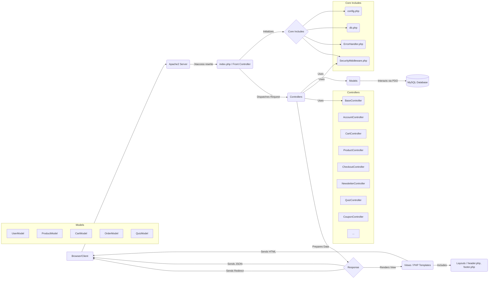
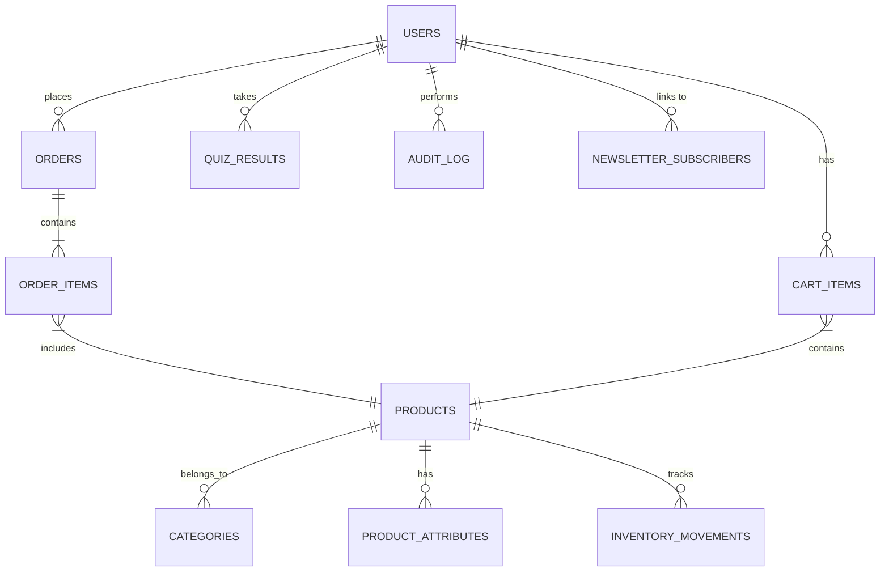

# 🌿 The Scent - Premium Aromatherapy E-commerce Platform (v2.0)

Welcome to **The Scent**, a modern, full-featured, and beautifully crafted e-commerce platform built to showcase and sell premium natural aromatherapy products. This project is designed from the ground up for extensibility, security, and seamless user experience, featuring a custom MVC-inspired PHP architecture.

> 🧘 “Find your moment of calm” – Discover your perfect scent and enhance your well-being.

---

## 🚀 Live Demo

[🌐 **Click here to view the demo**](#) *(Placeholder - Add Your Live Demo Link Here)*

---

## ✨ Current Status (v2.0)

*   ✅ **Core Functionality:** Product Browsing, Add-to-Cart (AJAX), Cart Management (AJAX), User Login/Registration (AJAX), Password Reset, Profile Update, Scent Quiz.
*   ✅ **Key Fixes:** Resolved fatal errors in `AccountController` and `CheckoutController`. Updated `User` model to align with controller requirements. Database schema patched for `users` table. Checkout page now loads correctly.
*   ⚠️ **Known Issues/TODOs:**
    *   `User::getAddress()` implemented as a placeholder; address pre-filling in checkout requires full implementation using new DB fields.
    *   Cart storage uses Session for guests and potentially DB for logged-in users (inconsistency requires standardization).
    *   Requires full Payment Gateway integration to complete checkout.
    *   Rate limiting usage needs standardization.
    *   Error handling for "Headers Already Sent" needs refinement.
    *   Content Security Policy (CSP) needs review/tightening.

---

## 🔖 Badges


---

## 📚 Table of Contents

1.  [🌟 Introduction](#-introduction)
2.  [🎯 Features](#-features)
3.  [🖼️ Screenshots](#-screenshots)
4.  [🧱 Architecture](#-system-architecture)
5.  [⚙️ Technology Stack](#-technology-stack)
6.  [📁 Folder Structure](#-folder-structure)
7.  [🗃️ Database Schema](#-database-schema)
8.  [📦 Installation Instructions](#-installation-instructions)
9.  [🚀 Deployment Guide Summary](#-deployment-guide-summary)
10. [🧪 Scent Finder Quiz](#-scent-finder-quiz)
11. [🛡️ Security Best Practices](#-security-best-practices)
12. [🔧 Customization & Extensibility](#-customization--extensibility)
13. [🤝 Contributing](#-contributing)
14. [📄 License](#-license)
15. [🙏 Credits](#-credits)
16. [📎 Appendix](#-appendix)

---

## 🌟 Introduction

**The Scent** is more than just an e-commerce platform — it’s an experience. Built specifically to support the sale and recommendation of **premium aromatherapy products**, the platform integrates:

*   A clean, modern, responsive UI/UX powered by Tailwind CSS and subtle animations (AOS.js, Particles.js).
*   Personalized shopping via an interactive scent finder quiz.
*   Dynamic product catalog with categories, filtering, sorting, and featured collections.
*   A functional shopping cart with AJAX updates and a modern UI.
*   Secure user authentication (Login/Registration/Password Reset/Profile) with robust validation.
*   A modular PHP codebase (MVC-inspired) for easy customization and future growth.

Designed for extensibility, performance, and user-centric experience, The Scent provides a solid foundation for wellness or natural product businesses. This README reflects the current state (**v2.0**), including recent critical fixes ensuring core authentication and checkout page loading function correctly.

---

## 🎯 Features

### 🛍️ Core E-commerce
*   ✅ **Modern Landing Page:** Engaging design with video background, particle effects, and scroll animations.
*   ✅ **Product Catalog:** Browse products with category filtering, sorting (name, price), price range filtering, and basic search.
*   ✅ **Product List Pagination:** Navigate through multiple pages of products seamlessly.
*   ✅ **Product Detail Pages:** Rich content including image gallery, descriptions, attributes, benefits, ingredients, usage instructions, and related products.
*   ✅ **AJAX Add-to-Cart:** Add items from Home, Product List, and Detail pages without page reloads.
*   ✅ **Functional Cart Page:** Updated grid layout, supports AJAX quantity updates and item removal.
*   ✅ **Mini-Cart:** Header dropdown showing cart contents, updated via AJAX.
*   ✅ **Stock Validation:** Checks availability during Add-to-Cart and before Checkout.
*   ✅ **Responsive Design:** Adapts to various screen sizes.

### 🔐 User Management
*   ✅ **User Authentication:** Functional Login and Registration (AJAX-based, secure password handling).
*   ✅ **Password Reset System:** Functional "Forgot Password" email flow and token-based password reset.
*   ✅ **User Profile Management:** View and update name, email, password, and newsletter preferences.
*   ✅ **Order History:** View past orders and details (requires completed checkout flow).

### ✨ Personalization
*   ✅ **Scent Finder Quiz:** Interactive quiz to guide users to suitable products.
*   ✅ **Product Recommendations:** Displays relevant products based on quiz results or related items.

### 🛒 Shopping Experience
*   ✅ **Checkout Process:** Requires login, collects shipping info. Loads correctly. (*Payment gateway integration needed for completion*).
*   ✅ **Order Confirmation Page:** Displays details after successful order placement (*requires payment flow completion*).

### 💼 Business Features *(Partially Implemented / Extensible)*
*   **Inventory Management:** Basic stock tracking fields and controller logic exist.
*   **Tax System:** Basic tax calculation logic via `TaxController`.
*   **Coupon System:** Basic admin CRUD interface and validation logic exist (`CouponController`). Integration into checkout needed for application.
*   **Email Notifications:** Functional system (`EmailService`) for Welcome, Password Reset, Order Confirmation (post-payment), Shipping Updates. Requires SMTP configuration.

### 👑 Admin Features *(Modular, Basic)*
*   ✅ Requires 'admin' role. Basic RBAC checks in place.
*   ✅ **Quiz Analytics:** View basic quiz statistics.
*   ✅ **Coupon Management:** Basic CRUD interface functional.
*   *Further admin panels (Products, Orders, Users) require development.*

---

## 🖼️ Screenshots

> 📸 *Please add screenshots of the application here!*

*   *Landing Page:* `[Insert Screenshot: views/home.php]`
*   *Product List:* `[Insert Screenshot: views/products.php]`
*   *Product Detail:* `[Insert Screenshot: views/product_detail.php]`
*   *Cart Page (Updated UI):* `[Insert Screenshot: views/cart.php]`
*   *Login Page:* `[Insert Screenshot: views/login.php]`
*   *Register Page:* `[Insert Screenshot: views/register.php]`
*   *Checkout Page:* `[Insert Screenshot: views/checkout.php]`
*   *Admin Coupons:* `[Insert Screenshot: views/admin/coupons.php]`

---

## 🧱 System Architecture

**Custom MVC-Inspired Modular PHP Architecture:**



*   **`index.php`:** Central entry point, handles routing via a `switch` statement, includes core files, performs global CSRF validation on POST requests, and dispatches to the appropriate controller.
*   **`Controllers`:** Handle incoming requests, interact with Models for data, perform business logic, and select the appropriate View or response type (JSON, redirect). Extend `BaseController` for shared functionality (DB access, helpers, security checks).
*   **`Models`:** Encapsulate database interaction logic using **PDO Prepared Statements** for security. The `User` model has been updated to meet `AccountController` requirements.
*   **`Views`:** Render the HTML output using PHP for dynamic data. Include layout partials (`header.php`, `footer.php`). Must output CSRF tokens correctly for forms/AJAX using `<input type="hidden" id="csrf-token-value" ...>`.
*   **`Includes`:** Core utilities like database connection (`db.php`), authentication helpers (`auth.php`), security features (`SecurityMiddleware.php`), and error handling (`ErrorHandler.php`).
*   **`config.php`:** Stores database credentials, security settings, API keys, and application constants.

---

## ⚙️ Technology Stack

| Layer            | Technology                                                                                                | Notes                                                              |
| :--------------- | :-------------------------------------------------------------------------------------------------------- | :----------------------------------------------------------------- |
| Frontend         | HTML5, Tailwind CSS (CDN), Custom CSS (`css/style.css`), JavaScript (Vanilla), Font Awesome 6 (CDN)           | Uses AOS.js & Particles.js for animations.                         |
| Backend          | PHP 8.0+                                                                                                  | Core logic, MVC-inspired structure.                              |
| Web Server       | Apache 2.4+                                                                                               | Requires `mod_rewrite`.                                            |
| Database         | MySQL 5.7+ / 8.0+ (or MariaDB equivalent)                                                                   | Schema requires patching for `users` table (see Installation). |
| Server-Side Libs | PDO                                                                                                       | For secure database access (Prepared Statements).                |
| Optional         | Composer                                                                                                  | Recommended for future dependency management & autoloading.        |
|                  | APCu                                                                                                      | Used by the rate limiting mechanism (if enabled and configured). |

---

## 📁 Folder Structure

```
/the-scent-project-root/
├── index.php             # ✅ Main entry/routing script
├── config.php            # ✅ DB, Security, App configuration
├── css/                  # ✅ Custom CSS (style.css)
├── images/               # ✅ Product, hero, UI images
├── videos/               # ✅ Hero background video(s)
├── particles.json        # ✅ Particles.js settings
├── .htaccess             # ✅ URL rewriting & security
├── includes/             # ✅ Shared PHP core scripts
│   ├── auth.php          #    Authentication helpers
│   ├── db.php            #    Database connection ($pdo global scope)
│   ├── SecurityMiddleware.php # Validation, CSRF, Headers, Session setup
│   ├── ErrorHandler.php  #    Global error handling
│   └── EmailService.php  #    Email sending logic
├── controllers/          # ✅ Business logic controllers
│   ├── BaseController.php#    Abstract base class
│   ├── AccountController.php # User auth, profile (Functional)
│   ├── ProductController.php # Product listing/detail (Pagination OK)
│   ├── CartController.php    # Cart logic, AJAX handlers
│   ├── QuizController.php    # Quiz logic
│   ├── CheckoutController.php # Checkout process (Loads)
│   ├── CouponController.php  # Coupon admin logic
│   ├── NewsletterController.php # Newsletter subscription
│   └── ... (Inventory, Payment, Tax - controllers exist)
├── models/               # ✅ Database interaction models (using PDO)
│   ├── Product.php       # Product data access (Pagination OK)
│   ├── Cart.php          # DB Cart logic
│   ├── User.php          # ✅ User data access (Updated)
│   ├── Order.php         # Order data access (Compatible)
│   └── Quiz.php          # Quiz data access (Compatible)
├── views/                # ✅ HTML/PHP templates
│   ├── home.php, products.php, product_detail.php, cart.php, checkout.php, ... # Page views
│   ├── account/            #    User account specific views
│   ├── admin/            #    Admin-specific views
│   └── layout/           #    Reusable layout partials (header, footer)
├── logs/                 # ✅ Log files directory (requires write permissions)
├── db/                   # ✅ Database schema & patches
│   ├── the_scent_schema.sql.txt # Base schema definition
│   └── the_scent_update_users_table.sql # REQUIRED patch for 'users' table
├── js/                   # ✅ Custom JavaScript
│   └── main.js           # Global handlers (AJAX, UI), page initializers
├── README.md             # ✅ Project documentation (This file, v2.0)
├── technical_design_specification.md # ✅ Detailed technical docs (v11.0)
└── LICENSE               # ✅ MIT License file (Assumed)
```

---

## 🗃️ Database Schema

*   The base schema is defined in [`db/the_scent_schema.sql.txt`](db/the_scent_schema.sql.txt).
*   **IMPORTANT:** Apply the patch script [`db/the_scent_update_users_table.sql`](#) *(Placeholder: add link if file is separate)* to update the `users` table with necessary columns for status, newsletter preferences, password reset, address fields, and timestamps.
*   **Key Tables:** `users` (updated), `products`, `categories`, `orders`, `order_items`, `cart_items`, `quiz_results`, `newsletter_subscribers`, `audit_log`.
*   **Note on Addresses:** Address fields (`address_line1`, `city`, etc.) have been added directly to the `users` table for simplicity. A separate `user_addresses` table might be better for scalability. The `User::getAddress()` method currently returns `null` and requires implementation.

### 🔑 ER Diagram (Simplified)
*(Reflects relationships, not all new `users` fields)*



---

## 📦 Installation Instructions

### Prerequisites
*   Web Server: Apache 2.4+ with `mod_rewrite` enabled.
*   PHP: 8.0 or higher.
*   Required PHP Extensions: `pdo_mysql`, `mbstring`, `openssl`, `json`, `session`, `fileinfo`.
*   Database: MySQL 5.7+ / 8.0+ or MariaDB equivalent.
*   Optional: `apcu` extension for rate limiting.

### Steps
1.  **Clone Repository:** `git clone <your-repo-url> the-scent && cd the-scent`
2.  **Database Setup:**
    *   Create database & user (adjust credentials as needed):
        ```sql
        CREATE DATABASE the_scent CHARACTER SET utf8mb4 COLLATE utf8mb4_unicode_ci;
        CREATE USER 'scent_user'@'localhost' IDENTIFIED BY 'YOUR_STRONG_PASSWORD';
        GRANT ALL PRIVILEGES ON the_scent.* TO 'scent_user'@'localhost';
        FLUSH PRIVILEGES;
        ```
    *   Import the **base schema**:
        ```bash
        mysql -u scent_user -p the_scent < db/the_scent_schema.sql.txt
        ```
    *   **Apply the `users` table update patch:**
        ```bash
        mysql -u scent_user -p the_scent < db/the_scent_update_users_table.sql
        # Enter YOUR_STRONG_PASSWORD when prompted for both commands
        ```
3.  **Configuration:**
    *   Edit `config.php`: Set `DB_HOST`, `DB_NAME`, `DB_USER`, `DB_PASS`. Review `BASE_URL`. Configure `SMTP_*` constants if needed.
4.  **File Permissions:**
    *   Ensure web server user (e.g., `www-data`) has write access to `logs/`:
        ```bash
        mkdir -p logs
        sudo chown www-data:www-data logs # Adjust user/group
        sudo chmod 750 logs
        ```
    *   Restrict access to `config.php`: `sudo chmod 640 config.php`
5.  **Apache Configuration:**
    *   Set up Virtual Host pointing `DocumentRoot` to the project root.
    *   Ensure `AllowOverride All` is set for the directory.
    *   Enable `mod_rewrite`: `sudo a2enmod rewrite`
    *   Restart Apache: `sudo systemctl restart apache2`
6.  **Access Site:** Browse to your configured URL (e.g., `http://the-scent.local`).

---

## 🚀 Deployment Guide Summary

*(Standard deployment process - Key points)*

1.  Transfer files (Git, rsync).
2.  Set up production DB, import schema, **apply `users` table patch**.
3.  Use secure production credentials in `config.php` (consider `.env` files). Set `ENVIRONMENT` to `production`.
4.  Set strict file permissions. Ensure `logs/` is writable.
5.  Configure production web server (Apache/Nginx).
6.  **Enable HTTPS** (Let's Encrypt or other cert). Force HTTPS.
7.  Keep server software updated.
8.  Enable PHP OPcache.
9.  Test thoroughly.

---

## 🧪 Scent Finder Quiz

*(No changes - Functionality remains)*

*   **Flow:** User answers mood-based questions (`views/quiz.php`) -> POST -> `QuizController::processQuiz` -> Display results (`views/quiz_results.php`).
*   **Logic:** Maps answers to product attributes, fetches recommendations.
*   **Persistence:** Results can be saved for logged-in users (`quiz_results` table).

---

## 🛡️ Security Best Practices Implemented

*   ✅ **Input/Output Handling:** Validation (`SecurityMiddleware::validateInput`), Output Escaping (`htmlspecialchars()`).
*   ✅ **SQL Injection Prevention:** **PDO Prepared Statements** used exclusively.
*   ✅ **CSRF Protection:** Synchronizer Token Pattern implemented and enforced globally on POST requests. JS relies on `#csrf-token-value`.
*   ✅ **Authentication & Authorization:** Secure password hashing, Role checks (`isAdmin`, `requireAdmin`).
*   ✅ **Session Management:** Secure cookie flags, Session ID regeneration, Session integrity checks (IP/User Agent binding).
*   ✅ **Security Headers:** Standard headers applied (X-Frame-Options, X-Content-Type-Options, CSP, etc.). **CSP needs review.**
*   ✅ **Error Handling:** Global handlers, sensitive details suppressed in production. **"Headers Already Sent" fix recommended.**
*   ⚠️ **Rate Limiting:** Mechanism exists, **implementation needs standardization**. Relies on APCu.
*   ✅ **Audit Logging:** Key security/user events logged.

---

## 🔧 Customization & Extensibility

*   **Adding Products/Categories:** Update database, ensure `image` paths are correct. Admin UI is basic.
*   **Adding Pages/Features:** Create Controller (extend `BaseController`), View(s), Model(s). Add route in `index.php`. Implement CSRF token pattern for POST actions.
*   **Customizing Appearance:** Modify Tailwind classes or `css/style.css`.

---

## 🤝 Contributing

*(Standard contribution guidelines - Add specific links if available)*

*   **Code Standards:** PSR-12 PHP standards. Semantic HTML. Tailwind preferred.
*   **Branching:** Use feature/bugfix branches.
*   **Commits:** Clear, concise messages.
*   **Pull Requests:** Provide clear descriptions. Ensure functionality isn't broken.
*   **Issues:** Report bugs/features via the project's Issue Tracker `[Link to Issues]`.

---

## 📄 License

Distributed under the **MIT License**. See the `LICENSE` file for details (assuming MIT).

---

## 🙏 Credits

*   **Libraries:** Tailwind CSS, AOS.js, Particles.js, Font Awesome
*   **Core Technologies:** PHP, MySQL, Apache
*   **Inspiration/Assistance:** Stack Overflow, PHP & MySQL Communities, OpenAI's GPT
*   **Imagery:** Placeholder images. *Attribute specific sources if known.*

---

## 📎 Appendix

### 📘 Related Documentation
*   [`technical_design_specification.md`](./technical_design_specification.md) (**v11.0** - Detailed technical overview)
*   [`db/the_scent_schema.sql.txt`](db/the_scent_schema.sql.txt) (Base DB Schema)
*   [`db/the_scent_update_users_table.sql`](#) (Users Table Patch - *Placeholder: Add Link*)

### ✅ Key Functionality Status Checklist
*   [✅] User Registration & Login/Logout
*   [✅] Password Reset Flow
*   [✅] User Profile View & Update (Name, Email, Password, Newsletter Pref)
*   [✅] Product Listing & Pagination
*   [✅] Product Filtering (Category, Price Range) & Sorting
*   [✅] Product Detail View
*   [✅] Add to Cart (AJAX - Home, List, Detail)
*   [✅] Cart Page View (Updated UI)
*   [✅] Cart Item Quantity Update / Removal (AJAX)
*   [✅] Checkout Page Load (Requires Login)
*   [✅] Scent Quiz & Results Display
*   [✅] Newsletter Signup (AJAX)
*   [✅] Basic Admin Coupon Management UI
*   [✅] Basic Admin Quiz Analytics UI
*   [🚧] Checkout Process Completion (*Requires Payment Gateway*)
*   [🚧] Order Confirmation Display (*Requires Completed Checkout*)
*   [🚧] User Address Pre-filling in Checkout (*Requires `User::getAddress` implementation*)

### 🔮 Future Enhancements / Recommendations (Prioritized)
1.  Implement `User::getAddress()` & Checkout Address Pre-filling (**High Priority**)
2.  Standardize Rate Limiting (**High Priority - Security**)
3.  Standardize Database Cart Storage (**High Priority - Consistency**)
4.  Payment Gateway Integration (Stripe/Other) (**High Priority - Core Feature**)
5.  Tighten Content Security Policy (CSP) (**Medium Priority - Security**)
6.  Fix "Headers Already Sent" Error Handling (**Medium Priority - Stability**)
7.  Refactor/Code Quality (Composer, Autoloader, Routing, Templating, .env, Migrations, Tests) (**Ongoing/Future**)
8.  Full Admin Panel Development (**Future**)
9.  Advanced Features (Search, Reviews, Wishlists) (**Future**)
10. Remove Dead Code (`preventSQLInjection`) (**Low Priority**)

---

## 📫 Contact

*   Project Maintainer/Support: `[Your Name/Email or GitHub Profile]`
*   GitHub Issues: `[Link to Project Issues Page]`

---

Built with ❤️ for aromatherapy enthusiasts.
