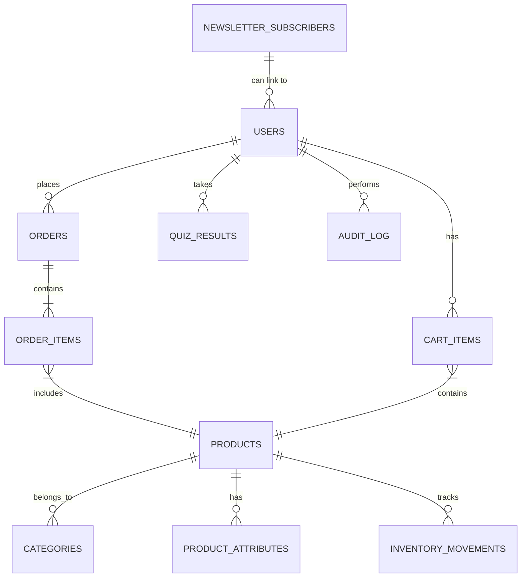

# 🌿 The Scent - Premium Aromatherapy E-commerce Platform (v1.0)

Welcome to **The Scent**, a modern, full-featured, and beautifully crafted e-commerce platform built to showcase and sell premium natural aromatherapy products. This project is designed from the ground up for extensibility, security, and seamless user experience, featuring a custom MVC-inspired PHP architecture.

> 🧘 “Find your moment of calm” – Discover your perfect scent and enhance your well-being.

---

## 🚀 Live Demo

[🌐 Click here to view the demo](#) *(Placeholder - Link Coming Soon)*

---

## 🔖 Badges


---

## 📚 Table of Contents

1.  [🌟 Introduction](#-introduction)
2.  [🎯 Features](#-features)
3.  [🖼️ Screenshots](#-screenshots)
4.  [🧱 Architecture](#-system-architecture)
5.  [⚙️ Technology Stack](#-technology-stack)
6.  [📁 Folder Structure](#-folder-structure)
7.  [🗃️ Database Schema](#-database-schema)
8.  [📦 Installation Instructions](#-installation-instructions)
9.  [🚀 Deployment Guide Summary](#-deployment-guide-summary)
10. [🧪 Scent Finder Quiz](#-scent-finder-quiz)
11. [🛡️ Security Best Practices](#-security-best-practices)
12. [🔧 Customization & Extensibility](#-customization--extensibility)
13. [🤝 Contributing](#-contributing)
14. [📄 License](#-license)
15. [🙏 Credits](#-credits)
16. [📎 Appendix](#-appendix)

---

## 🌟 Introduction

**The Scent** is more than just an e-commerce platform — it’s an experience. Built specifically to support the sale and recommendation of **premium aromatherapy products**, the platform integrates:

*   A clean, modern, responsive UI/UX powered by Tailwind CSS and subtle animations.
*   Personalized shopping via an interactive scent finder quiz.
*   Dynamic product catalog with categories, filtering, sorting, and featured collections.
*   A functional shopping cart with AJAX updates and a modern UI.
*   Secure user authentication and password management.
*   A modular PHP codebase (MVC-inspired) for easy customization and future growth.

Designed for extensibility, performance, and user-centric experience, The Scent is a robust foundation for wellness or natural product businesses. This README reflects the current state, including recent fixes and confirmations of core functionality.

---

## 🎯 Features

### 🛍️ Core E-commerce
*   **Modern Landing Page:** Featuring video background, particle effects (Particles.js), and smooth scroll animations (AOS.js).
*   **Product Catalog:** Displays products with filtering by category, sorting (name, price), price range filtering, and search.
*   **Product List Pagination:** Functional pagination allows browsing through multiple pages of products.
*   **Product Detail Pages:** Includes image gallery, detailed descriptions, product attributes (size, scent profile, etc.), benefits, ingredients, usage instructions, and related products.
*   **Personalized Scent Finder Quiz:** Guides users to suitable products based on preferences.
*   **Product Recommendations:** Displays relevant products based on quiz results or related items.
*   **Responsive Design:** Fully mobile-friendly interface.
*   **AJAX-powered Add-to-Cart:** Seamlessly add items from Home, Product List, and Product Detail pages without full page reloads.
*   **AJAX Newsletter Signup:** Functional signup forms in the main content and footer.

### 🔐 User Management
*   **User Authentication:** Functional Login and Registration system (AJAX-based).
*   **Password Reset System:** Functional "Forgot Password" and token-based password reset flow.
*   **User Profile Management:** Basic structure for viewing profile information (`views/account_profile.php`). Profile update functionality implemented.
*   **Order History & Tracking:** Basic structure for viewing past orders (`views/account_orders.php`, `views/account_order_details.php`).

### 🛒 Shopping Experience
*   **Functional Shopping Cart Page:** Displays items with an updated grid layout (`views/cart.php`). Supports AJAX updates for quantity and item removal.
*   **Mini-Cart:** Header dropdown showing current cart contents, updated via AJAX.
*   **Stock Validation:** Checks availability during Add-to-Cart and before Checkout processing.
*   **Price Calculations:** Subtotals and totals displayed in cart and checkout.
*   **Secure Checkout Process:** Requires user login. Collects shipping information. (Payment gateway integration needed for completion).
*   **Order Confirmation Page:** Displays details after successful order placement (requires payment flow completion).

### 💼 Business Features *(partially implemented / extensible)*
*   **Inventory Management:** Basic stock tracking (`stock_quantity`, `low_stock_threshold`, `backorder_allowed` fields in `products` table). `InventoryController` exists for stock updates.
*   **Tax System:** Basic tax calculation logic available via `TaxController`. Example usage in `CheckoutController`.
*   **Coupon System:** Controller (`CouponController`) and admin view (`views/admin/coupons.php`) exist, providing basic CRUD functionality. Integration into checkout flow needed.

### 📧 Communication
*   **Email Notification System:** Implemented via `EmailService.php`. Sends emails for password resets, welcome messages, order confirmations (requires successful payment), and shipping updates (requires admin action). Requires SMTP configuration in `config.php`.

### 👑 Admin Features *(modular, basic implementation)*
*   Requires 'admin' user role. Basic security checks in place.
*   **Quiz Analytics:** View quiz statistics and popular preferences (`views/admin/quiz_analytics.php`).
*   **Coupon Management:** Create, edit, activate/deactivate, and delete coupons (`views/admin/coupons.php`).
*   Basic views/controllers exist for managing products, orders, and users (requires further development for full CRUD).

---

## 🖼️ Screenshots

> 📸 *Screenshots Placeholder: Add relevant screenshots here or link to a folder.*

| Page            | Screenshot Placeholder        |
| :-------------- | :---------------------------- |
| Landing Page    | `[Image: Home Page]`          |
| Product Details | `[Image: Product Detail]`     |
| Product List    | `[Image: Product List]`       |
| Cart Page       | `[Image: Cart Page (New UI)]` |
| Login Page      | `[Image: Login Page]`         |
| Quiz Intro      | `[Image: Quiz Intro]`         |
| Quiz Results    | `[Image: Quiz Results]`       |
| Admin Coupons   | `[Image: Admin Coupons]`      |

---

## 🧱 System Architecture

**Custom MVC-Inspired Modular PHP Architecture:**


*   **`index.php`:** Central entry point, handles routing via a `switch` statement, includes core files, performs global CSRF validation on POST requests, and dispatches to the appropriate controller.
*   **`Controllers`:** Handle incoming requests, interact with Models for data, perform business logic, and select the appropriate View or response type (JSON, redirect). Extend `BaseController` for shared functionality.
*   **`Models`:** Encapsulate database interaction logic using PDO Prepared Statements for security.
*   **`Views`:** Render the HTML output using PHP for dynamic data. Include layout partials. Must output CSRF tokens correctly for forms/AJAX.
*   **`Includes`:** Core utilities like database connection setup (`db.php`), authentication helpers (`auth.php`), security features (`SecurityMiddleware.php`), and error handling (`ErrorHandler.php`).
*   **`config.php`:** Stores database credentials, security settings (headers, session parameters, rate limits), API keys, and application constants.

---

## ⚙️ Technology Stack

| Layer            | Technology                                                                                                | Notes                                                              |
| :--------------- | :-------------------------------------------------------------------------------------------------------- | :----------------------------------------------------------------- |
| Frontend         | HTML5, Tailwind CSS (CDN), Custom CSS (`css/style.css`), JavaScript (Vanilla), Font Awesome 6 (CDN)           | Uses AOS.js & Particles.js for animations.                         |
| Backend          | PHP 8.0+                                                                                                  | Core logic, MVC-inspired structure.                              |
| Web Server       | Apache 2.4+                                                                                               | Requires `mod_rewrite`.                                            |
| Database         | MySQL 5.7+ / 8.0+ (or MariaDB equivalent)                                                                   |                                                                    |
| Server-Side Libs | PDO                                                                                                       | For secure database access (Prepared Statements).                |
| Optional         | Composer                                                                                                  | Recommended for future dependency management & autoloading.        |
|                  | APCu                                                                                                      | Used by the rate limiting mechanism (if enabled and configured). |

---

## 📁 Folder Structure

```
/the-scent-project-root/
├── index.php             # ✅ Main entry/routing script
├── config.php            # ✅ DB, Security, App configuration
├── css/                  # ✅ Custom CSS (style.css)
├── images/               # ✅ Product, hero, UI images (product images assumed under products/)
├── videos/               # ✅ Hero background video(s)
├── particles.json        # ✅ Particles.js settings
├── .htaccess             # ✅ URL rewriting & security
├── includes/             # ✅ Shared PHP core scripts
│   ├── auth.php          #    Authentication helpers (isLoggedIn, isAdmin)
│   ├── db.php            #    Database connection ($pdo global scope)
│   ├── SecurityMiddleware.php # Validation, CSRF, Headers, Session setup
│   ├── ErrorHandler.php  #    Global error handling
│   └── EmailService.php  #    Email sending logic
├── controllers/          # ✅ Business logic controllers
│   ├── BaseController.php#    Abstract base class for controllers
│   ├── AccountController.php # User auth, profile (FIXED)
│   ├── ProductController.php # Product listing/detail (Pagination OK)
│   ├── CartController.php    # Cart logic, AJAX handlers
│   ├── QuizController.php    # Quiz logic, recommendations
│   ├── CheckoutController.php # Checkout process
│   ├── CouponController.php  # Coupon admin logic
│   ├── NewsletterController.php # Newsletter subscription
│   └── ... (Inventory, Payment, Tax - controllers exist)
├── models/               # ✅ Database interaction models (using PDO)
│   ├── Product.php       # Product data access (Pagination OK)
│   ├── Cart.php          # DB Cart logic (used alongside Session)
│   ├── User.php          # User data access
│   ├── Order.php         # Order data access
│   └── Quiz.php          # Quiz data access
├── views/                # ✅ HTML/PHP templates
│   ├── home.php          # Landing page
│   ├── products.php      # Product list (Pagination OK)
│   ├── product_detail.php# Single product view
│   ├── cart.php          # Cart view (Functional, New UI)
│   ├── login.php         # Login form (Functional)
│   ├── register.php      # Registration form (Functional)
│   ├── checkout.php      # Checkout form
│   ├── quiz.php, quiz_results.php # Quiz pages
│   ├── account_*.php     # User account pages (dashboard, profile, orders)
│   ├── admin/            #    Admin-specific views (coupons, quiz_analytics)
│   └── layout/           #    Reusable layout partials
│       ├── header.php      #    Site header, navigation
│       └── footer.php      #    Site footer, JS includes
├── logs/                 # ✅ Log files directory (requires write permissions)
│   ├── security.log
│   ├── error.log
│   └── audit.log
├── db/                   # ✅ Database schema file
│   └── the_scent_schema.sql.txt # Current schema definition
├── js/                   # ✅ Custom JavaScript
│   └── main.js           # Global handlers (AJAX, UI), page initializers
├── README.md             # ✅ Project documentation (This file)
├── technical_design_specification.md # ✅ Detailed technical docs (v10.0)
└── LICENSE               # ✅ MIT License file (Assumed)
```

---

## 🗃️ Database Schema

### ➕ Core Tables

*   `users`: Stores user credentials, roles, and basic info.
*   `products`: Main product catalog, including descriptions, pricing, stock levels, images, and JSON fields for `gallery_images` and `benefits`.
*   `categories`: Product categories.
*   `orders`, `order_items`: Standard order structure.
*   `cart_items`: Database storage for cart items (primarily intended for logged-in users).
*   `quiz_results`: Stores user responses and recommendations from the scent quiz.
*   `newsletter_subscribers`: Manages newsletter subscriptions.
*   `audit_log`: Tracks significant system and user actions for security and monitoring.
*   `product_attributes`: (Optional JOIN alternative) Stores structured attributes like scent type, mood effect.
*   `inventory_movements`: Tracks stock changes.

### 🔑 ER Diagram (Simplified)



See [`db/the_scent_schema.sql.txt`](db/the_scent_schema.sql.txt) for the full schema details.
**Note on Cart Implementation:** The application uses a hybrid approach. `$_SESSION['cart']` is used for guest carts, while `models/Cart.php` and the `cart_items` table handle database interactions, typically for logged-in users and merging carts on login. Standardizing this is recommended (See Future Enhancements).

---

## 📦 Installation Instructions

### Prerequisites
*   Web Server: Apache 2.4+ with `mod_rewrite` enabled.
*   PHP: 8.0 or higher.
*   Required PHP Extensions: `pdo_mysql`, `mbstring`, `openssl`, `json`, `session`, `fileinfo`. (Check `phpinfo()` or `php -m`).
*   Database: MySQL 5.7+ / 8.0+ or MariaDB equivalent.
*   Optional: `apcu` extension for rate limiting (if enabled).

### Steps
1.  **Clone the Repository:**
    ```bash
    git clone <your-repo-url> the-scent
    cd the-scent
    ```
2.  **Database Setup:**
    *   Create the database and user:
        ```sql
        CREATE DATABASE the_scent CHARACTER SET utf8mb4 COLLATE utf8mb4_unicode_ci;
        CREATE USER 'scent_user'@'localhost' IDENTIFIED BY 'YOUR_STRONG_PASSWORD'; -- Replace password
        GRANT ALL PRIVILEGES ON the_scent.* TO 'scent_user'@'localhost';
        FLUSH PRIVILEGES;
        ```
    *   Import the schema:
        ```bash
        mysql -u scent_user -p the_scent < db/the_scent_schema.sql.txt
        # Enter YOUR_STRONG_PASSWORD when prompted
        ```
3.  **Configuration:**
    *   Copy or rename `config.php.example` to `config.php` (if an example file exists, otherwise edit directly).
    *   Edit `config.php`:
        *   Set `DB_HOST`, `DB_NAME`, `DB_USER`, `DB_PASS` with your database details.
        *   Review `BASE_URL` and ensure it matches your setup (e.g., `/` for root, `/the-scent/` if in a subdirectory).
        *   Configure `SMTP_*` constants if email sending is required.
        *   Review security settings (CSP, rate limits, etc.).
4.  **File Permissions:**
    *   Ensure the web server user (e.g., `www-data` on Debian/Ubuntu, `apache` on CentOS) has write access to the `logs/` directory:
        ```bash
        mkdir -p logs
        sudo chown www-data:www-data logs # Adjust user/group if needed
        sudo chmod 750 logs
        ```
    *   Restrict access to `config.php`:
        ```bash
        sudo chmod 640 config.php
        # Optional: Change group ownership if different from web server
        # sudo chgrp www-data config.php
        ```
5.  **Apache Configuration:**
    *   Set up an Apache Virtual Host pointing its `DocumentRoot` to the project's root directory (where `index.php` resides).
    *   Ensure `AllowOverride All` is set for the directory to enable `.htaccess`.
    *   Enable `mod_rewrite`: `sudo a2enmod rewrite`
    *   Restart Apache: `sudo systemctl restart apache2`
6.  **(Self-Correction Check)**: Verify the `AccountController.php` fix is applied (the line `private EmailService $emailService;` should be removed).
7.  **Access the Site:** Browse to the URL configured in your Virtual Host (e.g., `http://the-scent.local`).

---

## 🚀 Deployment Guide Summary

*(See [`deployment_guide.md`](deployment_guide.md) if available for full details)*

1.  **Transfer Files:** Use `git clone`, `rsync`, or SCP to transfer the project files to the production server.
2.  **Database:** Set up the production database, user, and import the schema. Use strong, unique credentials.
3.  **Configure `config.php`:** Use production DB credentials. Set `ENVIRONMENT` to `'production'`. Configure SMTP, API keys. **Strongly consider using environment variables or a `.env` file outside the web root for sensitive credentials instead of hardcoding in `config.php`.**
4.  **Permissions:** Set production file permissions (restrict write access where possible, ensure `logs/` is writable by the web server).
5.  **Web Server:** Configure Apache/Nginx Virtual Host for the production domain. Ensure `AllowOverride All` (Apache) or equivalent rewrite rules (Nginx) are active.
6.  **Security:**
    *   **Enable HTTPS:** Obtain and configure an SSL/TLS certificate (e.g., Let's Encrypt). Force HTTPS redirection.
    *   Review firewall settings.
    *   Keep server software (OS, PHP, Apache, MySQL) updated.
7.  **Caching:** Configure PHP OPcache for performance. Consider APCu for rate limiting or object caching if beneficial.
8.  **Testing:** Thoroughly test all functionality in the production environment.

---

## 🧪 Scent Finder Quiz

The scent quiz helps users discover personalized product recommendations.

*   **Flow:** User answers mood-based questions on `/index.php?page=quiz` (`views/quiz.php`). Submission POSTs to `index.php?page=quiz&action=submit`, handled by `QuizController::processQuiz`. Results and recommendations are displayed on `/index.php?page=quiz&action=results` (`views/quiz_results.php`).
*   **Logic:** `QuizController` maps answers to product attributes (stored potentially in `product_attributes` or inferred from product data) and fetches suitable recommendations using `models/Product.php`.
*   **Persistence:** Quiz results can optionally be stored for logged-in users in the `quiz_results` table.

---

## 🛡️ Security Best Practices Implemented

Security is a core consideration. Key measures include:

*   **Input/Output Handling:** Input validation via `SecurityMiddleware::validateInput`. Output escaping via `htmlspecialchars()` in views (XSS prevention).
*   **SQL Injection Prevention:** Consistent use of **PDO Prepared Statements** in all database interactions.
*   **CSRF Protection:** Fully implemented Synchronizer Token Pattern. Tokens generated per session, validated on **all** POST requests globally in `index.php`. AJAX relies on reading the token from the `#csrf-token-value` hidden input.
*   **Authentication & Authorization:** Secure password hashing (`password_hash`/`verify`). Role-based access control checks (`isAdmin()`, `requireLogin()`, `requireAdmin()`).
*   **Session Management:** Secure cookie flags (HttpOnly, Secure, SameSite=Lax). Session ID regeneration implemented. Session integrity checks (User Agent, IP Address binding).
*   **Security Headers:** Headers like `X-Frame-Options`, `X-Content-Type-Options`, `Referrer-Policy`, and a basic `Content-Security-Policy` are applied via `SecurityMiddleware` (configurable in `config.php`). **CSP requires review and tightening.**
*   **Error Handling:** Global error/exception handling via `ErrorHandler.php`. Errors logged, sensitive details suppressed in production views. **"Headers Already Sent" issue needs fix.**
*   **Rate Limiting:** Basic mechanism available via `BaseController::validateRateLimit` (uses APCu). **Implementation is inconsistent; requires standardization across critical endpoints.**
*   **Audit Logging:** Key security events and user actions are logged to `logs/audit.log` and `logs/security.log` via `BaseController` helpers.

---

## 🔧 Customization & Extensibility

*   **Adding Products/Categories:** Modify the database directly or build Admin UI features. Ensure `image` paths are correct and required fields are populated.
*   **Adding Pages/Features:** Create new Controller (extending `BaseController`), View(s), and Model(s) as needed. Add a route (`case`) in `index.php`'s `switch` statement. Implement the CSRF token pattern for any POST actions.
*   **Customizing Appearance:** Modify Tailwind classes in views or add rules to `css/style.css`.

---

## 🤝 Contributing

Contributions are welcome! Please follow these guidelines:

*   **Code Standards:** Adhere to PSR-12 PHP standards. Use semantic HTML. Prefer Tailwind utilities. Comment complex code.
*   **Branching:** Create feature branches (`feature/AmazingFeature`) or bugfix branches (`fix/IssueDescription`).
*   **Commits:** Write clear, concise commit messages.
*   **Pull Requests:** Ensure tests pass (if applicable). Provide a clear description of changes.
*   **Issues:** Report bugs or suggest features via the project's Issue Tracker *(Placeholder: Link to Issues)*.

---

## 📄 License

Distributed under the **MIT License**. See the `LICENSE` file for details (assuming MIT).

---

## 🙏 Credits

*   **Libraries:** Tailwind CSS, AOS.js, Particles.js, Font Awesome
*   **Core Technologies:** PHP, MySQL, Apache
*   **Inspiration/Assistance:** Stack Overflow, PHP & MySQL Communities, OpenAI's ChatGPT
*   **Imagery:** Placeholder images. *Attribute specific sources if known (e.g., Unsplash, Pexels).*

---

## 📎 Appendix

### 📘 Related Documentation
*   [`technical_design_specification.md`](./technical_design_specification.md) (**v10.0** - This document provides the most detail)

### 🧪 Testing Scenarios (Key Functionality)
*   ✅ Can register and sign in/out.
*   ✅ Can browse featured products on homepage.
*   ✅ Can view product list page (Category filters work, Sorting works).
*   ✅ Can paginate through product list (Links function correctly).
*   ✅ Can view product detail page.
*   ✅ Can add items to cart (from Home, Product List, Product Detail via AJAX).
*   ✅ Can view Cart page (displays correctly with updated UI).
*   ✅ Can update quantity / remove items from Cart page (AJAX).
*   ✅ Can proceed to Checkout page (requires login).
*   ✅ Can take the Scent Quiz and view results.
*   ✅ Can subscribe/unsubscribe to newsletter (AJAX/Link).
*   ✅ Can reset password via email link.
*   ✅ Can update profile information (name, email, password).
*   ✅ Can view order history/details (basic).
*   ✅ Admin can access basic admin views (e.g., coupons, quiz analytics - requires admin user).
*   ☐ Can complete checkout process (**Requires Payment Gateway Integration**).

### 🔮 Future Enhancements / Recommendations (Prioritized)
1.  **Standardize Rate Limiting:** Implement consistently across sensitive endpoints (login, register, reset, checkout, cart updates). Ensure APCu or alternative cache reliability. (**High Priority - Security**)
2.  **Database Cart:** Standardize cart storage entirely on the DB `cart_items` table for logged-in users, removing session reliance post-login. (**High Priority - Consistency**)
3.  **Tighten CSP:** Review `config.php` and remove `'unsafe-inline'`/`'unsafe-eval'` if possible by refactoring JS/CSS. Add specific domains needed. (**Medium Priority - Security**)
4.  **Fix "Headers Already Sent":** Implement output buffering or self-contained error view in `ErrorHandler.php`. (**Medium Priority - Stability**)
5.  **Payment Gateway Integration:** Implement Stripe Elements (or similar) for checkout completion. (**High Priority - Core Feature**)
6.  **Refactor/Code Quality:**
    *   Implement PSR-4 Autoloader (via Composer).
    *   Refactor routing away from `index.php` switch (use a dedicated routing library).
    *   Consider a templating engine (e.g., Twig, Blade).
    *   Use `.env` file for credentials.
    *   Implement DB Migrations.
    *   Add Unit/Integration Tests. (**Ongoing/Future**)
7.  **Full Admin Panel:** Develop comprehensive CRUD interfaces for products, categories, orders, users, coupons. Add dashboard with key metrics. (**Future**)
8.  **Advanced Features:** Advanced search/filtering (facets), user reviews, wishlists, inventory alerts. (**Future**)
9.  **Remove Dead Code:** Delete commented `preventSQLInjection` from `SecurityMiddleware.php`. (**Low Priority**)

---

## 📫 Contact

*   Project Maintainer/Support: `[Your Name/Email or GitHub Profile]`
*   GitHub Issues: `[Link to Project Issues Page]`

---

Built with ❤️ for aromatherapy enthusiasts.
